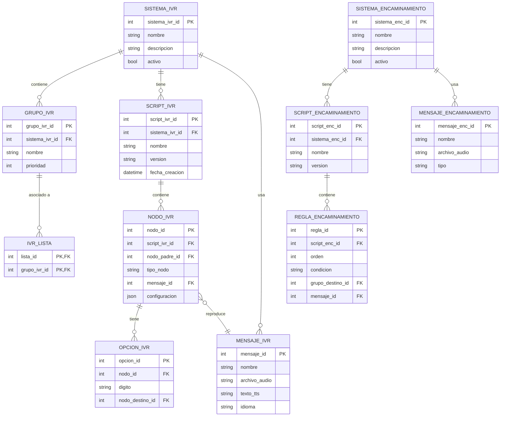
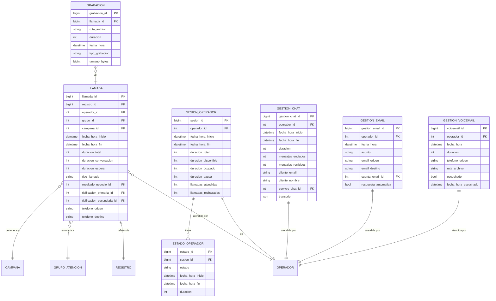
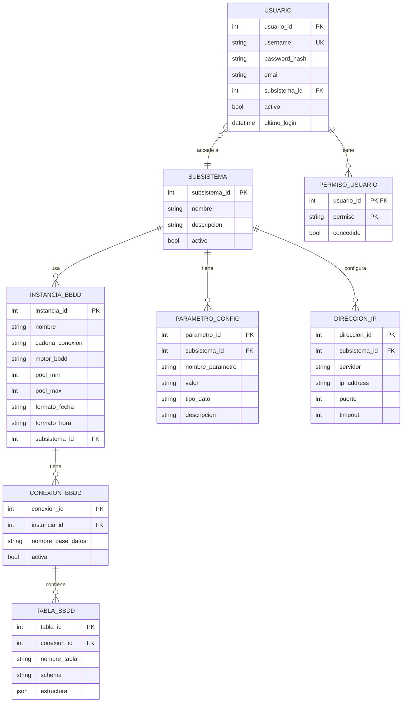
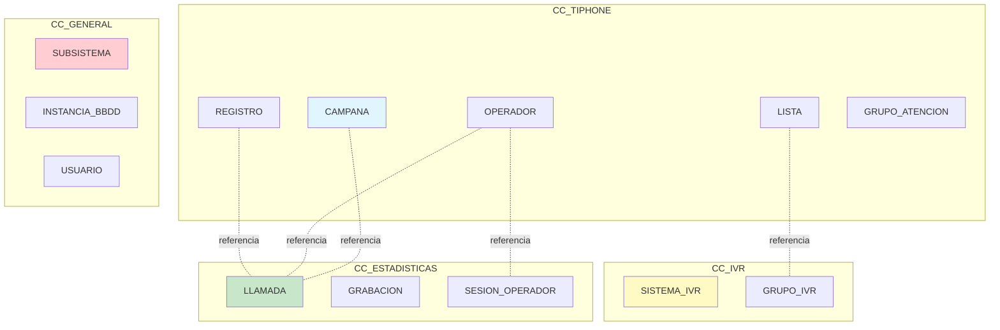

# Diagrama Entidad-Relación - Tiphone v6

## Base de Datos: CC_TIPHONE (Principal)

```mermaid
erDiagram
    OPERADOR ||--o{ OPERADOR_GRUPO : "pertenece a"
    OPERADOR ||--o{ OPERADOR_LISTA : "asignado a"
    OPERADOR ||--o{ OPERADOR_SKILL : "tiene"
    OPERADOR ||--o{ POSICION : "trabaja en"
    OPERADOR }o--|| ROL : "tiene"

    GRUPO_ATENCION ||--o{ OPERADOR_GRUPO : "contiene"
    GRUPO_ATENCION ||--o{ GRUPO_CANAL : "usa"
    GRUPO_ATENCION ||--o{ GRUPO_PERFIL_TIPIFICACION : "tiene"
    GRUPO_ATENCION ||--o{ DIA_ESPECIAL_GRUPO : "tiene"
    GRUPO_ATENCION }o--|| CALENDARIO : "usa"

    GRUPO_DISTRIBUCION ||--o{ OPERADOR_GRUPO : "contiene"
    GRUPO_DISTRIBUCION ||--o{ GRUPO_CANAL : "usa"
    GRUPO_DISTRIBUCION }o--|| CALENDARIO : "usa"

    CAMPANA ||--o{ LISTA : "contiene"
    CAMPANA ||--o{ FILTRO : "tiene"
    CAMPANA ||--o{ RESULTADO_NEGOCIO : "define"
    CAMPANA ||--o{ DIA_ESPECIAL_CAMPANA : "tiene"
    CAMPANA }o--|| CALENDARIO : "usa"
    CAMPANA }o--|| PREDICCION : "usa"
    CAMPANA }o--|| REPROGRAMACION : "usa"
    CAMPANA }o--|| TIPO_OPERACION : "tiene"

    LISTA ||--o{ REGISTRO : "contiene"
    LISTA ||--o{ OPERADOR_LISTA : "asignada a"
    LISTA ||--o{ IVR_LISTA : "asociada a"

    REGISTRO }o--|| RESULTADO_NEGOCIO : "tiene"
    REGISTRO }o--|| TIPIFICACION_PRIMARIA : "tipificado con"
    REGISTRO }o--|| TIPIFICACION_SECUNDARIA : "tipificado con"

    SKILL ||--o{ OPERADOR_SKILL : "asignado a"
    SKILL ||--o{ SKILLSET_SKILL : "incluido en"

    SKILLSET ||--o{ SKILLSET_SKILL : "contiene"
    SKILLSET ||--o{ CONJUNTO_OPERADORES : "asociado a"

    CONJUNTO_OPERADORES ||--o{ OPERADOR : "agrupa"

    TIPIFICACION_PRIMARIA ||--o{ TIPIFICACION_SECUNDARIA : "contiene"
    TIPIFICACION_PRIMARIA ||--o{ PERFIL_TIPIFICACION : "incluida en"

    PERFIL_TIPIFICACION ||--o{ GRUPO_PERFIL_TIPIFICACION : "asignado a"

    CANAL ||--o{ GRUPO_CANAL : "asignado a"

    CALENDARIO ||--o{ HORARIO : "usa"
    CALENDARIO ||--o{ DIA_ESPECIAL : "contiene"

    CONDICION ||--o{ FILTRO : "usada en"

    CERTIFICADO ||--o{ SERVIDOR : "instalado en"

    OPERADOR {
        int operador_id PK
        string login UK
        string nombre
        string password
        int rol_id FK
        bool activo
        datetime fecha_alta
        datetime ultimo_acceso
    }

    ROL {
        int rol_id PK
        string nombre
        string descripcion
        json permisos
    }

    GRUPO_ATENCION {
        int grupo_id PK
        string nombre
        string descripcion
        int calendario_id FK
        int perfil_tipificacion_id FK
        int prioridad
        bool activo
    }

    GRUPO_DISTRIBUCION {
        int grupo_dist_id PK
        string nombre
        string descripcion
        int calendario_id FK
        bool activo
    }

    OPERADOR_GRUPO {
        int operador_id PK,FK
        int grupo_id PK,FK
        int prioridad
        datetime fecha_asignacion
    }

    CAMPANA {
        int campana_id PK
        string alias
        string descripcion
        int tipo_operacion_id FK
        int calendario_id FK
        int prediccion_id FK
        int reprogramacion_id FK
        bool activa
        datetime fecha_inicio
        datetime fecha_fin
    }

    LISTA {
        int lista_id PK
        int campana_id FK
        string nombre
        string descripcion
        int total_registros
        bool activa
    }

    REGISTRO {
        bigint registro_id PK
        int lista_id FK
        string cliente_id
        string telefono
        int resultado_negocio_id FK
        int tipificacion_primaria_id FK
        int tipificacion_secundaria_id FK
        datetime fecha_alta
        datetime fecha_ultimo_intento
        int intentos
        int prioridad
        int peso
        json datos_adicionales
    }

    OPERADOR_LISTA {
        int operador_id PK,FK
        int lista_id PK,FK
        bool es_defecto
    }

    SKILL {
        int skill_id PK
        string nombre
        string descripcion
    }

    SKILLSET {
        int skillset_id PK
        string nombre
        int prioridad_cola
    }

    OPERADOR_SKILL {
        int operador_id PK,FK
        int skill_id PK,FK
        int prioridad
    }

    SKILLSET_SKILL {
        int skillset_id PK,FK
        int skill_id PK,FK
        string tipo
        int peso
    }

    CONJUNTO_OPERADORES {
        int conjunto_id PK
        string nombre
        string descripcion
    }

    TIPIFICACION_PRIMARIA {
        int tip_primaria_id PK
        string nombre
        string descripcion
    }

    TIPIFICACION_SECUNDARIA {
        int tip_secundaria_id PK
        int tip_primaria_id FK
        string nombre
        string descripcion
    }

    PERFIL_TIPIFICACION {
        int perfil_id PK
        string nombre
        bool es_defecto
    }

    GRUPO_PERFIL_TIPIFICACION {
        int grupo_id PK,FK
        int perfil_id PK,FK
    }

    CANAL {
        int canal_id PK
        string codigo
        string nombre
        int max_acciones
    }

    GRUPO_CANAL {
        int grupo_id PK,FK
        int canal_id PK,FK
        int operador_id PK,FK
        bool activo
    }

    CALENDARIO {
        int calendario_id PK
        string nombre
        int horario_id FK
        string mensaje_fuera_servicio
    }

    HORARIO {
        int horario_id PK
        string nombre
        json horario_semana
    }

    DIA_ESPECIAL {
        int dia_especial_id PK
        date fecha
        int horario_id FK
        string mensaje
        bool sin_servicio
    }

    DIA_ESPECIAL_GRUPO {
        int grupo_id PK,FK
        int dia_especial_id PK,FK
    }

    DIA_ESPECIAL_CAMPANA {
        int campana_id PK,FK
        int dia_especial_id PK,FK
    }

    RESULTADO_NEGOCIO {
        int resultado_id PK
        int campana_id FK
        string codigo
        string descripcion
        bool requiere_reprogramacion
    }

    FILTRO {
        int filtro_id PK
        int lista_id FK
        string nombre
        int condicion_id FK
        json parametros
    }

    CONDICION {
        int condicion_id PK
        string alias
        string descripcion
        string condicion_sql
    }

    TIPO_OPERACION {
        int tipo_operacion_id PK
        string nombre
        string descripcion
        string tipo_ejecucion
        string tipo_funcion
        bool grabar_voz
        bool multiples_instancias
        string url
        json parametros
    }

    PREDICCION {
        int prediccion_id PK
        string nombre
        string descripcion
        json configuracion
    }

    REPROGRAMACION {
        int reprogramacion_id PK
        string nombre
        string descripcion
        json reglas
    }

    POSICION {
        int posicion_id PK
        string nombre
        string ip_address
        int operador_id FK
        bool activa
    }

    SERVIDOR {
        int servidor_id PK
        string nombre
        string ip_address
        int puerto
        int timeout
    }

    CERTIFICADO {
        int certificado_id PK
        string nombre
        string ruta
        datetime fecha_vencimiento
        int servidor_id FK
    }
```

---

## Base de Datos: CC_IVR

---

## Base de Datos: CC_ESTADISTICAS

---

## Base de Datos: CC_GENERAL

---

## Relaciones entre Bases de Datos

---

## Cardinalidades

| Relación | Tipo | Descripción |
|----------|------|-------------|
| OPERADOR - GRUPO | N:M | Un operador puede estar en varios grupos, un grupo tiene varios operadores |
| OPERADOR - SKILL | N:M | Un operador puede tener varios skills, un skill puede estar en varios operadores |
| CAMPANA - LISTA | 1:N | Una campaña tiene varias listas, una lista pertenece a una campaña |
| LISTA - REGISTRO | 1:N | Una lista tiene muchos registros, un registro pertenece a una lista |
| GRUPO - CANAL | N:M | Un grupo puede tener varios canales, un canal puede estar en varios grupos |
| TIPIF_PRIMARIA - TIPIF_SECUNDARIA | 1:N | Una tipificación primaria tiene varias secundarias |
| CALENDARIO - DIA_ESPECIAL | 1:N | Un calendario puede tener varios días especiales |
| LLAMADA - GRABACION | 1:1 | Una llamada tiene una grabación opcional |

---

**Convenciones**:
- PK: Primary Key
- FK: Foreign Key
- UK: Unique Key
- N:M: Relación muchos a muchos
- 1:N: Relación uno a muchos
- 1:1: Relación uno a uno
