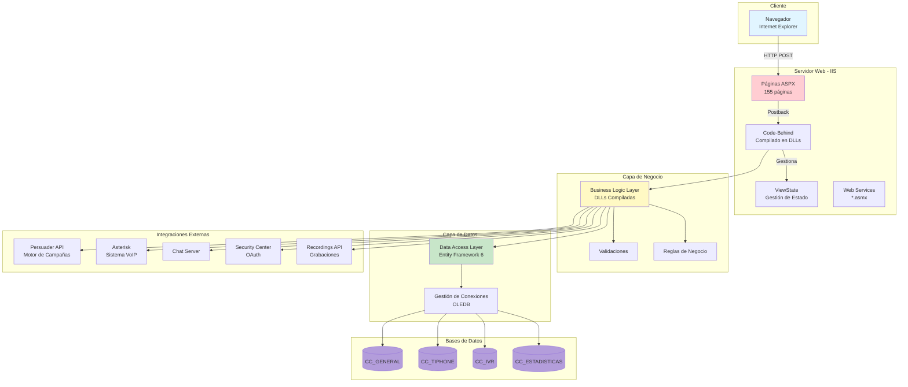
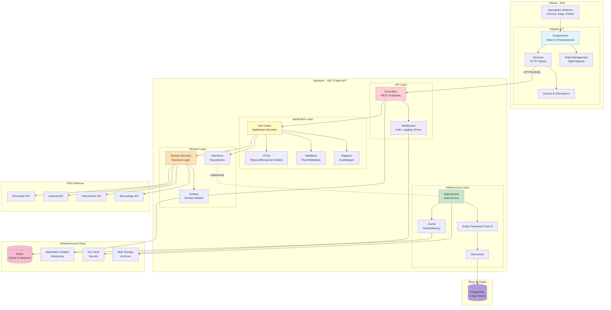
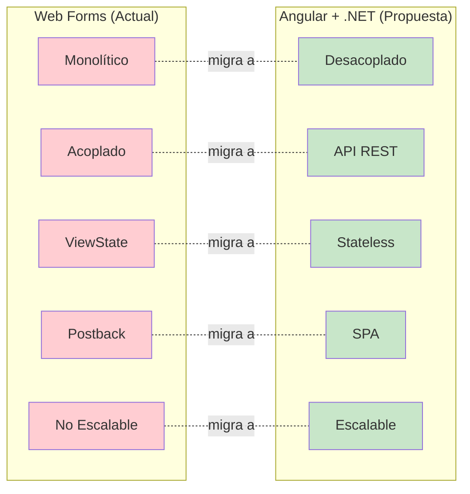
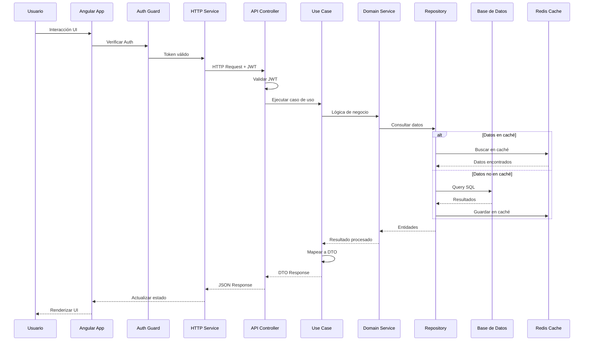
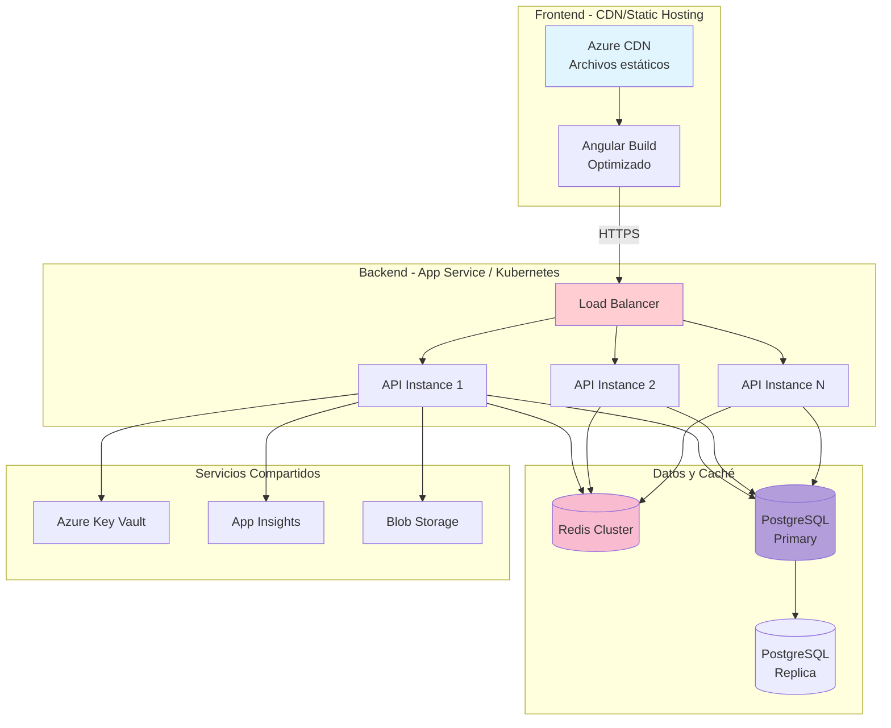
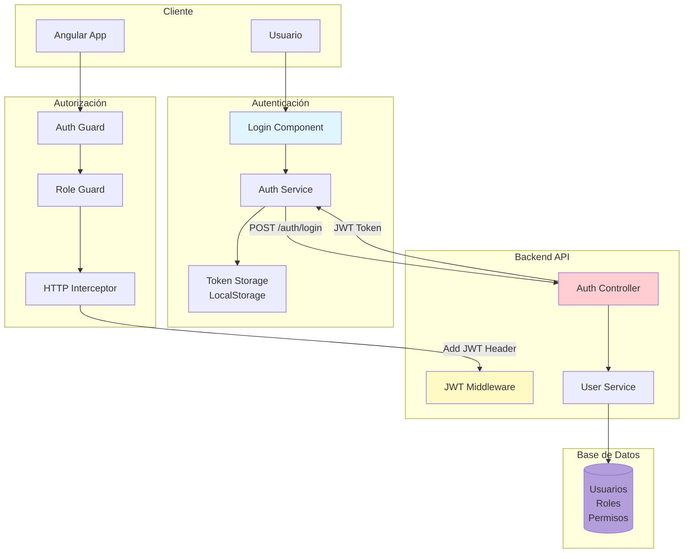
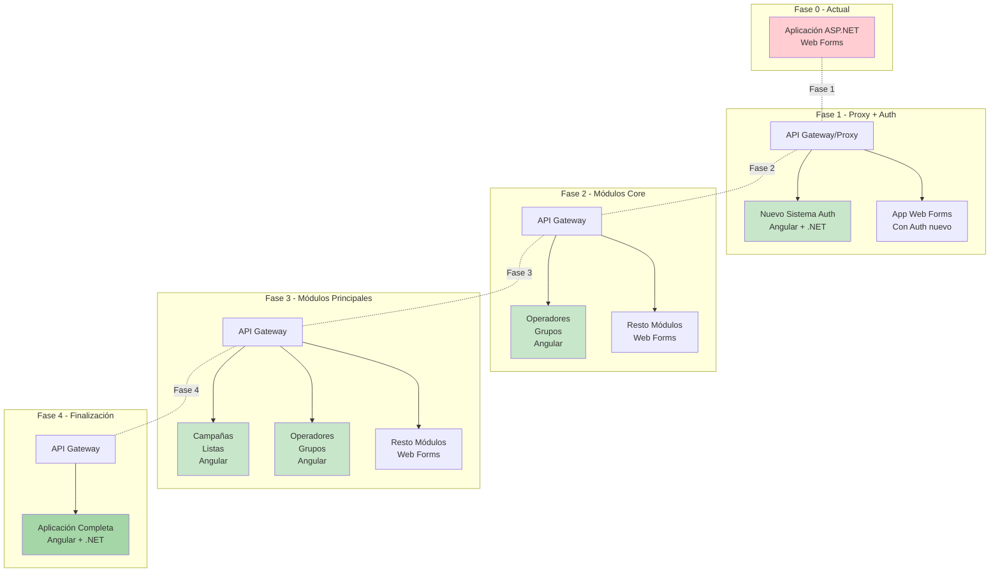

# Diagramas de Arquitectura - Tiphone v6

## 1. Arquitectura Actual (ASP.NET Web Forms)

---

## 2. Arquitectura Propuesta (Angular + .NET Core)

---

## 3. Comparación Arquitectónica

---

## 4. Flujo de Petición - Arquitectura Propuesta

---

## 5. Arquitectura de Despliegue

---

## 6. Seguridad y Autenticación

---

## 7. Estrategia de Migración - Strangler Pattern

---

**Leyenda de Colores**:
- 🔵 Azul: Frontend/Cliente
- 🔴 Rojo: API/Controllers
- 🟡 Amarillo: Application Layer
- 🟠 Naranja: Domain Layer
- 🟢 Verde: Infrastructure/Data
- 🟣 Púrpura: Base de Datos
- 🌸 Rosa: Caché/Redis
