# Diagramas de Secuencia - Flujos Principales

## 1. Autenticación y Login

---

## 2. Creación de Campaña

---

## 3. Asignación de Operador a Grupo

---

## 4. Supervisión de Campaña en Tiempo Real

---

## 5. Llamada Saliente (Outbound)

---

## 6. Gestión de Chat

---

## 7. Reprogramación de Registros

```mermaid
sequenceDiagram
    actor Sistema
    participant ReprogramacionJob
    participant ReprogramacionService
    participant CampanaRepository
    participant RegistroRepository
    participant ReglaRepository
    participant DB

    Sistema->>ReprogramacionJob: Ejecutar (cada hora)
    ReprogramacionJob->>ReprogramacionService: EjecutarReprogramaciones()

    ReprogramacionService->>CampanaRepository: GetCampanasActivas()
    CampanaRepository->>DB: SELECT * FROM Campana WHERE activa = true
    DB-->>CampanaRepository: Lista de campañas

    loop Para cada campaña
        ReprogramacionService->>CampanaRepository: GetReprogramacion(campanaId)
        CampanaRepository->>DB: SELECT * FROM Reprogramacion
        DB-->>CampanaRepository: Configuración

        ReprogramacionService->>ReglaRepository: GetReglas(reprogramacionId)
        ReglaRepository->>DB: SELECT * FROM ReglaReprogramacion
        DB-->>ReglaRepository: Reglas

        ReprogramacionService->>RegistroRepository: GetRegistrosParaReprogramar(campanaId)
        RegistroRepository->>DB: Query con condiciones
        DB-->>RegistroRepository: Registros

        loop Para cada registro
            ReprogramacionService->>ReprogramacionService: AplicarReglas(registro, reglas)

            alt Debe reprogramarse
                ReprogramacionService->>ReprogramacionService: CalcularNuevaFecha(registro, regla)
                ReprogramacionService->>RegistroRepository: Reprogramar(registroId, nuevaFecha)
                RegistroRepository->>DB: UPDATE Registro SET fecha_reprogramada
                DB-->>RegistroRepository: OK

                ReprogramacionService->>DB: INSERT INTO HistoricoReprogramacion
            else No se reprograma
                Note over ReprogramacionService: Registro no cumple condiciones
            end
        end
    end

    ReprogramacionService-->>ReprogramacionJob: Proceso completado
    ReprogramacionJob->>ReprogramacionJob: Log resultado
```

---

## 8. Exportación de Datos (Excel)

---

## Patrones Observados

1. **Request-Response**: Patrón estándar para operaciones CRUD
2. **WebSocket/SignalR**: Para actualizaciones en tiempo real
3. **Job/Background Task**: Para procesos batch como reprogramaciones
4. **Queue Pattern**: Para gestión de chats y llamadas
5. **Retry Pattern**: Para llamadas que no se completan
6. **Circuit Breaker**: Para llamadas a APIs externas
