# Estructura de Componentes Angular - Tiphone v6

## 1. Estructura de Carpetas del Proyecto Angular

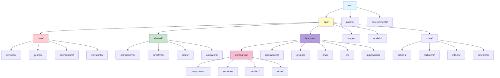

---

## 2. Módulo de Campañas - Árbol de Componentes

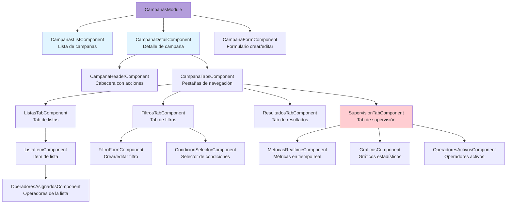

---

## 3. Módulo de Operadores - Componentes

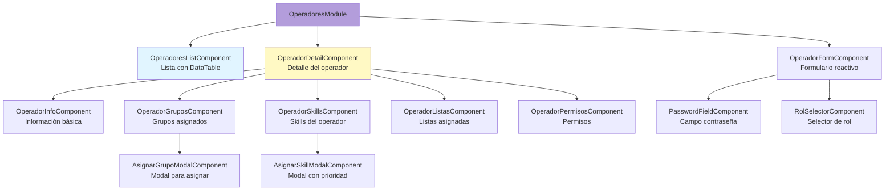

---

## 4. Componentes Compartidos (Shared)

```mermaid
graph TB
    SharedModule[SharedModule]

    SharedModule --> DataTableComponent[DataTableComponent<br/>Tabla reutilizable]
    SharedModule --> ModalComponent[ModalComponent<br/>Modal genérico]
    SharedModule --> LoadingSpinnerComponent[LoadingSpinnerComponent<br/>Spinner de carga]
    SharedModule --> ConfirmDialogComponent[ConfirmDialogComponent<br/>Diálogo confirmación]
    SharedModule --> ToastComponent[ToastComponent<br/>Notificaciones]
    SharedModule --> BreadcrumbComponent[BreadcrumbComponent<br/>Navegación]
    SharedModule --> SearchBoxComponent[SearchBoxComponent<br/>Buscador]
    SharedModule --> PaginatorComponent[PaginatorComponent<br/>Paginación]
    SharedModule --> FormFieldComponent[FormFieldComponent<br/>Campo de formulario]
    SharedModule --> DatePickerComponent[DatePickerComponent<br/>Selector de fecha]
    SharedModule --> TimePickerComponent[TimePickerComponent<br/>Selector de hora]
    SharedModule --> FileUploadComponent[FileUploadComponent<br/>Subir archivos]
    SharedModule --> BadgeComponent[BadgeComponent<br/>Insignias]
    SharedModule --> ChartComponent[ChartComponent<br/>Gráficos Chart.js]

    DataTableComponent --> ColumnFilterComponent[ColumnFilterComponent<br/>Filtro de columna]
    DataTableComponent --> ExportButtonComponent[ExportButtonComponent<br/>Exportar datos]

    style SharedModule fill:#c8e6c9
    style DataTableComponent fill:#e1f5ff
```

---

## 5. Layout y Navegación

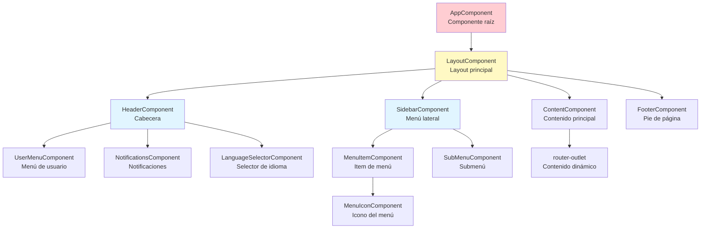

---

## 6. Estado Global (NgRx Store)

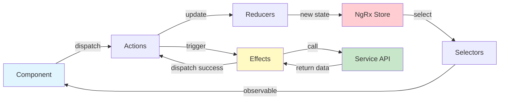

---

## 7. Flujo de Datos - Smart & Presentational Components

```mermaid
graph TB
    subgraph "Smart Components (Container)"
        CampanasListContainer[CampanasListContainer<br/>Gestiona estado y lógica]
    end

    subgraph "Services"
        CampanaService[CampanaService]
        Store[Store]
    end

    subgraph "Presentational Components"
        CampanasListView[CampanasListView<br/>Solo presentación]
        CampanaCardComponent[CampanaCardComponent<br/>Card individual]
        CampanaFiltersComponent[CampanaFiltersComponent<br/>Filtros]
    end

    CampanasListContainer -->|subscribe| Store
    CampanasListContainer -->|call| CampanaService
    Store -->|state$| CampanasListContainer
    CampanaService -->|data| CampanasListContainer

    CampanasListContainer -->|@Input campanas| CampanasListView
    CampanasListView -->|@Output onSelect| CampanasListContainer

    CampanasListView -->|*ngFor| CampanaCardComponent
    CampanaCardComponent -->|@Output onClick| CampanasListView

    CampanasListContainer -->|@Input| CampanaFiltersComponent
    CampanaFiltersComponent -->|@Output onFilter| CampanasListContainer

    style CampanasListContainer fill:#ffcdd2
    style CampanasListView fill:#e1f5ff
    style Store fill:#fff9c4
```

---

## 8. Servicios por Capa

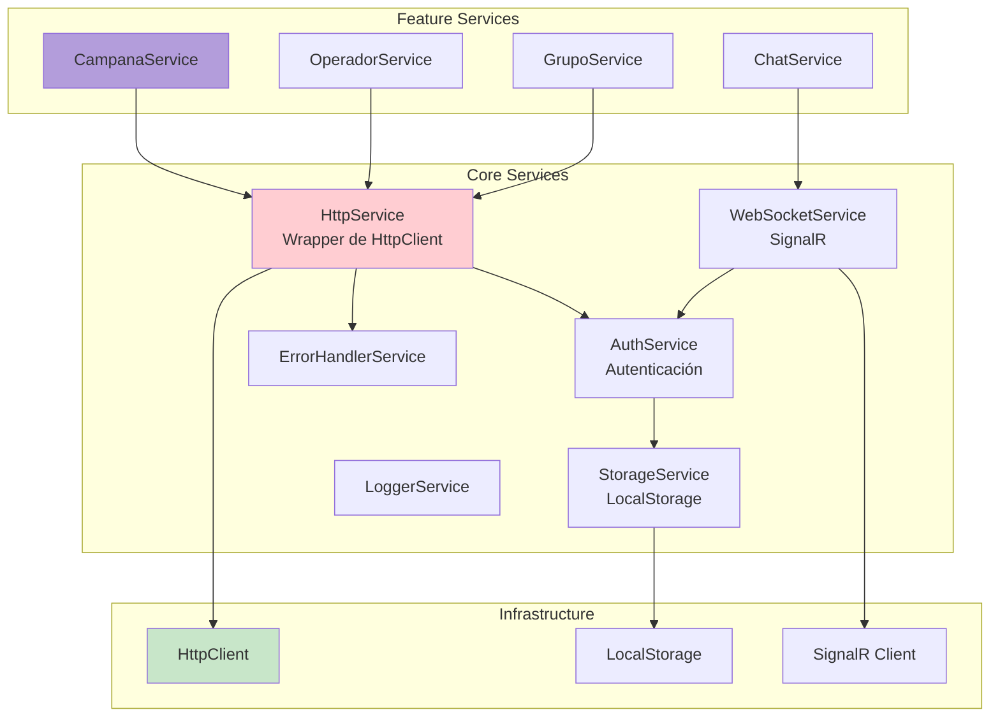

---

## 9. Guards y Rutas

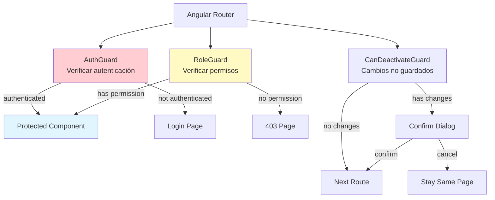

---

## 10. Interceptores HTTP

```mermaid
graph LR
    Component[Component]
    Service[Service]
    HttpClient[HttpClient]

    Interceptor1[AuthInterceptor<br/>Add JWT Token]
    Interceptor2[LoadingInterceptor<br/>Show/Hide Spinner]
    Interceptor3[ErrorInterceptor<br/>Handle Errors]
    Interceptor4[CacheInterceptor<br/>Cache Responses]

    API[Backend API]

    Component --> Service
    Service --> HttpClient
    HttpClient --> Interceptor1
    Interceptor1 --> Interceptor2
    Interceptor2 --> Interceptor3
    Interceptor3 --> Interceptor4
    Interceptor4 --> API

    API -->|response| Interceptor4
    Interceptor4 -->|response| Interceptor3
    Interceptor3 -->|response| Interceptor2
    Interceptor2 -->|response| Interceptor1
    Interceptor1 -->|response| HttpClient
    HttpClient -->|data| Service
    Service -->|data| Component

    style Component fill:#e1f5ff
    style Interceptor1 fill:#ffcdd2
    style Interceptor2 fill:#fff9c4
    style Interceptor3 fill:#c8e6c9
    style API fill:#b39ddb
```

---

## 11. Módulo de Chat - Componentes en Tiempo Real

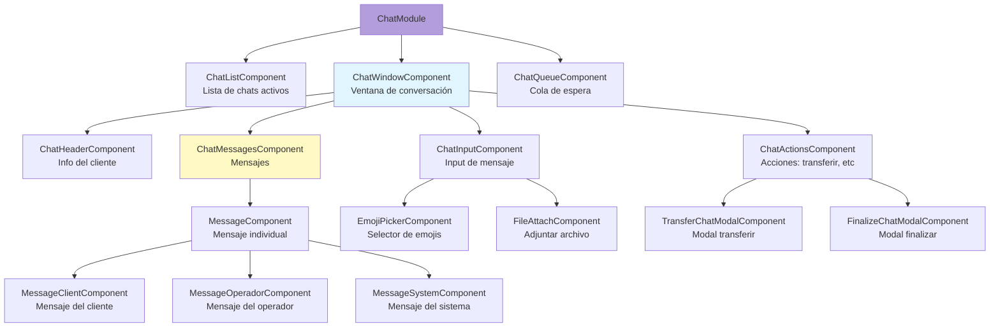

---

## 12. Directivas Personalizadas

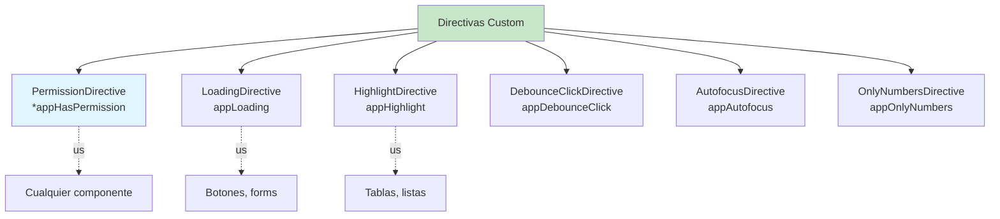

---

## 13. Pipes Personalizados

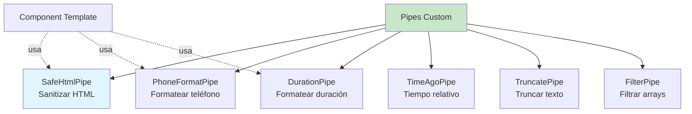

---

## 14. Validadores Personalizados

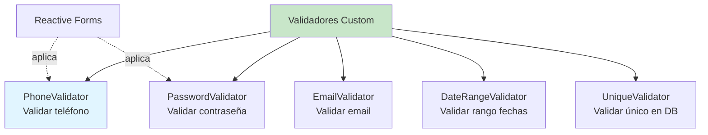

---

## Convenciones de Nomenclatura

### Componentes
- **Smart Components**: `*Container` o `*Page`
- **Presentational**: `*Component` o `*View`
- **Modal/Dialog**: `*ModalComponent` o `*DialogComponent`

### Servicios
- **Feature Services**: `*Service` (ej: `CampanaService`)
- **Core Services**: `*Service` (ej: `AuthService`)

### Store
- **Actions**: `[Feature] Action Name`
- **Reducers**: `*Reducer`
- **Effects**: `*Effects`
- **Selectors**: `select*`

### Archivos
- **Component**: `*.component.ts`, `*.component.html`, `*.component.scss`
- **Service**: `*.service.ts`
- **Model**: `*.model.ts` o `*.interface.ts`
- **Guard**: `*.guard.ts`
- **Interceptor**: `*.interceptor.ts`
