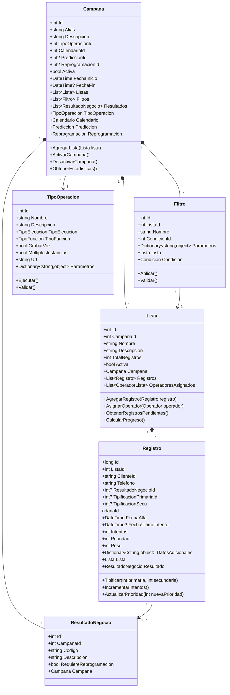
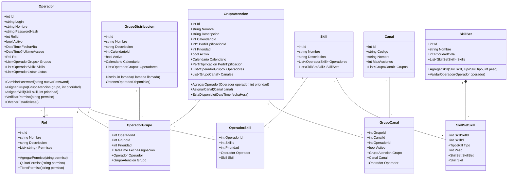
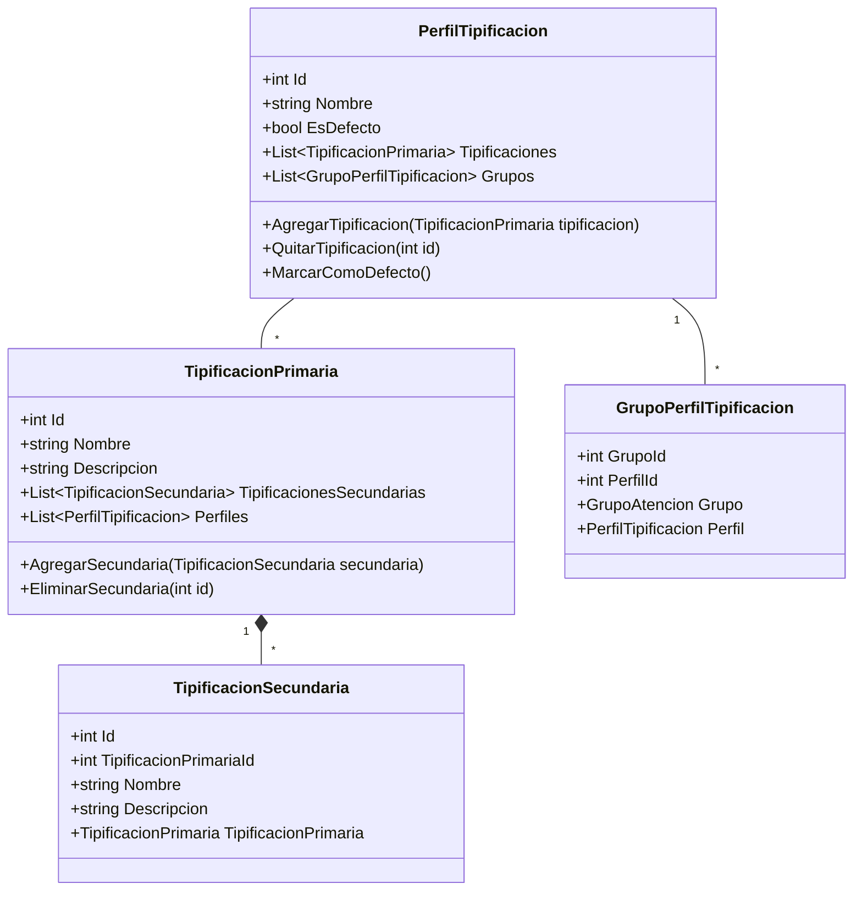
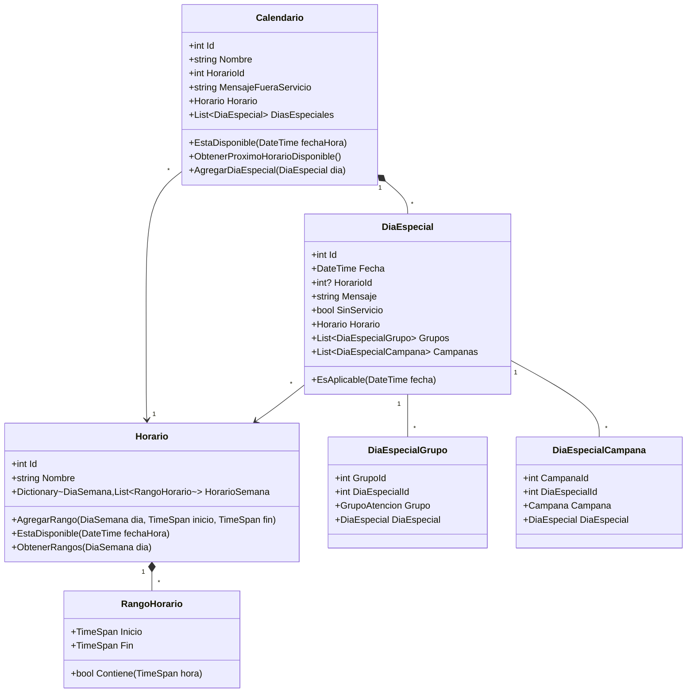
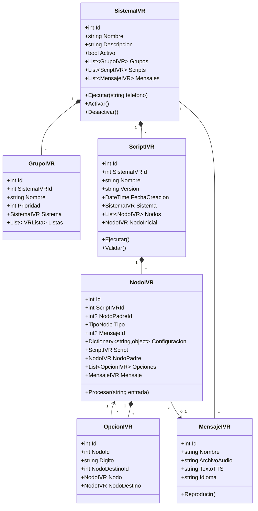
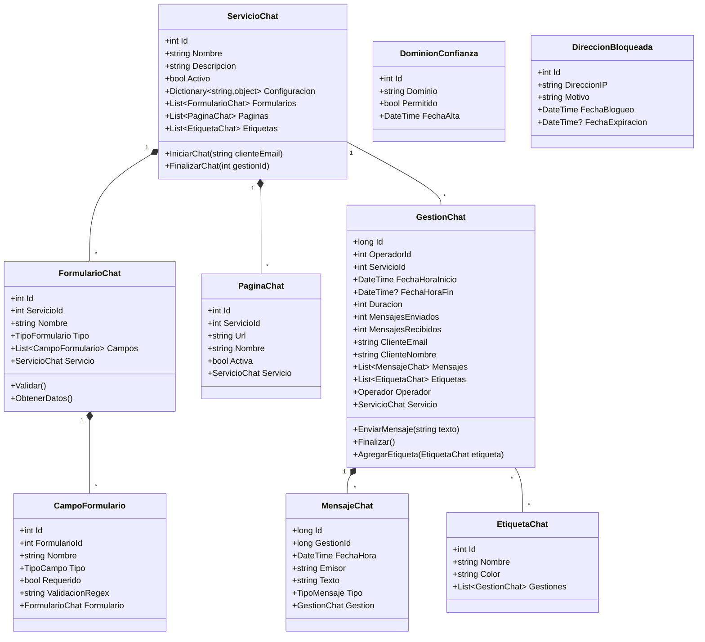
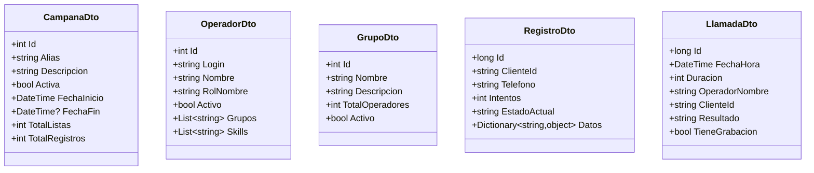
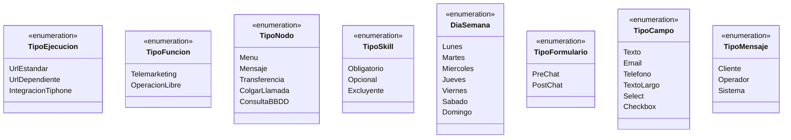
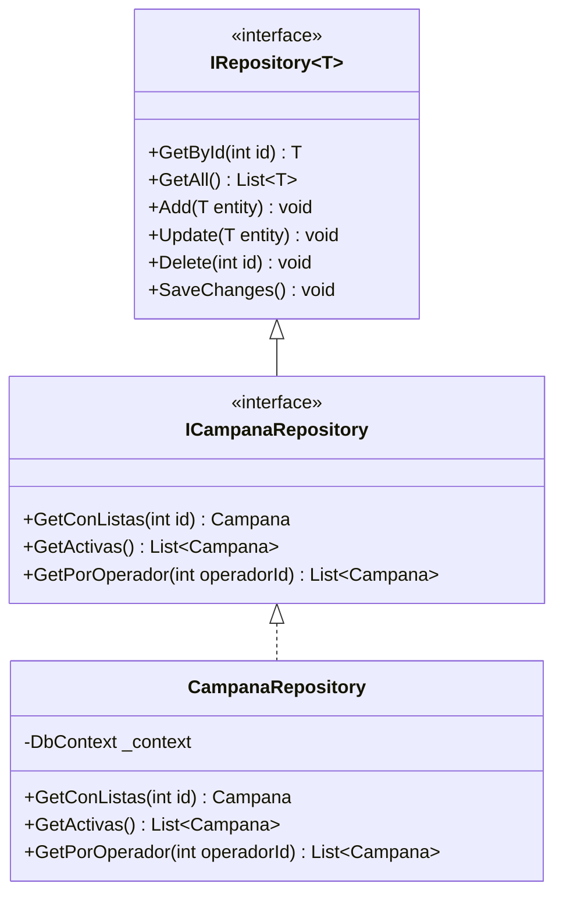
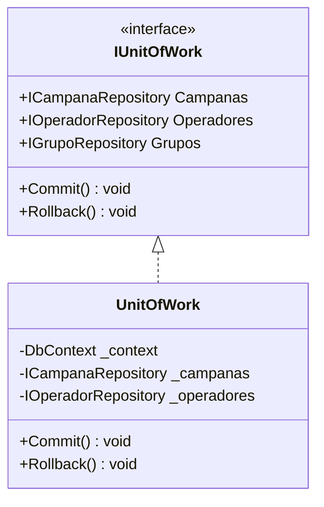

# Diagramas de Clases - Módulos Tiphone v6

## 1. Módulo de Campañas

---

## 2. Módulo de Operadores y Grupos

---

## 3. Módulo de Tipificaciones

---

## 4. Módulo de Calendario y Horarios

---

## 5. Módulo de IVR

---

## 6. Módulo de Chat

---

## 7. DTOs (Data Transfer Objects)

---

## Enumeraciones

---

## Patrones de Diseño Aplicados

### 1. Repository Pattern

### 2. Unit of Work Pattern

---

**Convenciones de Notación**:
- `+` : public
- `-` : private
- `#` : protected
- `~` : package/internal
- `*` : composición
- `o` : agregación
- `-->` : asociación
- `<|--` : herencia
- `<|..` : implementación de interfaz
