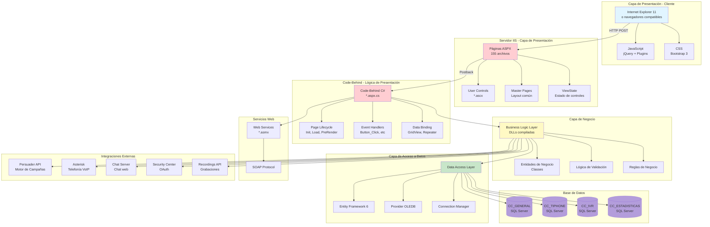
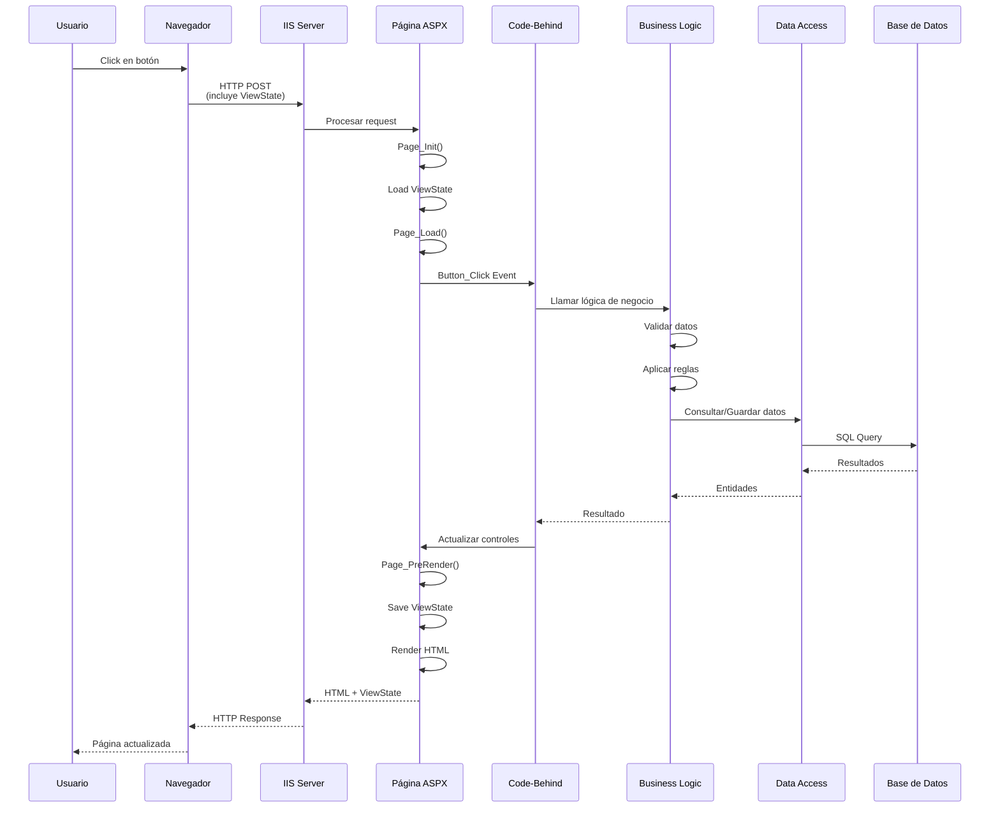

# Arquitectura General - Aplicación ACTUAL (ASP.NET Web Forms 4.8)

> **IMPORTANTE**: Este documento describe la arquitectura de la aplicación **EXISTENTE** en producción.

---

## 1. Visión General de la Arquitectura Actual



---

## 2. Patrón Arquitectónico: Web Forms

### Características Principales

**Modelo Event-Driven**:
- Los controles de servidor generan eventos
- Los eventos se manejan en el code-behind
- El servidor procesa los eventos y regenera la página

**ViewState**:
- Mantiene el estado de los controles entre postbacks
- Se serializa en un campo hidden en el HTML
- Se envía en cada request

**Postback**:
- Cada interacción recarga la página completa
- El servidor procesa y devuelve HTML nuevo
- No hay actualización parcial de la página (excepto con AJAX UpdatePanel)

---

## 3. Ciclo de Vida de una Petición



---

## 4. Tecnologías Utilizadas

### Backend
| Tecnología | Versión | Uso |
|-----------|---------|-----|
| ASP.NET Framework | 4.8 | Framework web |
| C# | 7.3 | Lenguaje de programación |
| Entity Framework | 6.0 | ORM |
| OLEDB Provider | 1.0 | Acceso a SQL Server |
| IIS | 10.0 | Servidor web |

### Frontend
| Tecnología | Versión | Uso |
|-----------|---------|-----|
| jQuery | ~3.x | Librería JavaScript |
| Bootstrap | 3.x | Framework CSS |
| DataTables | 1.12.1 | Tablas interactivas |
| FooTable | - | Tablas responsive |
| noUiSlider | - | Sliders |

### Base de Datos
| Componente | Detalle |
|-----------|---------|
| Motor | SQL Server |
| Instancia | VPCSQLMS\Pre |
| Timeout | 150 segundos |
| Pool | Gestionado por ADO.NET |

---

## 5. Componentes Principales

### 5.1 Páginas ASPX (155)

**Estructura típica**:
```xml
<%@ Page Language="C#"
         MasterPageFile="~/Site.Master"
         AutoEventWireup="true"
         CodeBehind="Campana.aspx.cs"
         Inherits="ManteniWeb.Campana" %>

<asp:Content ID="Content1" ContentPlaceHolderID="MainContent" runat="server">
    <asp:UpdatePanel ID="UpdatePanel1" runat="server">
        <ContentTemplate>
            <!-- Controles de servidor -->
            <asp:GridView ID="GridView1" runat="server" />
            <asp:Button ID="btnGuardar" runat="server"
                        OnClick="btnGuardar_Click" />
        </ContentTemplate>
    </asp:UpdatePanel>
</asp:Content>
```

### 5.2 Code-Behind

**Patrón típico**:
```csharp
public partial class Campana : System.Web.UI.Page
{
    protected void Page_Load(object sender, EventArgs e)
    {
        if (!IsPostBack)
        {
            CargarDatos();
        }
    }

    protected void btnGuardar_Click(object sender, EventArgs e)
    {
        // Lógica de negocio
        var campana = new CampanaEntity();
        campana.Nombre = txtNombre.Text;

        var bll = new CampanaBLL();
        bll.Guardar(campana);
    }

    private void CargarDatos()
    {
        var bll = new CampanaBLL();
        GridView1.DataSource = bll.ObtenerTodas();
        GridView1.DataBind();
    }
}
```

### 5.3 ViewState

**Funcionamiento**:
```html
<!-- Campo hidden generado automáticamente -->
<input type="hidden" name="__VIEWSTATE"
       value="/wEPDwUKMTY3ODM5NDU2Nw9kFgICAw9kFgICAQ8..." />
```

**Problemas**:
- Puede crecer mucho (varios KB o MB)
- Se envía en cada postback
- Impacto en rendimiento

### 5.4 AJAX UpdatePanel

**Actualización parcial**:
```xml
<asp:UpdatePanel ID="UpdatePanel1" runat="server" UpdateMode="Conditional">
    <ContentTemplate>
        <!-- Solo esta parte se actualiza -->
        <asp:Label ID="lblHora" runat="server" />
        <asp:Button ID="btnActualizar" runat="server" OnClick="btnActualizar_Click" />
    </ContentTemplate>
    <Triggers>
        <asp:AsyncPostBackTrigger ControlID="btnActualizar" EventName="Click" />
    </Triggers>
</asp:UpdatePanel>
```

---

## 6. Gestión de Estado

### ViewState (por defecto)
- Almacena estado de controles
- Se envía en cada request
- Habilitado por defecto

### Session State
- Almacena datos del usuario
- Timeout: 200 minutos
- Mode: InProc (en memoria del servidor)

### Application State
- Compartido entre todos los usuarios
- Persiste mientras la app esté ejecutándose

### Cookies
- Forms Authentication ticket
- Timeout: 120 minutos
- Sliding expiration: true

---

## 7. Autenticación y Autorización

### Forms Authentication

**Web.config**:
```xml
<authentication mode="Forms">
    <forms loginUrl="~/Login.aspx"
           defaultUrl="~/Principal.aspx"
           timeout="120"
           slidingExpiration="true" />
</authentication>
```

**Flujo**:
1. Usuario no autenticado → Redirect a Login.aspx
2. Valida credenciales contra BD
3. Crea FormsAuthenticationTicket
4. Almacena en cookie cifrada
5. Usuario autenticado

### Autorización

**Por archivo**:
```xml
<location path="Campanas.aspx">
    <system.web>
        <authorization>
            <allow roles="Administrador,Supervisor" />
            <deny users="*" />
        </authorization>
    </system.web>
</location>
```

**Por código**:
```csharp
if (!User.IsInRole("Administrador"))
{
    Response.Redirect("AccesoDenegado.aspx");
}
```

---

## 8. Manejo de Errores

### Global.asax

```csharp
protected void Application_Error(object sender, EventArgs e)
{
    Exception ex = Server.GetLastError();

    // Log del error
    Logger.Error(ex);

    // Redirect a página de error
    Server.ClearError();
    Response.Redirect("Error.aspx");
}
```

### CustomErrors (OFF en desarrollo)

```xml
<customErrors mode="Off" />
```

**Problema**: En producción debería estar "On" o "RemoteOnly"

---

## 9. Integraciones

### 9.1 Persuader (Motor de Campañas)

**Tipo**: API REST
**URL**: `https://vpcpre.adlantia.com/MantPersuaderApi/api/v1.0`
**Uso**: Obtención de próximo registro para marcar

### 9.2 Asterisk (Telefonía)

**Tipo**: Archivos en red + Configuración
**Rutas**:
- `\\192.168.1.159\Configuracion` - Config
- `\\CRK8269\Temp\Tiphone\Asterisk` - Mensajes

### 9.3 Chat Server

**Tipo**: API REST + WebSockets
**URLs**:
- `https://vpcpre.adlantia.com/ChatServer/`
- `https://vpcpre.adlantia.com/ChatFileApi/api/chats/`

### 9.4 Recordings API

**Tipo**: API REST
**URL**: `https://vpcpre.adlantia.com/tiphoneRecords/api/recordings/`

### 9.5 Security Center (OAuth)

**Tipo**: OAuth 2.0
**URL**: `https://vpcpre.adlantia.com/SecurityCenter`
**Estado**: Configurado pero no activo (`UsarSecurityToken=N`)

---

## 10. Problemas de la Arquitectura Actual

### Rendimiento
- ❌ Postbacks completos recargan toda la página
- ❌ ViewState grande impacta la transferencia
- ❌ No hay caché efectivo
- ❌ Consultas a BD no optimizadas

### Escalabilidad
- ❌ Session en memoria (InProc) no escalable
- ❌ No puede escalar horizontalmente fácilmente
- ❌ Acoplamiento alto entre capas

### Mantenibilidad
- ❌ Código compilado (DLLs) dificulta debugging
- ❌ Lógica dispersa entre ASPX y code-behind
- ❌ Difícil de testear (fuertemente acoplado)
- ❌ ViewState management complejo

### Seguridad
- ⚠️ CustomErrors en Off (expone stack traces)
- ⚠️ ViewState sin cifrado ni MAC
- ⚠️ Credenciales hardcodeadas en Web.config
- ⚠️ Usuario `sa` de SQL Server

### UX/UI
- ❌ No responsive
- ❌ Interfaz anticuada
- ❌ Postbacks lentos
- ❌ Dependencia de Internet Explorer

---

## 11. Ventajas que Tuvo en Su Momento

### Rapid Application Development (RAD)
- ✅ Desarrollo rápido con drag & drop
- ✅ Controles de servidor listos para usar
- ✅ Event-driven programming familiar

### Abstracción
- ✅ Oculta complejidad de HTTP
- ✅ Gestión automática de estado
- ✅ Data binding automático

### Ecosistema
- ✅ Gran cantidad de componentes comerciales
- ✅ Mucha documentación
- ✅ Amplia adopción en empresas

---

## 12. Por Qué Migrar

### Tecnología Obsoleta
- Microsoft no da soporte activo
- No hay nuevas versiones
- Comunidad en declive

### Limitaciones Técnicas
- No puede ser SPA
- Difícil integrar con frameworks modernos
- No es API-first

### Costos
- Hosting en Windows Server más caro
- Licencias de SQL Server
- Difícil encontrar desarrolladores

### Competitividad
- Los usuarios esperan UX modernas
- Necesidad de aplicaciones móviles
- Integración con otros sistemas

---

## Conclusión

La arquitectura actual basada en ASP.NET Web Forms **fue apropiada en su momento** pero presenta limitaciones significativas para:
- Experiencia de usuario moderna
- Escalabilidad
- Mantenibilidad
- Costos operativos

La migración a una arquitectura moderna (Angular + .NET Core) resolverá estos problemas.

---

**Documento**: Arquitectura General Actual
**Versión**: 1.0
**Fecha**: 2025-10-27
