# Postback - Modelo de Interacción ASP.NET Web Forms

> **IMPORTANTE**: Este documento describe el modelo Postback de la aplicación **ACTUAL** (ASP.NET Web Forms 4.8).

---

## 1. ¿Qué es un Postback?

Un **Postback** es el mecanismo por el cual ASP.NET Web Forms procesa interacciones del usuario enviando el formulario completo de vuelta al servidor.

### Características

- **Full Page Reload**: Toda la página se recarga
- **Stateful**: Mantiene estado mediante ViewState
- **Event-Driven**: Basado en eventos de servidor
- **Synchronous**: Bloquea la UI mientras procesa

---

## 2. Ciclo Completo de un Postback

```mermaid
sequenceDiagram
    participant User as Usuario
    participant Browser as Navegador
    participant IIS as IIS Server
    participant HTTP as HTTP Handler
    participant Page as Página ASPX
    participant VS as ViewState
    participant CB as Code-Behind
    participant BLL as Business Logic
    participant DB as Base de Datos

    Note over User,DB: CARGA INICIAL (No Postback)
    User->>Browser: Accede a URL
    Browser->>IIS: GET /Campanas.aspx
    IIS->>HTTP: Procesar request
    HTTP->>Page: Crear instancia de página
    Page->>Page: Page_Init()
    Page->>Page: Page_Load() con IsPostBack=false
    Page->>CB: CargarDatos()
    CB->>BLL: ObtenerCampanas()
    BLL->>DB: SELECT * FROM Campanas
    DB-->>BLL: Resultados
    BLL-->>CB: List<Campana>
    CB->>Page: GridView.DataBind()
    Page->>VS: SaveViewState()
    Page->>Page: Render()
    Page-->>Browser: HTML + ViewState + JavaScript
    Browser-->>User: Página mostrada

    Note over User,DB: POSTBACK (Usuario hace click)
    User->>Browser: Click en botón "Guardar"
    Browser->>Browser: Deshabilitar controles
    Browser->>IIS: POST /Campanas.aspx<br/>(incluye __VIEWSTATE, __EVENTVALIDATION, campos)
    IIS->>HTTP: Procesar POST
    HTTP->>Page: Crear nueva instancia
    Page->>Page: Page_Init()
    Page->>VS: LoadViewState()
    VS->>Page: Restaurar estado controles
    Page->>Page: Page_Load() con IsPostBack=true
    Page->>Page: RaisePostBackEvent()
    Page->>CB: btnGuardar_Click()
    CB->>BLL: GuardarCampana(campana)
    BLL->>DB: INSERT/UPDATE Campana
    DB-->>BLL: Confirmación
    BLL-->>CB: Success
    CB->>Page: Mostrar mensaje
    Page->>VS: SaveViewState()
    Page->>Page: Render()
    Page-->>Browser: HTML completo + nuevo ViewState
    Browser->>Browser: Reemplazar página completa
    Browser-->>User: Página actualizada

    Note over Browser: Toda la página se ha recargado
```



---

## 3. Anatomía de un Postback

### 3.1 HTML Generado

```html
<!DOCTYPE html>
<html>
<head>
    <title>Campañas</title>
</head>
<body>
    <form method="post" action="./Campanas.aspx" id="form1">

        <!-- ViewState: Estado de todos los controles -->
        <input type="hidden" name="__VIEWSTATE"
               value="/wEPDwUKMTY3ODM5NDU2Nw9kFgICAw9kFgICAQ..." />

        <!-- Event Validation: Seguridad -->
        <input type="hidden" name="__EVENTVALIDATION"
               value="/wEdAAWDkVcON9..." />

        <!-- Event Target: Control que causó el postback -->
        <input type="hidden" name="__EVENTTARGET"
               value="" />

        <!-- Event Argument: Argumento del evento -->
        <input type="hidden" name="__EVENTARGUMENT"
               value="" />

        <!-- Controles visibles -->
        <div>
            <input name="txtAlias" type="text" value="Campaña 2024"
                   id="txtAlias" />
            <select name="ddlEstado" id="ddlEstado">
                <option value="1">Activa</option>
                <option value="2" selected="selected">Pausada</option>
            </select>
            <input type="submit" name="btnGuardar" value="Guardar"
                   id="btnGuardar" />
        </div>

        <!-- JavaScript que maneja el postback -->
        <script type="text/javascript">
            function __doPostBack(eventTarget, eventArgument) {
                var theForm = document.forms['form1'];
                if (!theForm.onsubmit || (theForm.onsubmit() != false)) {
                    theForm.__EVENTTARGET.value = eventTarget;
                    theForm.__EVENTARGUMENT.value = eventArgument;
                    theForm.submit();
                }
            }
        </script>

    </form>
</body>
</html>
```

### 3.2 HTTP POST Request

```http
POST /Campanas.aspx HTTP/1.1
Host: localhost
Content-Type: application/x-www-form-urlencoded
Content-Length: 2847

__VIEWSTATE=%2FwEPDwUKMTY3ODM5NDU2Nw9kFgICAw9kFgICAQ...
&__EVENTVALIDATION=%2FwEdAAWDkVcON9...
&__EVENTTARGET=
&__EVENTARGUMENT=
&txtAlias=Campa%C3%B1a+2024
&ddlEstado=2
&btnGuardar=Guardar
```

**Tamaño típico**: 2-10 KB (sin ViewState grande: 50-500 KB)

---

## 4. Page Lifecycle Detallado

```mermaid
graph TB
    A[POST Request] --> B[Page Constructor]
    B --> C[AddParsedSubObject]
    C --> D[Page_PreInit]
    D --> E[Page_Init]
    E --> F[InitComplete]

    F --> G{Es Postback?}
    G -->|Sí| H[LoadViewState]
    G -->|No| I[Skip LoadViewState]

    H --> J[LoadPostData]
    I --> J
    J --> K[Page_PreLoad]
    K --> L[Page_Load]

    L --> M{Es Postback?}
    M -->|Sí| N[RaisePostBackEvent]
    M -->|No| O[Skip eventos]

    N --> P[Button_Click, etc.]
    O --> P
    P --> Q[LoadComplete]
    Q --> R[Page_PreRender]
    R --> S[PreRenderComplete]
    S --> T[SaveViewState]
    T --> U[SaveStateComplete]
    U --> V[Render]
    V --> W[Unload]

    style H fill:#fff9c4
    style N fill:#ffcdd2
    style T fill:#fff9c4
    style V fill:#c8e6c9
```



### Fases Clave

| Fase | Propósito | IsPostBack |
|------|-----------|------------|
| **Init** | Crear controles, aplicar temas | N/A |
| **LoadViewState** | Restaurar estado desde ViewState | Solo en postback |
| **LoadPostData** | Cargar valores del formulario | Solo en postback |
| **Load** | Lógica de negocio principal | Ambos |
| **RaisePostBackEvent** | Ejecutar eventos (Button_Click) | Solo en postback |
| **PreRender** | Últimos cambios antes de renderizar | Ambos |
| **SaveViewState** | Guardar estado en ViewState | Ambos |
| **Render** | Generar HTML | Ambos |

---

## 5. Tipos de Postback en ManteniWeb

### 5.1 Postback Completo (Full Postback)

```xml
<!-- Botón que causa postback completo -->
<asp:Button ID="btnGuardar" runat="server"
            Text="Guardar"
            OnClick="btnGuardar_Click" />
```

**Flujo**:
1. Usuario hace click
2. Browser envía POST con toda la página
3. Servidor procesa
4. Servidor devuelve HTML completo
5. Browser reemplaza toda la página

**Tiempo**: 500-2000 ms

```mermaid
sequenceDiagram
    Browser->>Server: POST (página completa)
    Note over Browser: Página en blanco o bloqueada
    Server->>Server: Procesar
    Server->>Browser: HTML completo
    Browser->>Browser: Reemplazar DOM
    Note over Browser: Página actualizada
```



### 5.2 Postback Parcial (AJAX UpdatePanel)

```xml
<!-- UpdatePanel para postback parcial -->
<asp:UpdatePanel ID="upCampanas" runat="server" UpdateMode="Conditional">
    <ContentTemplate>
        <asp:GridView ID="gvCampanas" runat="server" />
        <asp:Button ID="btnRefrescar" runat="server"
                    Text="Refrescar"
                    OnClick="btnRefrescar_Click" />
    </ContentTemplate>
</asp:UpdatePanel>
```

**Flujo**:
1. Usuario hace click
2. Browser envía POST AJAX
3. Solo la región UpdatePanel se actualiza
4. Resto de la página intacta

**Tiempo**: 200-800 ms (más rápido pero aún lento)

```mermaid
sequenceDiagram
    Browser->>Server: POST AJAX (página completa + headers especiales)
    Note over Browser: Solo UpdatePanel se bloquea
    Server->>Server: Procesar
    Server->>Browser: Delta HTML (solo región UpdatePanel)
    Browser->>Browser: Actualizar región específica
    Note over Browser: Resto de página intacta
```



**Problema**: ¡Aún se envía el ViewState completo!

### 5.3 Postback desde GridView

```xml
<asp:GridView ID="gvCampanas" runat="server"
              DataKeyNames="Id"
              OnRowCommand="gvCampanas_RowCommand">
    <Columns>
        <asp:ButtonField CommandName="Edit" Text="Editar" />
        <asp:ButtonField CommandName="Delete" Text="Eliminar" />
    </Columns>
</asp:GridView>
```

```csharp
protected void gvCampanas_RowCommand(object sender, GridViewCommandEventArgs e)
{
    // Obtener índice desde el __EVENTARGUMENT
    int rowIndex = Convert.ToInt32(e.CommandArgument);

    // Obtener ID desde ViewState (DataKeys)
    int campanaId = (int)gvCampanas.DataKeys[rowIndex].Value;

    if (e.CommandName == "Edit")
    {
        // Editar...
        // ESTO CAUSA UN NUEVO POSTBACK
    }
    else if (e.CommandName == "Delete")
    {
        // Eliminar...
        // ESTO CAUSA UN NUEVO POSTBACK
    }
}
```

---

## 6. Ejemplo Real: Guardar Campaña

### 6.1 Código ASPX

```xml
<%@ Page Language="C#" AutoEventWireup="true"
         CodeBehind="Campana.aspx.cs"
         Inherits="ManteniWeb.Campana" %>

<asp:Content ID="Content1" ContentPlaceHolderID="MainContent" runat="server">

    <div class="panel panel-default">
        <div class="panel-heading">
            <h3>Editar Campaña</h3>
        </div>
        <div class="panel-body">

            <div class="form-group">
                <label>Alias:</label>
                <asp:TextBox ID="txtAlias" runat="server" CssClass="form-control" />
                <asp:RequiredFieldValidator ID="rfvAlias" runat="server"
                    ControlToValidate="txtAlias"
                    ErrorMessage="El alias es obligatorio"
                    CssClass="text-danger" />
            </div>

            <div class="form-group">
                <label>Estado:</label>
                <asp:DropDownList ID="ddlEstado" runat="server" CssClass="form-control">
                    <asp:ListItem Value="1">Activa</asp:ListItem>
                    <asp:ListItem Value="2">Pausada</asp:ListItem>
                    <asp:ListItem Value="3">Finalizada</asp:ListItem>
                </asp:DropDownList>
            </div>

            <asp:Button ID="btnGuardar" runat="server"
                        Text="Guardar"
                        CssClass="btn btn-primary"
                        OnClick="btnGuardar_Click" />

            <asp:Button ID="btnCancelar" runat="server"
                        Text="Cancelar"
                        CssClass="btn btn-default"
                        OnClick="btnCancelar_Click"
                        CausesValidation="false" />

        </div>
    </div>

</asp:Content>
```

### 6.2 Code-Behind

```csharp
public partial class Campana : System.Web.UI.Page
{
    private int CampanaId
    {
        get { return ViewState["CampanaId"] != null ? (int)ViewState["CampanaId"] : 0; }
        set { ViewState["CampanaId"] = value; }
    }

    protected void Page_Load(object sender, EventArgs e)
    {
        if (!IsPostBack)
        {
            // Primera carga - obtener ID de query string
            if (Request.QueryString["id"] != null)
            {
                CampanaId = Convert.ToInt32(Request.QueryString["id"]);
                CargarCampana();
            }
        }
        // En postback, CampanaId se restaura desde ViewState automáticamente
    }

    private void CargarCampana()
    {
        var bll = new CampanaBLL();
        var campana = bll.ObtenerPorId(CampanaId);

        if (campana != null)
        {
            // Cargar valores en controles
            txtAlias.Text = campana.Alias;
            ddlEstado.SelectedValue = campana.IdEstado.ToString();
        }
    }

    protected void btnGuardar_Click(object sender, EventArgs e)
    {
        // INICIO DEL POSTBACK

        // Page.IsValid verifica los validators
        if (Page.IsValid)
        {
            // Los valores ya están restaurados desde ViewState
            var campana = new CampanaEntity
            {
                Id = CampanaId,
                Alias = txtAlias.Text, // Viene del ViewState
                IdEstado = Convert.ToInt32(ddlEstado.SelectedValue) // Viene del ViewState
            };

            var bll = new CampanaBLL();
            bool exito = bll.Actualizar(campana);

            if (exito)
            {
                // Redirect causa OTRO request (no es postback)
                Response.Redirect("Campanas.aspx?mensaje=guardado");
            }
            else
            {
                // Mostrar error (la página se re-renderiza)
                // Aquí se genera el HTML de respuesta del postback
                ClientScript.RegisterStartupScript(
                    this.GetType(),
                    "error",
                    "alert('Error al guardar');",
                    true
                );
            }
        }

        // FIN DEL POSTBACK - Se envía HTML al browser
    }

    protected void btnCancelar_Click(object sender, EventArgs e)
    {
        // Otro postback para ir atrás
        Response.Redirect("Campanas.aspx");
    }
}
```

### 6.3 Flujo Temporal

```mermaid
gantt
    title Tiempo de Postback - Guardar Campaña
    dateFormat X
    axisFormat %L ms

    section Usuario
    Click en Guardar    :0, 50
    Espera bloqueado    :50, 1500
    Ve resultado        :1500, 1550

    section Browser
    Preparar POST       :50, 100
    Enviar request      :100, 200
    Recibir response    :1400, 1500
    Renderizar HTML     :1500, 1550

    section Red
    Upload (10 KB)      :200, 400
    Download (30 KB)    :1200, 1400

    section Servidor
    Procesar request    :400, 500
    Init + LoadVS       :500, 600
    Page_Load           :600, 650
    Button_Click        :650, 1000
    Guardar BD          :1000, 1100
    SaveVS + Render     :1100, 1200
```

**Total**: ~1.5 segundos (óptimo) hasta 5+ segundos (con BD lenta o red mala)

---

## 7. Problemas del Postback

### 7.1 Performance


**Problema**: Cada interacción requiere full round-trip

### 7.2 User Experience

```mermaid
sequenceDiagram
    participant User
    participant Page

    User->>Page: Click "Guardar"
    Note over Page: Página se blanquea
    Note over User: Usuario espera...
    Note over User: ¿Se guardó?
    Note over User: ¿Hago click de nuevo?
    Page->>User: Página recargada
    Note over User: ¡Finalmente!
```



**Problemas**:
- ❌ Página se blanquea o congela
- ❌ Sin feedback inmediato
- ❌ Scroll position se pierde
- ❌ Focus se pierde
- ❌ Animaciones interrumpidas

### 7.3 Escalabilidad

Cada postback requiere:
- Nueva instancia de página en memoria
- Deserialización de ViewState
- Procesamiento completo del lifecycle
- Generación de HTML completo
- Serialización de ViewState

**Para 100 usuarios simultáneos**:
- 100 instancias de página en memoria
- 100 deserializaciones de ViewState
- 100 queries a BD (sin caché efectivo)
- Alto uso de CPU

---

## 8. Comparación: Postback vs Angular

```mermaid
graph TB
    subgraph "ASP.NET Postback"
        A1[Click guardar] --> B1[POST 50 KB]
        B1 --> C1[Servidor crea página]
        C1 --> D1[Procesa evento]
        D1 --> E1[Genera HTML completo]
        E1 --> F1[Response 80 KB]
        F1 --> G1[Browser reemplaza página]

        style B1 fill:#ffcdd2
        style E1 fill:#ffcdd2
        style F1 fill:#ffcdd2
    end

    subgraph "Angular HTTP"
        A2[Click guardar] --> B2[POST 1 KB JSON]
        B2 --> C2[API procesa]
        C2 --> D2[Response 0.5 KB JSON]
        D2 --> E2[Actualiza modelo]
        E2 --> F2[Re-render componente]

        style B2 fill:#c8e6c9
        style D2 fill:#c8e6c9
    end
```



### Métricas Comparativas

| Aspecto | Postback | Angular |
|---------|----------|---------|
| **Request size** | 10-500 KB | 0.5-5 KB |
| **Response size** | 20-100 KB | 0.5-10 KB |
| **Server processing** | 200-800 ms | 50-200 ms |
| **Browser rendering** | 100-300 ms | 10-50 ms |
| **Total time** | 1-5 segundos | 0.2-0.8 segundos |
| **User feedback** | Después de completar | Inmediato + loading |
| **Page reload** | Sí (pierde contexto) | No (mantiene contexto) |

---

## 9. Código Equivalente en Angular

### Angular Component (campana.component.ts)

```typescript
export class CampanaComponent implements OnInit {
  campanaForm: FormGroup;
  campanaId: number;
  loading = false;

  constructor(
    private fb: FormBuilder,
    private campanaService: CampanaService,
    private route: ActivatedRoute,
    private router: Router
  ) {
    this.campanaForm = this.fb.group({
      alias: ['', Validators.required],
      idEstado: [1, Validators.required]
    });
  }

  ngOnInit() {
    // Obtener ID de la ruta
    this.campanaId = +this.route.snapshot.paramMap.get('id')!;
    this.cargarCampana();
  }

  cargarCampana() {
    this.loading = true;

    // Llamada API - solo trae JSON
    this.campanaService.obtenerPorId(this.campanaId)
      .subscribe({
        next: (campana) => {
          // Actualizar formulario
          this.campanaForm.patchValue({
            alias: campana.alias,
            idEstado: campana.idEstado
          });
          this.loading = false;
        },
        error: (err) => {
          console.error('Error al cargar', err);
          this.loading = false;
        }
      });
  }

  guardar() {
    if (this.campanaForm.valid) {
      this.loading = true;

      const campana: Campana = {
        id: this.campanaId,
        ...this.campanaForm.value
      };

      // Llamada API - solo envía JSON
      this.campanaService.actualizar(campana)
        .subscribe({
          next: () => {
            // Sin postback - navegación instantánea
            this.router.navigate(['/campanas'], {
              queryParams: { mensaje: 'guardado' }
            });
          },
          error: (err) => {
            console.error('Error al guardar', err);
            // Mostrar error sin recargar página
            this.loading = false;
          }
        });
    }
  }

  cancelar() {
    // Navegación instantánea sin postback
    this.router.navigate(['/campanas']);
  }
}
```

### Angular Template (campana.component.html)

```html
<div class="panel panel-default">
  <div class="panel-heading">
    <h3>Editar Campaña</h3>
  </div>
  <div class="panel-body">

    <!-- Formulario reactivo -->
    <form [formGroup]="campanaForm" (ngSubmit)="guardar()">

      <div class="form-group">
        <label>Alias:</label>
        <input type="text"
               class="form-control"
               formControlName="alias" />

        <!-- Validación en tiempo real -->
        <div *ngIf="campanaForm.get('alias')?.invalid &&
                    campanaForm.get('alias')?.touched"
             class="text-danger">
          El alias es obligatorio
        </div>
      </div>

      <div class="form-group">
        <label>Estado:</label>
        <select class="form-control" formControlName="idEstado">
          <option value="1">Activa</option>
          <option value="2">Pausada</option>
          <option value="3">Finalizada</option>
        </select>
      </div>

      <!-- Botones con estado de carga -->
      <button type="submit"
              class="btn btn-primary"
              [disabled]="campanaForm.invalid || loading">
        <span *ngIf="loading">Guardando...</span>
        <span *ngIf="!loading">Guardar</span>
      </button>

      <button type="button"
              class="btn btn-default"
              (click)="cancelar()"
              [disabled]="loading">
        Cancelar
      </button>

    </form>

  </div>
</div>

<!-- Loading spinner -->
<div *ngIf="loading" class="loading-overlay">
  <mat-spinner></mat-spinner>
</div>
```

### Ventajas Evidentes

```typescript
// NO HAY:
// - ViewState
// - Postback
// - Regeneración de HTML
// - Recarga de página
// - Pérdida de scroll/focus

// SÍ HAY:
// - Feedback inmediato
// - Validación en tiempo real
// - Estado de carga visible
// - Sin interrupciones
// - Navegación fluida
```

---

## 10. Conclusión

El modelo **Postback** de ASP.NET Web Forms:

### Fue innovador en 2002
- ✅ Simplificó el desarrollo web
- ✅ Ocultó complejidad de HTTP
- ✅ Permitió RAD (Rapid Application Development)

### Pero en 2025
- ❌ Es lento e ineficiente
- ❌ Mala experiencia de usuario
- ❌ No escala bien
- ❌ Incompatible con SPAs
- ❌ Alto consumo de recursos

### La migración a Angular eliminará
- 🚫 Postbacks completos
- 🚫 ViewState
- 🚫 Recargas de página
- 🚫 Pérdida de contexto

### Y proporcionará
- ⚡ Interacciones instantáneas
- 🎯 Feedback inmediato
- 📱 UX moderna
- 🚀 Alto rendimiento
- 📈 Escalabilidad

---

**Documento**: Postback en Aplicación Actual
**Versión**: 1.0
**Fecha**: 2025-10-27
