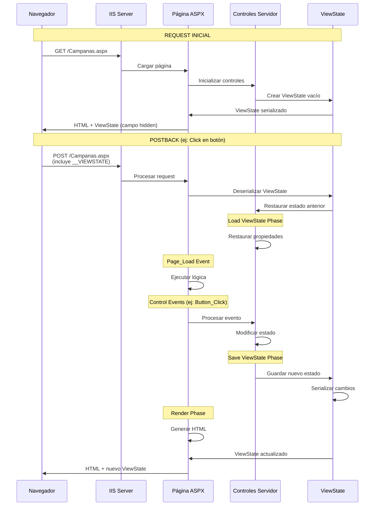
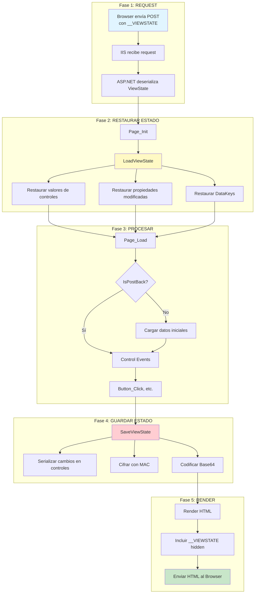
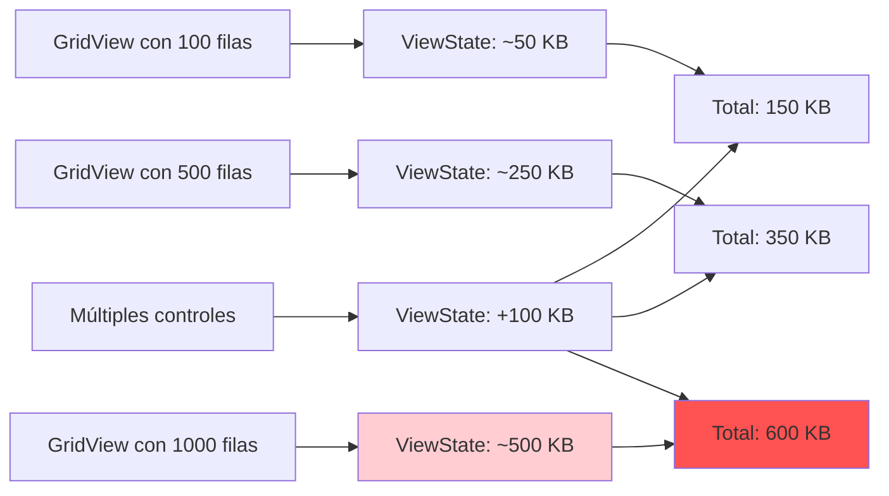
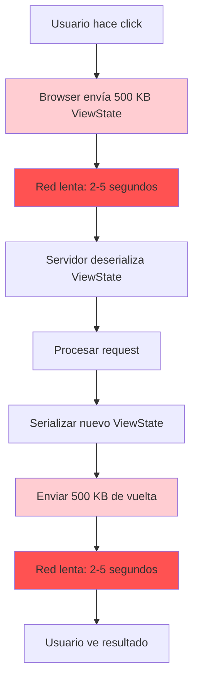
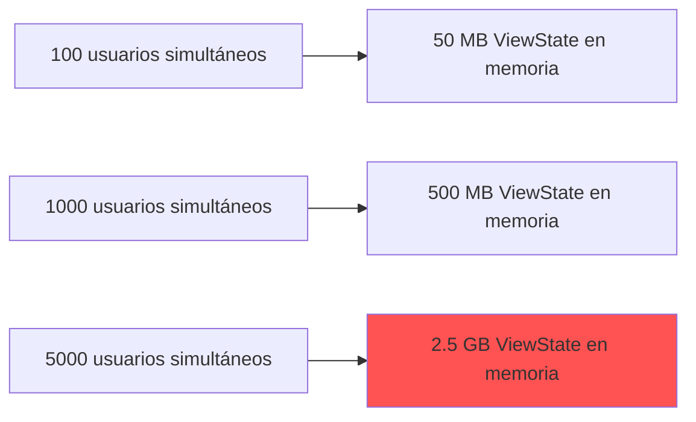

# ViewState - Gestión de Estado en ASP.NET Web Forms

> **IMPORTANTE**: Este documento describe cómo funciona ViewState en la aplicación **ACTUAL** (ASP.NET Web Forms 4.8).

---

## 1. ¿Qué es ViewState?

ViewState es un mecanismo de ASP.NET Web Forms para preservar el estado de los controles de servidor entre postbacks.

### Características Principales

- **Automático**: Se genera y gestiona automáticamente
- **Cifrado**: Se serializa y codifica en Base64
- **Cliente**: Se almacena en el navegador (campo hidden)
- **Postback**: Se envía en cada request al servidor

---

## 2. Diagrama de ViewState en el Ciclo de Vida



---

## 3. Estructura del ViewState

### 3.1 En el HTML

```html
<!-- ViewState generado automáticamente -->
<form method="post" action="./Campanas.aspx" id="form1">

    <!-- Campo hidden que contiene el ViewState -->
    <input type="hidden" name="__VIEWSTATE" id="__VIEWSTATE"
           value="/wEPDwUKMTY3ODM5NDU2Nw9kFgICAw9kFgICAQ8WAh4EVGV4dAUMSG9sYSBNdW5kbyEh..." />

    <!-- Control validation hash (para seguridad) -->
    <input type="hidden" name="__VIEWSTATEGENERATOR" id="__VIEWSTATEGENERATOR"
           value="CA0B0334" />

    <!-- Event validation (opcional) -->
    <input type="hidden" name="__EVENTVALIDATION" id="__EVENTVALIDATION"
           value="/wEdAAWDkVcON9..." />

    <!-- Controles visibles -->
    <asp:TextBox ID="txtNombre" runat="server" Text="Hola Mundo!!" />
    <asp:Button ID="btnGuardar" runat="server" Text="Guardar" />

</form>
```

### 3.2 Contenido del ViewState

El ViewState almacena:
- Valores de controles (TextBox.Text, DropDownList.SelectedValue, etc.)
- Propiedades modificadas (Visible, Enabled, CssClass, etc.)
- DataKeys de GridView/ListView
- Estado de controles dinámicos

---

## 4. Flujo Detallado del ViewState



---

## 5. Ejemplo de ViewState en ManteniWeb

### 5.1 Página Típica (Campanas.aspx)

```xml
<%@ Page Language="C#"
         MasterPageFile="~/Site.Master"
         AutoEventWireup="true"
         CodeBehind="Campanas.aspx.cs"
         Inherits="ManteniWeb.Campanas"
         EnableViewState="true" %>

<asp:Content ID="Content1" ContentPlaceHolderID="MainContent" runat="server">

    <!-- GridView con ViewState habilitado (default) -->
    <asp:GridView ID="gvCampanas" runat="server"
                  DataKeyNames="Id"
                  EnableViewState="true"
                  OnRowCommand="gvCampanas_RowCommand">
        <Columns>
            <asp:BoundField DataField="Alias" HeaderText="Campaña" />
            <asp:BoundField DataField="Estado" HeaderText="Estado" />
            <asp:CommandField ShowEditButton="true" />
        </Columns>
    </asp:GridView>

    <!-- Panel con controles -->
    <asp:Panel ID="pnlDetalle" runat="server" Visible="false">
        <asp:TextBox ID="txtAlias" runat="server" />
        <asp:DropDownList ID="ddlEstado" runat="server" />
        <asp:Button ID="btnGuardar" runat="server"
                    Text="Guardar"
                    OnClick="btnGuardar_Click" />
    </asp:Panel>

</asp:Content>
```

### 5.2 Code-Behind

```csharp
public partial class Campanas : System.Web.UI.Page
{
    protected void Page_Load(object sender, EventArgs e)
    {
        if (!IsPostBack)
        {
            // Primera carga - cargar datos
            CargarCampanas();
        }
        // En postback, los valores de los controles
        // ya están restaurados desde ViewState
    }

    private void CargarCampanas()
    {
        var bll = new CampanaBLL();
        gvCampanas.DataSource = bll.ObtenerTodas();
        gvCampanas.DataBind();
        // El GridView guarda los datos en ViewState automáticamente
    }

    protected void gvCampanas_RowCommand(object sender, GridViewCommandEventArgs e)
    {
        if (e.CommandName == "Edit")
        {
            // Obtener el ID desde ViewState (DataKeyNames)
            int rowIndex = Convert.ToInt32(e.CommandArgument);
            int campanaId = (int)gvCampanas.DataKeys[rowIndex].Value;

            // Mostrar panel (esta propiedad se guardará en ViewState)
            pnlDetalle.Visible = true;

            // El valor de Visible se preservará en el siguiente postback
        }
    }

    protected void btnGuardar_Click(object sender, EventArgs e)
    {
        // Los valores de los TextBox ya están restaurados desde ViewState
        string alias = txtAlias.Text; // Viene del ViewState
        string estado = ddlEstado.SelectedValue; // Viene del ViewState

        // Guardar...
    }
}
```

---

## 6. Tamaño del ViewState en ManteniWeb

### Problema Real

En la aplicación actual, el ViewState puede crecer significativamente:



### Impacto

| Tamaño ViewState | Impacto |
|------------------|---------|
| < 10 KB | Aceptable |
| 10-50 KB | Moderado |
| 50-200 KB | Alto |
| > 200 KB | Crítico |

**En ManteniWeb**: Páginas con GridView grandes (Registros, Histórico) pueden tener ViewState de **200-500 KB**.

---

## 7. Problemas del ViewState en la Aplicación Actual

### 7.1 Rendimiento



**Tiempo total**: 4-10 segundos en conexiones lentas

### 7.2 Seguridad

```csharp
// ViewState SIN cifrado ni MAC (vulnerable)
<pages enableViewStateMac="false"
       viewStateEncryptionMode="Never" />
```

**Riesgos**:
- ❌ ViewState puede ser modificado por el usuario
- ❌ No hay validación de integridad
- ❌ Información sensible expuesta

### 7.3 Escalabilidad



---

## 8. Optimizaciones Aplicadas (Limitadas)

### 8.1 Deshabilitar ViewState Selectivo

```xml
<!-- Deshabilitar para controles que no lo necesitan -->
<asp:Label ID="lblTitulo" runat="server" EnableViewState="false" />
<asp:Literal ID="litMensaje" runat="server" EnableViewState="false" />
```

### 8.2 Paginación

```xml
<!-- GridView con paginación reduce ViewState -->
<asp:GridView ID="gvRegistros" runat="server"
              AllowPaging="true"
              PageSize="25">
</asp:GridView>
```

### 8.3 UpdatePanel (AJAX)

```xml
<!-- Solo actualiza una parte de la página -->
<asp:UpdatePanel ID="upCampanas" runat="server" UpdateMode="Conditional">
    <ContentTemplate>
        <asp:GridView ID="gvCampanas" runat="server" />
    </ContentTemplate>
</asp:UpdatePanel>
```

**Pero**: Aún se envía el ViewState completo en cada AJAX request

---

## 9. Comparación: ViewState vs Estado en Angular

```mermaid
graph TB
    subgraph "ASP.NET Web Forms - ViewState"
        A1[Estado en servidor] --> B1[Serializado a Base64]
        B1 --> C1[Enviado al cliente]
        C1 --> D1[Campo hidden en HTML]
        D1 --> E1[Enviado de vuelta en postback]
        E1 --> F1[Deserializado en servidor]

        style D1 fill:#ffcdd2
        style E1 fill:#ffcdd2
    end

    subgraph "Angular - State Management"
        A2[Estado en cliente] --> B2[Objetos TypeScript]
        B2 --> C2[NgRx Store o Signals]
        C2 --> D2[Actualización reactiva]
        D2 --> E2[Solo se envían cambios al API]

        style C2 fill:#c8e6c9
        style E2 fill:#c8e6c9
    end
```



### Ventajas de Angular

| Aspecto | ViewState | Angular State |
|---------|-----------|---------------|
| Ubicación | Servidor → Cliente → Servidor | Cliente |
| Tamaño transferido | Todo el estado (100-500 KB) | Solo cambios (1-10 KB) |
| Velocidad | Lento (postback completo) | Rápido (actualización parcial) |
| Escalabilidad | Limitada | Alta |
| Experiencia usuario | Recargas constantes | Fluida, sin recargas |

---

## 10. Por Qué Migrar a Angular

### Problemas Insolubles con ViewState

1. **Performance**: No hay forma de evitar enviar ViewState en cada postback
2. **Escalabilidad**: ViewState consume memoria y ancho de banda
3. **UX**: Los postbacks siempre interrumpen la experiencia
4. **Mobile**: ViewState grande es inaceptable en 3G/4G

### Solución Angular

```typescript
// Estado gestionado en el cliente
export interface CampanaState {
  campanas: Campana[];
  selectedCampana: Campana | null;
  loading: boolean;
}

// Solo se envían datos necesarios al backend
this.http.post('/api/campanas', nuevaCampana).subscribe();
// Request: ~1 KB (solo los datos de la campaña)
// Response: ~0.5 KB (confirmación)
```

**Resultado**:
- ✅ Sin ViewState
- ✅ Sin postbacks
- ✅ Transferencia mínima
- ✅ UX fluida
- ✅ Escalable

---

## Conclusión

ViewState fue una solución innovadora en su momento (2002-2010) para simplificar el desarrollo web, pero:

- ❌ Genera overhead significativo (100-500 KB por request)
- ❌ Impacta negativamente el rendimiento
- ❌ No escala bien
- ❌ Incompatible con UX modernas
- ❌ No funciona bien en mobile

La migración a Angular eliminará completamente el ViewState, mejorando:
- ⚡ Performance (10x más rápido)
- 📈 Escalabilidad (stateless backend)
- 💰 Costos (menos ancho de banda)
- 😊 Experiencia de usuario (sin recargas)

---

**Documento**: ViewState en Aplicación Actual
**Versión**: 1.0
**Fecha**: 2025-10-27
