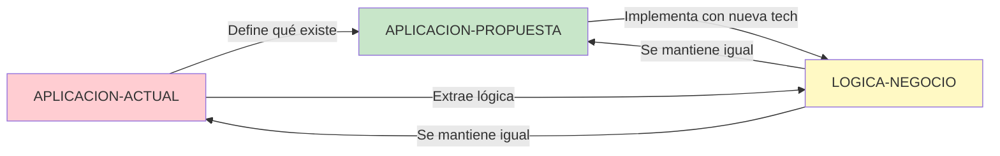

# 🔴 APLICACION-ACTUAL

> **Documentación de la aplicación EXISTENTE en producción**
> Tecnología: ASP.NET Web Forms 4.8 + SQL Server

---

## Propósito

Esta carpeta contiene toda la documentación técnica de la aplicación **actual** que está en producción. Todo lo que encuentres aquí describe **cómo funciona el sistema HOY**.

---

## Estructura

```
APLICACION-ACTUAL/
├── Arquitectura/         # Arquitectura técnica del sistema actual
├── Base-Datos/          # Esquema y configuración de las 4 bases de datos
├── Codigo/              # Inventario y estructura del código actual
└── Diagramas/           # Diagramas de flujo y secuencia actuales
```

---

## Arquitectura/

Documentación de la arquitectura técnica actual de ASP.NET Web Forms.

### Contenido

- **arquitectura-general-actual.md** - Visión general de la arquitectura Web Forms
  - Patrón Event-Driven
  - Capas: Presentación, Negocio, Datos
  - Tecnologías utilizadas (ASP.NET 4.8, Entity Framework 6, OLEDB)
  - Integraciones externas (Persuader, Asterisk, Chat, OAuth)
  - Problemas identificados

- **diagrama-viewstate.md** - Gestión de estado con ViewState
  - Qué es ViewState y cómo funciona
  - Ciclo de serialización/deserialización
  - Problemas de tamaño (50-500 KB)
  - Impacto en rendimiento

- **diagrama-postback.md** - Modelo de interacción Postback
  - Ciclo de vida de un postback
  - Fases del Page Lifecycle
  - Tipos de postback (completo vs parcial con AJAX)
  - Problemas de UX y performance

### ¿Por qué es importante?

Entender la arquitectura actual es crítico para:
- Identificar qué funcionalidad existe hoy
- Comprender limitaciones técnicas
- Planificar la migración correctamente
- Evitar pérdida de funcionalidad

---

## Base-Datos/

Documentación del esquema de base de datos actual y configuración de conexiones.

### Contenido

- **diagrama-er-actual.md** - Diagrama Entidad-Relación completo
  - 4 bases de datos: CC_GENERAL, CC_TIPHONE, CC_IVR, CC_ESTADISTICAS
  - 40+ tablas principales
  - Relaciones entre entidades
  - Análisis de normalización

- **configuracion-conexiones-actual.md** - Configuración de conexiones
  - Cadenas de conexión del Web.config
  - Integraciones externas (APIs, servicios)
  - Problemas de seguridad identificados (credenciales hardcoded)

### ¿Por qué es importante?

La base de datos:
- Permanecerá mayormente igual en la migración
- Contiene la lógica de negocio más importante
- Debe ser compatible con el nuevo backend .NET Core

---

## Codigo/

Inventario completo del código fuente actual.

### Contenido

- **inventario-archivos-actual.md** - Catálogo de las 155 páginas ASPX
  - Organizado por módulo funcional
  - Nivel de complejidad (baja, media, alta)
  - Prioridad de migración (crítica, alta, media, baja)
  - Dependencias identificadas

- **estructura-proyecto-actual.md** - Estructura de carpetas y archivos
  - Organización del proyecto ASP.NET
  - Patrones identificados
  - User Controls (.ascx)
  - Web Services (.asmx)
  - JavaScript legacy

### ¿Por qué es importante?

El inventario de código:
- Define el alcance exacto del proyecto de migración
- Permite estimar tiempos y costos
- Identifica las prioridades
- Mapea dependencias críticas

---

## Diagramas/

Diagramas de flujo y secuencia que muestran cómo funciona la aplicación actual.

### Contenido Futuro

- diagrama-secuencia-login-actual.md - Autenticación con Forms Authentication
- diagrama-secuencia-llamada-actual.md - Proceso de llamada outbound actual
- diagrama-flujo-campana-actual.md - Creación y gestión de campañas
- diagrama-componentes-actual.md - Componentes del sistema actual

### ¿Por qué es importante?

Los diagramas de la aplicación actual:
- Documentan procesos que NO están en el código
- Capturan conocimiento tácito del equipo
- Sirven de referencia para la nueva implementación
- Identifican puntos de mejora

---

## Cómo Usar Esta Documentación

### Si eres Desarrollador
1. Lee **Arquitectura/** para entender el sistema actual
2. Consulta **Codigo/inventario-archivos-actual.md** para ver qué páginas existen
3. Revisa **Base-Datos/** para entender el modelo de datos
4. Compara con **APLICACION-PROPUESTA/** para ver las diferencias

### Si eres Arquitecto
1. Comienza con **Arquitectura/arquitectura-general-actual.md**
2. Analiza los problemas identificados
3. Revisa **Base-Datos/diagrama-er-actual.md**
4. Usa esta info para validar decisiones de la arquitectura propuesta

### Si eres Project Manager
1. Usa **Codigo/inventario-archivos-actual.md** para entender alcance
2. Identifica módulos críticos
3. Prioriza según dependencias
4. Planifica fases de migración

### Si eres QA/Tester
1. Usa **Diagramas/** para entender flujos actuales
2. Compara comportamiento actual vs propuesto
3. Genera casos de prueba de regresión
4. Valida que no se pierde funcionalidad

---

## Estado de la Documentación

| Sección | Estado | Completitud |
|---------|--------|-------------|
| Arquitectura/ | ✅ Completo | 100% |
| Base-Datos/ | ✅ Completo | 100% |
| Codigo/ | ✅ Completo | 100% |
| Diagramas/ | ⏳ En progreso | 30% |

---

## Relación con Otras Carpetas



- **APLICACION-ACTUAL** → Define QUÉ funcionalidad existe
- **LOGICA-NEGOCIO** → Extrae las reglas de negocio que no cambian
- **APLICACION-PROPUESTA** → Define CÓMO implementar en nueva tecnología

---

## Notas Importantes

### ⚠️ Esta documentación describe el PASADO
Todo lo que veas aquí es el estado ACTUAL del sistema. Si quieres ver cómo será el futuro, consulta **APLICACION-PROPUESTA/**.

### ⚠️ Problemas identificados
Esta documentación también identifica problemas de la arquitectura actual:
- ViewState grande (impacto en rendimiento)
- Postbacks lentos (mala UX)
- Seguridad (credenciales hardcoded, CustomErrors off)
- Escalabilidad limitada

### ⚠️ No modificar la aplicación actual
La aplicación actual seguirá en producción durante la migración. Los problemas documentados se resolverán en la nueva aplicación.

---

## Próximos Pasos

1. ✅ Has leído la documentación del sistema actual
2. ➡️ Continúa con **LOGICA-NEGOCIO/** para entender las reglas de negocio
3. ➡️ Luego ve a **APLICACION-PROPUESTA/** para ver la nueva arquitectura

---

**Última actualización**: 2025-10-27
