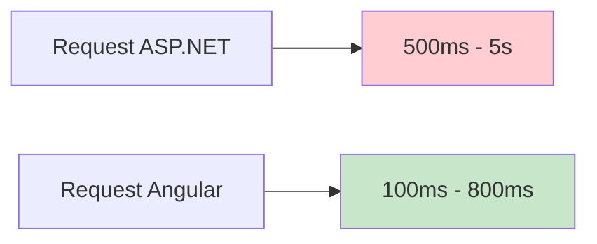
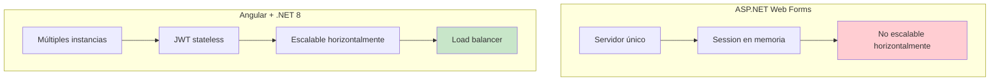
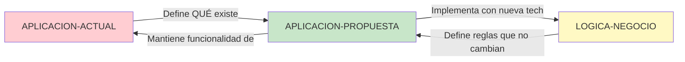

# 🟢 APLICACION-PROPUESTA

> **Documentación de la NUEVA aplicación a desarrollar**
> Tecnología: Angular 17+ + .NET 8 + SQL Server

---

## Propósito

Esta carpeta contiene toda la documentación técnica de la **nueva aplicación** que se va a construir. Todo lo que encuentres aquí describe **cómo funcionará el sistema FUTURO**.

---

## Estructura

```
APLICACION-PROPUESTA/
├── Arquitectura-Angular/   # Diseño del frontend en Angular
├── Arquitectura-DotNet/    # Diseño del backend en .NET 8
├── Base-Datos/             # Optimizaciones de BD propuestas
└── Migracion/              # Estrategia y plan de migración
```

---

## Arquitectura-Angular/

Documentación completa del frontend Angular (SPA - Single Page Application).

### Contenido

- **diagrama-arquitectura-propuesta.md** - Arquitectura general Angular
  - Comparación Actual vs Propuesta
  - Arquitectura de microservicios
  - Deployment
  - Seguridad (JWT)
  - Estrategia de migración (Strangler Pattern)

- **diagramas-secuencia-propuesta.md** - Flujos de interacción con API REST
  - Autenticación con JWT
  - Creación de campaña
  - Asignación de operadores
  - Supervisión en tiempo real con SignalR
  - Llamada outbound
  - Gestión de chat
  - Auto-reprogramación
  - Exportación a Excel

- **estructura-componentes-propuesta.md** - Organización de componentes Angular
  - Estructura de carpetas del proyecto Angular
  - Árbol de componentes por módulo (14 módulos)
  - Patrón Smart/Presentational
  - Servicios Angular
  - Guards, Interceptors, Directivas, Pipes
  - State Management (NgRx/Signals)

### ¿Por qué Angular?

- ✅ Framework maduro y escalable
- ✅ TypeScript (tipado fuerte)
- ✅ Component-based architecture
- ✅ Excelente UX (SPA sin recargas)
- ✅ Amplia comunidad y soporte
- ✅ CLI potente para desarrollo
- ✅ Compatible con Progressive Web Apps

---

## Arquitectura-DotNet/

Documentación completa del backend .NET 8 Web API.

### Contenido

- **diagramas-clases-propuesta.md** - Modelo de dominio y clases
  - Módulo Campañas
  - Módulo Operadores
  - Módulo Tipificaciones
  - Módulo Calendario
  - Módulo IVR
  - Módulo Chat
  - Módulo Supervisión
  - Repository Pattern
  - Unit of Work Pattern

### Patrones Aplicados

**Clean Architecture**:
```
Domain/          # Entidades, interfaces
Application/     # Casos de uso, DTOs, validaciones
Infrastructure/  # EF Core, repositorios, servicios externos
API/            # Controllers, middleware, filters
```

**Principios SOLID**:
- Single Responsibility
- Open/Closed
- Liskov Substitution
- Interface Segregation
- Dependency Inversion

### ¿Por qué .NET 8?

- ✅ Cross-platform (Linux, Windows, macOS)
- ✅ Alto rendimiento (más rápido que .NET Framework)
- ✅ Soporte LTS hasta 2026
- ✅ Entity Framework Core (ORM moderno)
- ✅ Dependency Injection nativo
- ✅ Middleware pipeline flexible
- ✅ SignalR para real-time
- ✅ Hosting más económico

---

## Base-Datos/

Optimizaciones y cambios propuestos para la base de datos.

### Contenido Futuro

- **diagrama-er-propuesto.md** - ER optimizado
  - Misma estructura base que actual
  - Índices optimizados
  - Vistas para consultas complejas
  - Cambios mínimos para mantener compatibilidad

- **cambios-respecto-actual.md** - Qué cambia y por qué
  - Nuevos índices para mejorar performance
  - Normalización adicional donde sea necesario
  - Campos adicionales para auditoría

- **migraciones.md** - Scripts de migración de datos
  - Estrategia de migración de datos
  - Scripts SQL
  - Validaciones

### Filosofía

**Cambios mínimos**: La base de datos actual está bien diseñada. Solo se harán optimizaciones donde el impacto sea significativo.

---

## Migracion/

Estrategia y planificación de la migración incremental.

### Contenido Futuro

- **estrategia-migracion.md** - Strangler Pattern
  - Migración incremental por módulos
  - Coexistencia temporal de ambas aplicaciones
  - Proxy/Gateway para routing

- **matriz-conversion.md** - Mapeo ASPX → Angular Component
  - Tabla de conversión página por página
  - Complejidad estimada
  - Dependencias

- **plan-fases.md** - Fases de migración
  - Fase 1: Módulos independientes (Calendario, Tipificaciones)
  - Fase 2: Módulos core (Campañas, Operadores)
  - Fase 3: Módulos complejos (Chat, IVR)
  - Fase 4: Supervisión y reportes
  - Fase 5: Testing y cutover

- **riesgos-mitigacion.md** - Gestión de riesgos
  - Riesgos técnicos identificados
  - Plan de mitigación para cada riesgo
  - Plan de contingencia

- **rollback-plan.md** - Plan de vuelta atrás
  - Cómo revertir si algo falla
  - Puntos de no-retorno
  - Backups y recovery

---

## Cómo Usar Esta Documentación

### Si eres Desarrollador Angular
1. Lee **Arquitectura-Angular/estructura-componentes-propuesta.md**
2. Revisa **Arquitectura-Angular/diagramas-secuencia-propuesta.md** para entender flujos
3. Consulta **LOGICA-NEGOCIO/** para las reglas de negocio
4. Implementa componentes siguiendo los patrones establecidos

### Si eres Desarrollador .NET
1. Lee **Arquitectura-DotNet/diagramas-clases-propuesta.md**
2. Implementa siguiendo Clean Architecture
3. Consulta **Base-Datos/** para el modelo de datos
4. Implementa APIs RESTful con documentación Swagger

### Si eres Arquitecto
1. Revisa toda la carpeta **Arquitectura-Angular/** y **Arquitectura-DotNet/**
2. Valida decisiones técnicas
3. Asegura coherencia con **LOGICA-NEGOCIO/**
4. Define estándares de código y patrones

### Si eres Project Manager
1. Usa **Migracion/plan-fases.md** para planificación
2. Consulta **Migracion/riesgos-mitigacion.md** para gestión de riesgos
3. Revisa **Migracion/matriz-conversion.md** para estimaciones
4. Coordina con equipos usando la documentación como referencia

### Si eres QA/Tester
1. Compara **APLICACION-ACTUAL/** vs **APLICACION-PROPUESTA/**
2. Genera test cases basados en **LOGICA-NEGOCIO/**
3. Valida que los flujos de **diagramas-secuencia-propuesta.md** funcionen
4. Prueba performance y escalabilidad

---

## Estado de la Documentación

| Sección | Estado | Completitud |
|---------|--------|-------------|
| Arquitectura-Angular/ | ✅ Completo | 100% |
| Arquitectura-DotNet/ | ✅ Completo | 100% |
| Base-Datos/ | ⏳ Planeado | 0% |
| Migracion/ | ⏳ Planeado | 0% |

---

## Ventajas de la Nueva Arquitectura

### Performance



**Mejora**: 5-10x más rápido

### Escalabilidad



### User Experience

| Aspecto | Actual | Propuesta |
|---------|--------|-----------|
| Carga inicial | 2-5s | 1-3s |
| Interacciones | 500ms-5s (postback) | 100-500ms (sin recarga) |
| Feedback | Después de completar | Inmediato |
| Mobile | Funciona mal | Responsive + PWA |
| Offline | No funciona | Posible con Service Workers |

### Costos Operativos

- **Hosting**: 40% más económico (Linux vs Windows Server)
- **Licencias**: Sin licencias de Windows Server
- **Mantenimiento**: Más simple (stateless, logs estructurados)
- **Desarrollo**: Más rápido (Angular CLI, .NET CLI, hot reload)

---

## Tecnologías Elegidas

### Frontend

| Tecnología | Versión | Propósito |
|-----------|---------|-----------|
| Angular | 17+ | Framework SPA |
| TypeScript | 5.0+ | Lenguaje tipado |
| RxJS | 7.8+ | Programación reactiva |
| NgRx o Signals | Latest | State management |
| Angular Material o PrimeNG | Latest | UI Components |
| Chart.js | Latest | Gráficos |
| Socket.IO Client | Latest | Real-time |

### Backend

| Tecnología | Versión | Propósito |
|-----------|---------|-----------|
| .NET | 8 LTS | Framework |
| C# | 12 | Lenguaje |
| Entity Framework Core | 8 | ORM |
| ASP.NET Core Web API | 8 | REST API |
| SignalR | 8 | Real-time |
| Serilog | Latest | Logging |
| FluentValidation | Latest | Validaciones |
| AutoMapper | Latest | Object mapping |
| Swagger/OpenAPI | Latest | Documentación API |

### Base de Datos

| Componente | Tecnología |
|-----------|------------|
| Motor | SQL Server (mantener actual) |
| Migración | EF Core Migrations |
| Consultas complejas | Stored Procedures (existentes) |
| Cache | Redis (opcional para alta carga) |

---

## Comparación Visual: Actual vs Propuesta

```mermaid
graph TB
    subgraph "ACTUAL - ASP.NET Web Forms"
        A1[Browser] -->|POST con ViewState| B1[IIS]
        B1 --> C1[ASPX Pages]
        C1 --> D1[Code-Behind]
        D1 --> E1[BLL DLLs]
        E1 --> F1[DAL + EF6]
        F1 --> G1[(SQL Server)]

        style C1 fill:#ffcdd2
        style D1 fill:#ffcdd2
    end

    subgraph "PROPUESTA - Angular + .NET 8"
        A2[Browser] -->|JSON requests| B2[Angular SPA]
        B2 -->|HTTP/SignalR| C2[.NET 8 API]
        C2 --> D2[Application Layer]
        D2 --> E2[Domain Layer]
        E2 --> F2[Infrastructure]
        F2 --> G2[(SQL Server)]

        style B2 fill:#c8e6c9
        style C2 fill:#c8e6c9
    end
```



---

## Relación con Otras Carpetas



- **APLICACION-ACTUAL** → Qué funcionalidad existe hoy
- **LOGICA-NEGOCIO** → Reglas de negocio que se mantienen
- **APLICACION-PROPUESTA** → Cómo implementar con tecnología moderna

---

## Notas Importantes

### ✅ Esta es la documentación del FUTURO
Todo lo que ves aquí es el diseño de la nueva aplicación. Si quieres saber cómo funciona HOY, consulta **APLICACION-ACTUAL/**.

### ✅ Compatibilidad con lógica de negocio
Aunque la tecnología cambia, la funcionalidad y reglas de negocio se mantienen. Ver **LOGICA-NEGOCIO/**.

### ✅ Arquitectura moderna
Clean Architecture + SOLID + Design Patterns = Código mantenible y testeable.

### ✅ Estrategia de migración incremental
No "big bang". Migración por fases usando Strangler Pattern.

---

## Próximos Pasos

1. ✅ Has revisado la arquitectura propuesta
2. ➡️ Consulta **LOGICA-NEGOCIO/** para entender las reglas que debes implementar
3. ➡️ Revisa **Migracion/** para el plan de ejecución
4. ➡️ Comienza el desarrollo siguiendo los patrones documentados

---

**Última actualización**: 2025-10-27
