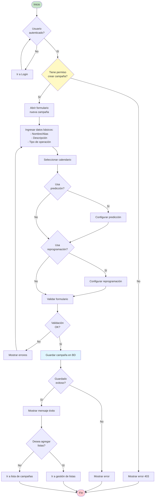
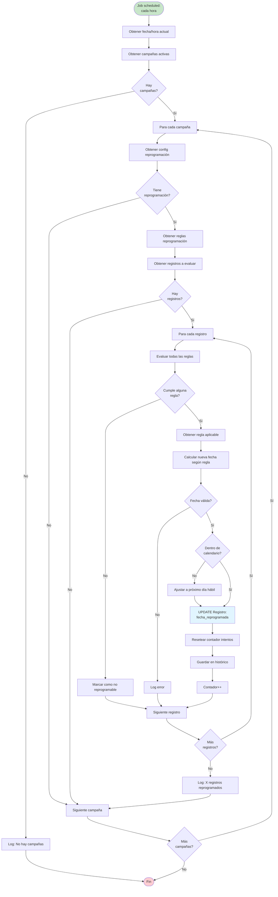

# Diagramas de Flujo de Procesos de Negocio

## 1. Proceso de Alta de Campaña



---

## 2. Proceso de Marcación de Llamada (Outbound)

```mermaid
flowchart TD
    Start([Operador disponible]) --> CheckCampana{Hay campaña<br/>activa?}

    CheckCampana -->|No| WaitCampana[Esperar asignación]
    WaitCampana --> CheckCampana

    CheckCampana -->|Sí| CheckHorario{Dentro de<br/>horario?}
    CheckHorario -->|No| WaitHorario[Esperar horario]
    WaitHorario --> CheckHorario

    CheckHorario -->|Sí| GetRegistro[Obtener próximo registro<br/>según algoritmo predictivo]
    GetRegistro --> CheckRegistro{Registro<br/>disponible?}

    CheckRegistro -->|No| NoRegistros[No hay más registros]
    NoRegistros --> End([Fin])

    CheckRegistro -->|Sí| CheckIntentos{Intentos < Max?}
    CheckIntentos -->|No| MarcarNoContactable[Marcar como no contactable]
    MarcarNoContactable --> GetRegistro

    CheckIntentos -->|Sí| ShowCliente[Mostrar datos del cliente<br/>en pantalla]
    ShowCliente --> TipoMarcacion{Tipo de<br/>marcación}

    TipoMarcacion -->|Manual| WaitOperador[Esperar que operador<br/>pulse "Llamar"]
    TipoMarcacion -->|Predictiva| AutoDial[Marcar automáticamente]

    WaitOperador --> Dial[Iniciar llamada]
    AutoDial --> Dial

    Dial --> Calling[Estado: Llamando...]
    Calling --> LlamadaResult{Resultado<br/>llamada}

    LlamadaResult -->|No contesta| NoAnswer[Incrementar intentos]
    NoAnswer --> Reprogramar{Debe<br/>reprogramar?}
    Reprogramar -->|Sí| ReprogDate[Calcular nueva fecha]
    ReprogDate --> SaveReintento[Guardar reintento]
    SaveReintento --> GetRegistro

    Reprogramar -->|No| GetRegistro

    LlamadaResult -->|Ocupado| Busy[Marcar como ocupado]
    Busy --> Reprogramar

    LlamadaResult -->|Contesta| Answered[Cliente contestó]
    Answered --> StartTimer[Iniciar timer conversación]
    StartTimer --> Conversation[Conversación...]
    Conversation --> EndCall[Finalizar llamada]

    EndCall --> Tipificar[Mostrar modal tipificación]
    Tipificar --> SelectTipPrimaria[Seleccionar tipificación primaria]
    SelectTipPrimaria --> SelectTipSecundaria[Seleccionar tipificación secundaria]
    SelectTipSecundaria --> AddNotas{Agregar<br/>notas?}

    AddNotas -->|Sí| InputNotas[Ingresar notas]
    InputNotas --> SaveTipif
    AddNotas -->|No| SaveTipif[Guardar tipificación]

    SaveTipif --> UpdateRegistro[Actualizar registro en BD]
    UpdateRegistro --> SaveEstadisticas[Guardar estadísticas]
    SaveEstadisticas --> CheckResultado{Resultado<br/>positivo?}

    CheckResultado -->|Sí| Gestion[Mostrar operación de negocio]
    Gestion --> EndGestion[Finalizar gestión]
    EndGestion --> GetRegistro

    CheckResultado -->|No| GetRegistro

    style Start fill:#c8e6c9
    style Answered fill:#a5d6a7
    style NoAnswer fill:#ffcdd2
    style SaveTipif fill:#e1f5ff
```

---

## 3. Proceso de Asignación de Operador a Grupo

```mermaid
flowchart TD
    Start([Inicio]) --> SelectGrupo[Seleccionar grupo]
    SelectGrupo --> ViewGrupo[Ver detalle del grupo]
    ViewGrupo --> ClickAsignar[Click "Asignar operador"]

    ClickAsignar --> OpenModal[Abrir modal selección]
    OpenModal --> LoadOperadores[Cargar operadores disponibles]
    LoadOperadores --> CheckOperadores{Hay operadores<br/>disponibles?}

    CheckOperadores -->|No| NoOperadores[Mostrar mensaje:<br/>"No hay operadores disponibles"]
    NoOperadores --> End([Fin])

    CheckOperadores -->|Sí| ShowList[Mostrar lista de operadores]
    ShowList --> FilterOperadores{Filtrar?}

    FilterOperadores -->|Sí| ApplyFilter[Aplicar filtro]
    ApplyFilter --> ShowList
    FilterOperadores -->|No| SelectOperador[Seleccionar operador]

    SelectOperador --> CheckYaAsignado{Ya está<br/>asignado?}
    CheckYaAsignado -->|Sí| ShowWarning[Mostrar advertencia]
    ShowWarning --> SelectOperador

    CheckYaAsignado -->|No| SetPrioridad[Establecer prioridad<br/>1-10]
    SetPrioridad --> ValidatePrioridad{Prioridad<br/>válida?}

    ValidatePrioridad -->|No| ErrorPrioridad[Error: prioridad inválida]
    ErrorPrioridad --> SetPrioridad

    ValidatePrioridad -->|Sí| ConfirmAsignar[Click "Asignar"]
    ConfirmAsignar --> SaveAsignacion[Guardar en BD:<br/>OperadorGrupo]

    SaveAsignacion --> CheckSave{Guardado<br/>exitoso?}
    CheckSave -->|No| ErrorSave[Mostrar error]
    ErrorSave --> End

    CheckSave -->|Sí| UpdateCache[Actualizar caché]
    UpdateCache --> NotifySystem[Notificar al sistema]
    NotifySystem --> CloseModal[Cerrar modal]
    CloseModal --> RefreshList[Refrescar lista de operadores]
    RefreshList --> ShowSuccess[Mostrar mensaje éxito]
    ShowSuccess --> End

    style Start fill:#c8e6c9
    style End fill:#ffcdd2
    style SaveAsignacion fill:#e1f5ff
    style ShowSuccess fill:#a5d6a7
```

---

## 4. Proceso de Gestión de Chat

```mermaid
flowchart TD
    Start([Cliente inicia chat]) --> ShowPreChat[Mostrar formulario pre-chat]
    ShowPreChat --> FillForm[Cliente completa:<br/>- Nombre<br/>- Email<br/>- Motivo]

    FillForm --> SubmitForm[Enviar formulario]
    SubmitForm --> ValidateForm{Formulario<br/>válido?}

    ValidateForm -->|No| ShowErrors[Mostrar errores]
    ShowErrors --> FillForm

    ValidateForm -->|Sí| CreateGestion[Crear GestionChat en BD]
    CreateGestion --> AddToQueue[Agregar a cola de espera]
    AddToQueue --> ShowWaiting[Mostrar: "Espere su turno"<br/>Posición en cola: X]

    ShowWaiting --> CheckOperador{Operador<br/>disponible?}
    CheckOperador -->|No| UpdatePosition[Actualizar posición en cola]
    UpdatePosition --> CheckOperador

    CheckOperador -->|Sí| AssignOperador[Asignar operador]
    AssignOperador --> NotifyOperador[Notificar a operador]
    NotifyOperador --> OperadorAccept{Operador<br/>acepta?}

    OperadorAccept -->|No| Timeout[Timeout 30s]
    Timeout --> ReassignQueue[Reasignar a cola]
    ReassignQueue --> CheckOperador

    OperadorAccept -->|Sí| StartChat[Iniciar chat]
    StartChat --> ShowConnected[Mostrar: "Conectado con<br/>operador: Juan"]

    ShowConnected --> ChatLoop[Loop de mensajes]
    ChatLoop --> WaitMessage{Esperar<br/>mensaje}

    WaitMessage -->|Cliente envía| ClientMessage[Enviar mensaje cliente]
    WaitMessage -->|Operador envía| OperadorMessage[Enviar mensaje operador]
    WaitMessage -->|Timeout| CheckTimeout{Timeout > 5min?}

    ClientMessage --> SaveMessage1[Guardar en BD]
    SaveMessage1 --> NotifyOper[Notificar a operador]
    NotifyOper --> ChatLoop

    OperadorMessage --> SaveMessage2[Guardar en BD]
    SaveMessage2 --> NotifyClient[Notificar a cliente]
    NotifyClient --> ChatLoop

    CheckTimeout -->|No| ChatLoop
    CheckTimeout -->|Sí| AutoClose[Auto-cerrar por inactividad]
    AutoClose --> EndChat

    WaitMessage -->|Cliente cierra| ClientClose[Cliente finaliza chat]
    WaitMessage -->|Operador cierra| OperadorClose[Operador finaliza chat]

    ClientClose --> EndChat[Finalizar chat]
    OperadorClose --> EndChat

    EndChat --> UpdateDuration[Calcular duración total]
    UpdateDuration --> ShowPostChat{Mostrar<br/>post-chat?}

    ShowPostChat -->|Sí| PostChatForm[Mostrar formulario satisfacción]
    PostChatForm --> ClientRate[Cliente califica]
    ClientRate --> SaveRating[Guardar calificación]
    SaveRating --> UpdateStats

    ShowPostChat -->|No| UpdateStats[Actualizar estadísticas]
    UpdateStats --> OperadorTipify[Operador tipifica chat]
    OperadorTipify --> SaveFinal[Guardar datos finales]
    SaveFinal --> End([Fin])

    style Start fill:#c8e6c9
    style StartChat fill:#a5d6a7
    style EndChat fill:#ffcdd2
    style End fill:#ffcdd2
```

---

## 5. Proceso de Reprogramación Automática



---

## 6. Proceso de Supervisión en Tiempo Real

```mermaid
flowchart TD
    Start([Supervisor abre<br/>supervisión]) --> CheckAuth{Autenticado?}
    CheckAuth -->|No| Login[Ir a Login]
    Login --> CheckAuth

    CheckAuth -->|Sí| CheckPerm{Permiso<br/>supervisar?}
    CheckPerm -->|No| Error403[Error 403]
    Error403 --> End([Fin])

    CheckPerm -->|Sí| SelectCampana[Seleccionar campaña]
    SelectCampana --> LoadInitial[Cargar datos iniciales]
    LoadInitial --> ConnectWS[Conectar WebSocket/SignalR]
    ConnectWS --> JoinRoom[Join room: campana-{id}]
    JoinRoom --> ShowDashboard[Mostrar dashboard]

    ShowDashboard --> Subscribe[Suscribirse a eventos]
    Subscribe --> WaitEvents{Esperar eventos}

    WaitEvents -->|Update métricas| OnMetricas[Recibir métricas]
    OnMetricas --> UpdateCharts[Actualizar gráficos]
    UpdateCharts --> UpdateTables[Actualizar tablas]
    UpdateTables --> WaitEvents

    WaitEvents -->|Operador cambio estado| OnEstado[Recibir cambio estado]
    OnEstado --> UpdateOperList[Actualizar lista operadores]
    UpdateOperList --> WaitEvents

    WaitEvents -->|Nueva llamada| OnLlamada[Recibir nueva llamada]
    OnLlamada --> IncrementCounter[Incrementar contador]
    IncrementCounter --> UpdateLiveData[Actualizar datos en vivo]
    UpdateLiveData --> WaitEvents

    WaitEvents -->|Llamada finalizada| OnEndLlamada[Recibir fin llamada]
    OnEndLlamada --> UpdateResults[Actualizar resultados]
    UpdateResults --> WaitEvents

    WaitEvents -->|Supervisor acción| SupervisorAction{Tipo de<br/>acción}

    SupervisorAction -->|Pausar campaña| PauseCampana[Pausar campaña]
    PauseCampana --> SendCommand[Enviar comando a servidor]
    SendCommand --> WaitEvents

    SupervisorAction -->|Escuchar llamada| ListenCall[Escuchar llamada operador]
    ListenCall --> OpenAudioStream[Abrir stream de audio]
    OpenAudioStream --> WaitEvents

    SupervisorAction -->|Ver detalle operador| ViewOperador[Mostrar detalle operador]
    ViewOperador --> WaitEvents

    SupervisorAction -->|Cerrar supervisión| Disconnect[Desconectar WebSocket]
    Disconnect --> LeaveRoom[Leave room]
    LeaveRoom --> SaveSession[Guardar sesión supervisión]
    SaveSession --> End

    style Start fill:#c8e6c9
    style ShowDashboard fill:#e1f5ff
    style WaitEvents fill:#fff9c4
    style End fill:#ffcdd2
```

---

## 7. Proceso de Exportación a Excel

```mermaid
flowchart TD
    Start([Usuario solicita<br/>exportación]) --> OpenModal[Abrir modal opciones]
    OpenModal --> SelectFields[Seleccionar campos a exportar]
    SelectFields --> SetFilters{Aplicar<br/>filtros?}

    SetFilters -->|Sí| ConfigFilters[Configurar filtros]
    ConfigFilters --> ValidateFilters{Filtros<br/>válidos?}
    ValidateFilters -->|No| ErrorFilters[Mostrar error filtros]
    ErrorFilters --> ConfigFilters
    ValidateFilters -->|Sí| SelectFormat

    SetFilters -->|No| SelectFormat[Seleccionar formato:<br/>- Todos los datos<br/>- Solo visibles<br/>- Selección]

    SelectFormat --> CheckCount[Consultar cantidad de registros]
    CheckCount --> CountResult{Cantidad}

    CountResult -->|> 50,000| ShowWarning[Advertencia:<br/>"Muchos registros"]
    ShowWarning --> ConfirmLarge{Continuar?}
    ConfirmLarge -->|No| End([Fin])
    ConfirmLarge -->|Sí| StartExport

    CountResult -->|<= 50,000| StartExport[Iniciar exportación]

    StartExport --> ShowProgress[Mostrar barra progreso]
    ShowProgress --> RequestAPI[POST /api/export/excel]
    RequestAPI --> ServerProcess[Servidor procesa]

    ServerProcess --> QueryDB[Query a base de datos]
    QueryDB --> CheckBatches{Más de 10K<br/>registros?}

    CheckBatches -->|Sí| ProcessBatches[Procesar en lotes de 5K]
    ProcessBatches --> BuildExcel[Construir archivo Excel]

    CheckBatches -->|No| BuildExcel

    BuildExcel --> ApplyStyles[Aplicar estilos]
    ApplyStyles --> GenerateFile[Generar archivo]
    GenerateFile --> ReturnFile[Retornar archivo]

    ReturnFile --> ReceiveFile[Cliente recibe archivo]
    ReceiveFile --> DownloadFile[Descargar archivo]
    DownloadFile --> ShowSuccess[Mostrar éxito]
    ShowSuccess --> End

    RequestAPI -.Error.- HandleError[Manejar error]
    HandleError --> ShowError[Mostrar mensaje error]
    ShowError --> Retry{Reintentar?}
    Retry -->|Sí| RequestAPI
    Retry -->|No| End

    style Start fill:#c8e6c9
    style BuildExcel fill:#e1f5ff
    style ShowSuccess fill:#a5d6a7
    style End fill:#ffcdd2
```

---

## Leyenda de Símbolos

- **Rectángulo**: Proceso/Acción
- **Rombo**: Decisión/Condición
- **Rectángulo redondeado**: Inicio/Fin
- **Paralelogramo**: Entrada/Salida de datos
- **Flecha**: Flujo de proceso

## Convenciones de Colores

- 🟢 Verde: Inicio
- 🔴 Rojo: Fin/Error
- 🔵 Azul: Proceso importante
- 🟡 Amarillo: Decisión crítica
