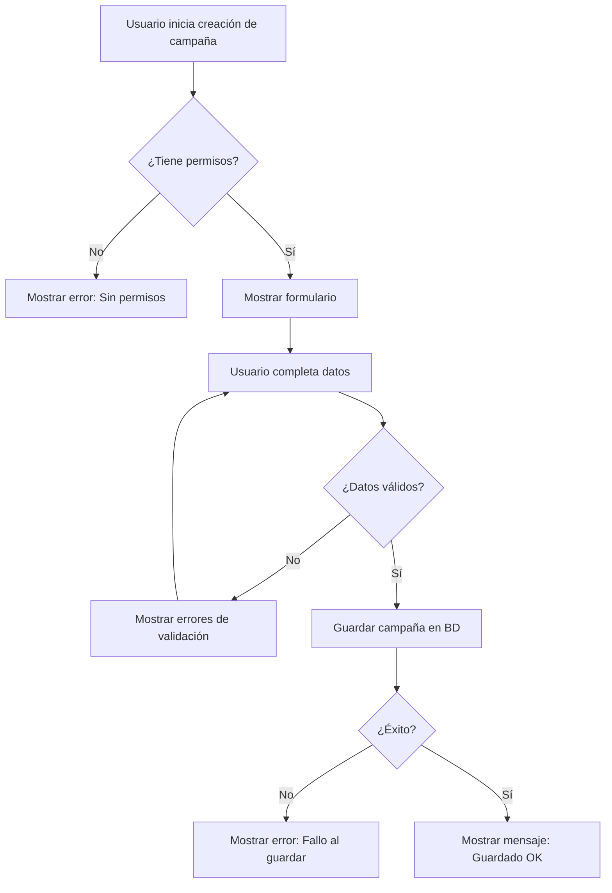
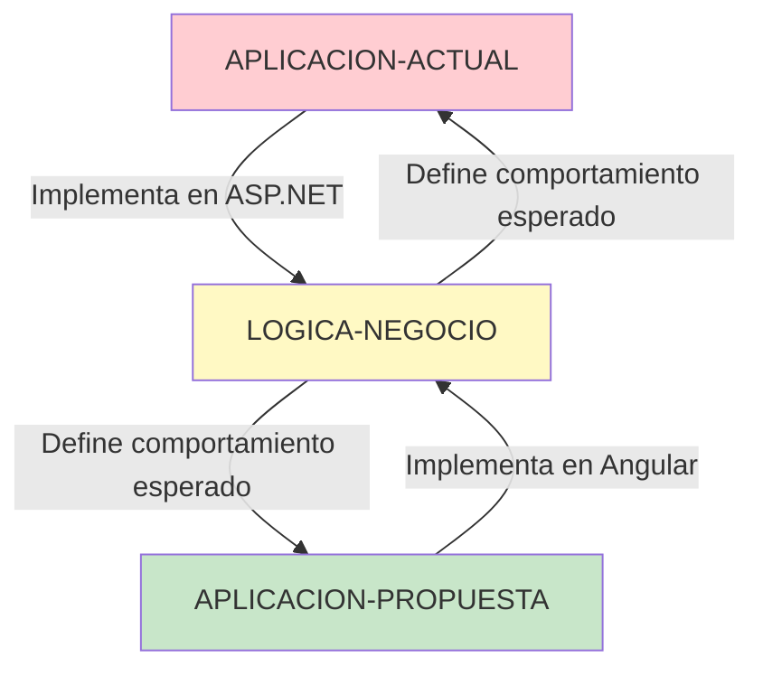
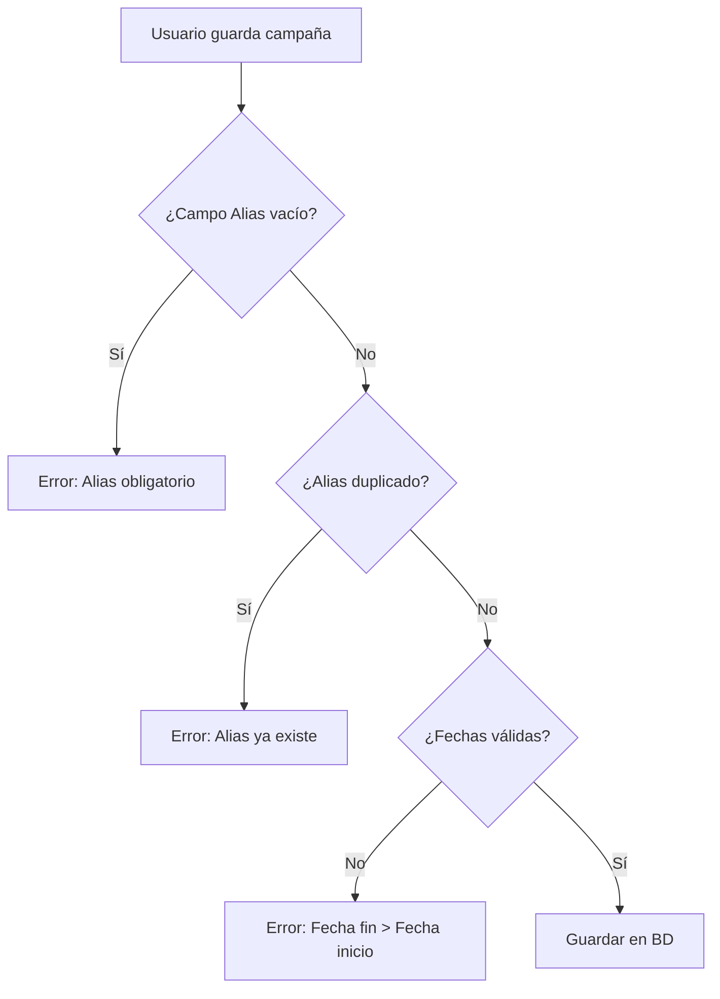

# 🟡 LOGICA-NEGOCIO

> **Reglas de negocio y flujos que NO cambian entre versiones**
> Independiente de la tecnología

---

## Propósito

Esta carpeta contiene la documentación de la **lógica de negocio pura** de Tiphone v6. Estas reglas y flujos son **independientes de la tecnología** utilizada y permanecen **iguales** tanto en la aplicación actual como en la propuesta.

---

## ¿Por qué es importante?

La lógica de negocio:
- ✅ Define QUÉ hace el sistema (no CÓMO lo implementa)
- ✅ Es el conocimiento más valioso del sistema
- ✅ Debe preservarse en la migración
- ✅ Es independiente de ASP.NET o Angular

**Principio clave**: La tecnología cambia, la lógica de negocio NO.

---

## Estructura

```
LOGICA-NEGOCIO/
├── Flujos/      # Procesos de negocio paso a paso
└── Reglas/      # Reglas, validaciones y restricciones
```

---

## Flujos/

Procesos de negocio documentados como flujos paso a paso.

### Contenido

- **flujos-negocio.md** - Procesos principales del sistema
  1. Alta de campaña
  2. Llamada outbound (marcación automática)
  3. Asignación de operador a grupo
  4. Gestión de chat
  5. Reprogramación automática
  6. Supervisión en tiempo real
  7. Exportación a Excel

### Características de los Flujos

- **Independientes de tecnología**: No mencionan ASP.NET, Angular, etc.
- **Orientados a negocio**: Describen QUÉ sucede, no CÓMO
- **Diagramas Mermaid**: Visualización clara de procesos
- **Roles definidos**: Usuario, Sistema, Integración Externa

### Ejemplo de Flujo



Este flujo es **exactamente igual** en ASP.NET Web Forms y en Angular + .NET 8.

---

## Reglas/

Reglas de negocio, validaciones y restricciones del sistema.

### Contenido Futuro

- **reglas-negocio-campanas.md** - Reglas para campañas
  - Validaciones de campos
  - Estados permitidos
  - Transiciones de estado
  - Reglas de activación/pausa

- **reglas-negocio-operadores.md** - Reglas para operadores
  - Asignación a grupos
  - Límites de grupos simultáneos
  - Estados de operador (disponible, ocupado, pausa, etc.)

- **reglas-marcacion.md** - Reglas de marcación telefónica
  - Algoritmo de marcación predictiva
  - Ratio de llamadas vs operadores
  - Horarios permitidos
  - Lista Robinson (no llamar)

- **reglas-tipificacion.md** - Reglas de tipificación
  - Tipificaciones obligatorias vs opcionales
  - Dependencias entre tipificaciones
  - Reprogramaciones según tipificación

- **reglas-reprogramacion.md** - Lógica de reprogramación
  - Cálculo de fecha/hora de reprogramación
  - Máximo de intentos
  - Escalado de tiempos (30 min → 1h → 2h → 1 día)

- **reglas-calendario.md** - Reglas de horarios
  - Días laborables
  - Festivos
  - Horarios de campaña
  - Zonas horarias

- **validaciones.md** - Validaciones de negocio generales
  - Validaciones de campos (formato, longitud, rangos)
  - Reglas de integridad referencial
  - Validaciones cruzadas

- **permisos.md** - Matriz de permisos
  - Roles del sistema
  - Permisos por rol
  - Restricciones de acceso

---

## Cómo Usar Esta Documentación

### Si eres Desarrollador
1. **Antes de implementar cualquier funcionalidad**:
   - Consulta **Flujos/** para entender el proceso completo
   - Revisa **Reglas/** para conocer las validaciones y restricciones
   - Implementa según la tecnología (Angular/ASP.NET) pero manteniendo la lógica

2. **Durante el desarrollo**:
   - Si tienes dudas de negocio, busca aquí primero
   - Si encuentras lógica no documentada, actualiza esta documentación
   - Si detectas inconsistencias, reporta

### Si eres Analista de Negocio
1. **Esta es TU documentación principal**
2. Define nuevos flujos aquí primero, antes de implementar
3. Mantén actualizada la documentación cuando cambie el negocio
4. Usa esta documentación para entrenar nuevos miembros del equipo

### Si eres Tester (QA)
1. **Los casos de prueba deben basarse en esta documentación**
2. Cada flujo debe tener al menos:
   - Test del camino feliz (happy path)
   - Tests de validaciones (errores esperados)
   - Tests de permisos
3. Verifica que la lógica sea **idéntica** en Actual y Propuesta

### Si eres Project Manager
1. Usa esta documentación para:
   - Validar que no se pierde funcionalidad en la migración
   - Estimar esfuerzo de implementación
   - Definir criterios de aceptación
   - Comunicar alcance al cliente

---

## Principios Fundamentales

### 1. Independencia Tecnológica

**❌ MAL** - Documentar con detalles de implementación:
```
Cuando el usuario hace click en btnGuardar_Click,
se ejecuta un postback que carga el ViewState...
```

**✅ BIEN** - Documentar solo la lógica:
```
Cuando el usuario guarda una campaña,
el sistema valida que tenga permisos,
valida los datos, y guarda en base de datos.
```

### 2. Orientación a Negocio

**Habla en términos de negocio, no técnicos**:
- ✅ "campaña", "operador", "tipificación"
- ❌ "tabla CAMPANA", "foreign key", "GridView"

### 3. Reglas Explícitas

**Documenta reglas implícitas en el código**:
```
REGLA: Una campaña no puede tener más de 50 listas activas
RAZÓN: Limitación de rendimiento del motor de marcación
VALIDACIÓN: Al crear/activar lista, contar listas activas < 50
ERROR: "La campaña ya tiene 50 listas activas. Pause alguna lista antes de activar esta."
```

### 4. Trazabilidad

**Cada regla debe indicar**:
- **Qué**: Descripción de la regla
- **Por qué**: Razón de negocio
- **Dónde**: Dónde se aplica
- **Cuándo**: En qué momento
- **Quién**: Roles afectados

---

## Estado de la Documentación

| Sección | Estado | Completitud |
|---------|--------|-------------|
| Flujos/ | ✅ Completo | 100% |
| Reglas/ | ⏳ En progreso | 30% |

---

## Relación con Otras Carpetas



- **APLICACION-ACTUAL** → Implementa la lógica en ASP.NET Web Forms
- **APLICACION-PROPUESTA** → Implementa la lógica en Angular + .NET 8
- **LOGICA-NEGOCIO** → Define QUÉ debe hacer el sistema (independiente del CÓMO)

---

## Ejemplo Completo: Validación de Campaña

### Flujo (independiente de tecnología)



### Regla de Negocio

```markdown
## REGLA: Alias único por cuenta

**Descripción**: Cada campaña debe tener un alias único dentro de su cuenta.

**Razón**: El alias se usa como identificador visual en múltiples pantallas.

**Validación**:
- Al crear/editar campaña
- Consultar BD: SELECT COUNT(*) FROM Campanas WHERE Alias = @Alias AND IdCuenta = @IdCuenta AND Id <> @IdActual
- Si COUNT > 0, rechazar

**Error**: "Ya existe una campaña con el alias '{alias}' en esta cuenta."

**Excepción**: Cuentas diferentes pueden tener campañas con el mismo alias.
```

### Implementación ASP.NET (ACTUAL)

```csharp
protected void btnGuardar_Click(object sender, EventArgs e)
{
    // Implementa la lógica documentada arriba
    if (string.IsNullOrWhiteSpace(txtAlias.Text))
    {
        lblError.Text = "El alias es obligatorio";
        return;
    }

    if (bll.ExisteAlias(txtAlias.Text, IdCuentaActual, CampanaId))
    {
        lblError.Text = $"Ya existe una campaña con el alias '{txtAlias.Text}' en esta cuenta.";
        return;
    }

    // ... resto de validaciones ...
}
```

### Implementación Angular (PROPUESTA)

```typescript
guardar() {
  // Implementa la MISMA lógica documentada arriba
  if (!this.campanaForm.value.alias) {
    this.showError('El alias es obligatorio');
    return;
  }

  this.campanaService.existeAlias(
    this.campanaForm.value.alias,
    this.idCuentaActual,
    this.campanaId
  ).subscribe(existe => {
    if (existe) {
      this.showError(`Ya existe una campaña con el alias '${this.campanaForm.value.alias}' en esta cuenta.`);
      return;
    }

    // ... resto de validaciones ...
  });
}
```

**Observa**: La lógica es IDÉNTICA, solo cambia la sintaxis.

---

## Glosario de Términos de Negocio

| Término | Definición |
|---------|------------|
| **Campaña** | Conjunto de registros a marcar con un objetivo común |
| **Lista** | Subconjunto de registros dentro de una campaña |
| **Registro** | Contacto individual con teléfono(s) a marcar |
| **Operador** | Agente que atiende llamadas |
| **Grupo** | Conjunto de operadores con habilidades comunes |
| **Tipificación** | Clasificación del resultado de una llamada |
| **Reprogramación** | Agendar nueva llamada para el futuro |
| **Marcación predictiva** | Algoritmo que marca antes de que operador esté libre |
| **Supervisión** | Monitoreo en tiempo real de operadores y llamadas |
| **IVR** | Interactive Voice Response (menú de voz automático) |

---

## Notas Importantes

### ⚠️ Esta documentación NO cambia con la tecnología

Si la lógica de negocio documentada aquí cambia, es porque **el negocio** cambió, no porque migramos de tecnología.

### ⚠️ Fuente de verdad

Cuando haya conflicto entre código y documentación:
1. Verificar qué es correcto desde el punto de vista de NEGOCIO
2. Actualizar código O documentación según corresponda
3. Validar con usuarios/negocio si hay dudas

### ⚠️ Testing

Los tests deben verificar que ambas aplicaciones (Actual y Propuesta) cumplan con la lógica documentada aquí.

---

## Próximos Pasos

1. ✅ Has comprendido qué es la lógica de negocio
2. ➡️ Consulta **Flujos/** para entender procesos completos
3. ➡️ Consulta **Reglas/** para entender validaciones y restricciones
4. ➡️ Implementa en la tecnología que corresponda (Angular o ASP.NET)
5. ➡️ Verifica que tu implementación cumple con la lógica documentada

---

**Última actualización**: 2025-10-27
