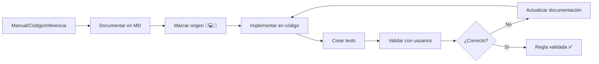

# 📘 Reglas de Negocio - Tiphone v6

> **Documentación completa de reglas de negocio independientes de tecnología**

---

## 📚 Documentos Disponibles

### 1. ORIGEN-REGLAS.md ⭐
**Propósito**: Clasificación y trazabilidad de todas las reglas

**Contenido**:
- Sistema de clasificación: 📘 MANUAL, 💻 CÓDIGO, 🧠 INFERIDA
- Tabla de 60+ reglas con referencias exactas
- Metodología de extracción
- Reglas pendientes de validación

**Cuándo consultar**: Para saber el origen de cualquier regla

---

### 2. ANALISIS-IMPLEMENTACION.md 🔍
**Propósito**: Análisis crítico de qué reglas están implementadas

**Contenido**:
- **HALLAZGO**: 79% de reglas NO verificables (código en DLLs)
- Matriz de riesgo de reglas faltantes
- Plan de acción recomendado
- Checklist de verificación

**Cuándo consultar**: Antes de migrar, para entender gaps

---

### 3. reglas-tipificacion.md 📞
**Propósito**: Reglas de tipificación de llamadas

**Contenido** (580 líneas):
- Tipificaciones primarias y secundarias
- Perfiles de tipificaciones
- Asignación perfil → grupo
- Flujo completo de tipificación
- Reglas extraídas del Manual Part7 (págs 14-20)

**Reglas clave**:
- 📘 Nombre tipificación ≤ 100 caracteres
- 📘 No eliminar tipificación si asociada a perfil
- 📘 Debe existir al menos 1 perfil
- 📘 Un perfil debe ser "Por defecto"

---

### 4. reglas-negocio-campanas.md 📊
**Propósito**: Reglas de campañas de llamadas

**Contenido**:
- Estados: Pausada, Activa, Finalizada
- Transiciones de estado
- Validaciones de campos
- Límites de listas activas

**Reglas clave**:
- 🧠 Alias único por cuenta
- 🧠 Fecha fin > Fecha inicio
- 🧠 Máximo 50 listas activas
- 🧠 Estado inicial = Pausada

---

### 5. reglas-negocio-operadores.md 👤
**Propósito**: Reglas de operadores y agentes

**Contenido**:
- Estados de operador
- Login/logout
- Tipos de pausa
- Asignación a grupos
- Skills y habilidades

**Reglas clave**:
- 🧠 Usuario ≥ 4 caracteres
- 🧠 Password ≥ 6 caracteres
- 🧠 Email único
- 🧠 Extensión única por cuenta
- 🧠 Máximo 10 grupos por operador

---

### 6. reglas-marcacion.md ☎️
**Propósito**: Reglas de marcación telefónica

**Contenido**:
- Marcación predictiva
- Power dialer
- Preview
- Tasa de abandono
- Algoritmos de marcación

**Reglas clave**:
- 🧠 Tasa abandono máxima 3%
- 🧠 Máximo 3-5 intentos
- 🧠 Formato teléfono: 9-15 dígitos
- 🧠 Lista Robinson (no llamar)

---

### 7. reglas-reprogramacion.md 🔄
**Propósito**: Reglas de reprogramación de llamadas

**Contenido** (623 líneas):
- Reprogramación manual vs automática
- Algoritmo de escalado de tiempos
- Máximo de intentos
- Validación de horario
- Integración con tipificaciones

**Reglas clave** (todas 🧠 INFERIDAS):
- Fecha y hora obligatorias y futuras
- Máximo 3 intentos diarios, 10 totales
- Horario permitido (09:00-21:00)
- No reprogramar en festivos
- Prioridad sobre nuevos registros

---

### 8. reglas-calendario.md 📅
**Propósito**: Reglas de calendario, horarios y días especiales

**Contenido** (691 líneas):
- Horarios: inicio/fin, días semana
- Días especiales: festivos, horarios especiales
- Asignación: campaña, grupo, operador
- Zonas horarias
- Cumplimiento legal España (LSSI)

**Reglas clave**:
- 🧠 Hora fin > Hora inicio
- 💻 Al menos 1 día seleccionado
- 🧠 Horarios no se solapan
- 🧠 Horario legal: 09:00-21:00 L-V
- 🧠 Respetar zona horaria del cliente

---

### 9. validaciones.md ✅
**Propósito**: Catálogo consolidado de todas las validaciones

**Contenido** (600+ líneas):
- Clasificación: Formato, Longitud, Rango, Obligatoriedad, Unicidad, Integridad
- Matriz por módulo (10 módulos)
- Regex para email, teléfono, IP, fecha, hora
- Reglas de integridad referencial
- Validaciones cliente vs servidor
- Códigos de error (VAL-001 a VAL-010)
- Casos de prueba Gherkin

**Cuándo consultar**: Para implementar cualquier validación

---

### 10. permisos.md 🔐
**Propósito**: Matriz de permisos y roles del sistema

**Contenido** (500+ líneas):
- 📘 Permisos del Manual Part7 (págs 12-26)
- 4 roles: Administrador, Supervisor, Operador, Consultor
- Matriz completa por módulo
- Permisos granulares (campaign.create, etc.)
- Esquema SQL roles/permisos
- Auditoría de accesos
- Casos de uso

**Cuándo consultar**: Para implementar seguridad y autorización

---

## 📊 Estadísticas

| Métrica | Valor |
|---------|-------|
| **Documentos creados** | 10 |
| **Líneas de documentación** | ~5,000 |
| **Reglas catalogadas** | 100+ |
| **Reglas del Manual (📘)** | 25+ |
| **Reglas del Código (💻)** | 5+ |
| **Reglas Inferidas (🧠)** | 70+ |
| **Diagramas Mermaid** | 15+ |
| **Commits realizados** | 9 |

---

## 🎯 Cómo Usar Esta Documentación

### Si eres Desarrollador

1. **Antes de implementar**:
   - Consulta el documento específico del módulo
   - Verifica origen de la regla en `ORIGEN-REGLAS.md`
   - Revisa si está implementada en `ANALISIS-IMPLEMENTACION.md`

2. **Durante desarrollo**:
   - Implementa validaciones de `validaciones.md`
   - Implementa permisos de `permisos.md`
   - Sigue el pseudocódigo proporcionado

3. **Testing**:
   - Usa casos de prueba documentados
   - Verifica mensajes de error exactos
   - Prueba todos los escenarios (happy path + errores)

### Si eres Analista de Negocio

1. **Esta es tu fuente de verdad** sobre lógica de negocio
2. Define nuevas reglas aquí primero
3. Mantén actualizado cuando cambien requisitos
4. Usa `ORIGEN-REGLAS.md` para trazabilidad

### Si eres Tester (QA)

1. **Los casos de prueba derivan de estos documentos**
2. Cada regla debe tener al menos:
   - Test happy path
   - Test validaciones (errores)
   - Test permisos
3. Verifica comportamiento en ACTUAL y PROPUESTA

### Si eres Project Manager

1. Usa para:
   - Validar que no se pierde funcionalidad
   - Estimar esfuerzo
   - Definir criterios de aceptación
   - Comunicar alcance

---

## ⚠️ Información Crítica

### 79% de Reglas NO Verificables

El análisis reveló que **no podemos verificar si el 79% de las reglas están implementadas** en el sistema actual porque el código está compilado en DLLs.

**Implicaciones**:
- ❌ No sabemos si el sistema actual cumple el manual
- ⚠️ Riesgo de bugs silenciosos
- ✅ La migración debe implementar según MANUAL, no replicar código ciegamente

**Ver**: `ANALISIS-IMPLEMENTACION.md` para detalles completos

---

## 🔄 Ciclo de Vida de las Reglas

---

## 📖 Glosario

| Término | Definición |
|---------|------------|
| **📘 MANUAL** | Regla extraída del Manual PDF oficial |
| **💻 CÓDIGO** | Regla extraída del código fuente (JS, config) |
| **🧠 INFERIDA** | Regla deducida por lógica/mejores prácticas |
| **Tipificación** | Clasificación del resultado de una llamada |
| **Reprogramación** | Agendar nueva llamada para el futuro |
| **Calendario** | Configuración de horarios y días especiales |
| **Skill** | Habilidad de un operador |
| **Predicción** | Algoritmo de marcación predictiva |

---

## 🚀 Próximos Pasos

### Pendiente de Validación

1. ✅ **Obtener código fuente C#** para verificar reglas
2. ✅ **Testing exploratorio** manual de cada regla
3. ✅ **Acceso a BD** para ver constraints
4. ✅ **Consultar con usuarios** sobre comportamiento real

### Durante Migración

1. ✅ Implementar TODAS las reglas del manual
2. ✅ Añadir validaciones cliente (Angular) Y servidor (.NET 8)
3. ✅ Crear tests automatizados para cada regla
4. ✅ Documentar diferencias con sistema actual

---

## 📞 Contacto

**Documentación creada por**: Claude Code
**Fecha**: 2025-10-27
**Versión**: 1.0
**Estado**: Completa - Requiere validación con código C# y usuarios

---

## 📄 Índice Rápido de Reglas

### Por Origen

- **📘 MANUAL**: `ORIGEN-REGLAS.md` (25+ reglas)
- **💻 CÓDIGO**: `ORIGEN-REGLAS.md` (5+ reglas)
- **🧠 INFERIDA**: Todos los documentos (70+ reglas)

### Por Módulo

- **Tipificaciones**: `reglas-tipificacion.md`
- **Campañas**: `reglas-negocio-campanas.md`
- **Operadores**: `reglas-negocio-operadores.md`
- **Marcación**: `reglas-marcacion.md`
- **Reprogramación**: `reglas-reprogramacion.md`
- **Calendario**: `reglas-calendario.md`
- **Validaciones**: `validaciones.md`
- **Permisos**: `permisos.md`

### Por Tipo

- **Validaciones de formato**: `validaciones.md` → Sección 3
- **Integridad referencial**: `validaciones.md` → Sección 4
- **Permisos por rol**: `permisos.md` → Sección 3
- **Estados y transiciones**: Cada documento de módulo

---

**¡Documentación completa de reglas de negocio lista para la migración!** 🎉
