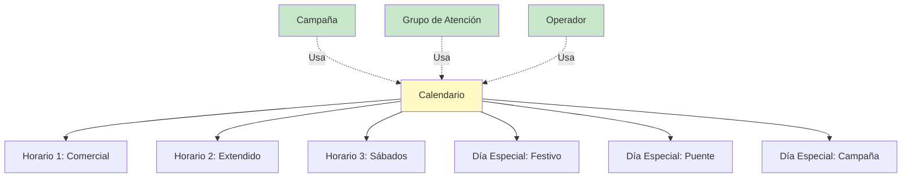

# Reglas de Negocio: Calendario y Horarios

> **Lógica de negocio independiente de tecnología**
> Documentación de reglas de calendario, horarios y días especiales en Tiphone v6

---

## 📊 Origen de las Reglas

Este documento contiene reglas de **3 orígenes**:

- **📘 MANUAL**: Extraídas del Manual oficial Tiphone v6 (referenciadas en índice)
- **💻 CÓDIGO**: Extraídas del código fuente (Calendario.js, DiaEspecialCalendario.js)
- **🧠 INFERIDA**: Deducidas por lógica/mejores prácticas

**⚠️ NOTA**: Las secciones "Calendarios", "Horario" y "Días especiales" están referenciadas
en el índice del manual (Part2, págs 35-39) pero el contenido detallado no está completamente
disponible en los archivos MD analizados.

Consulta `ORIGEN-REGLAS.md` y `ANALISIS-IMPLEMENTACION.md` para más detalles.

---

## 1. Conceptos Fundamentales

### 1.1 Calendario

**Definición**: Conjunto de configuraciones que define:
- Horarios de operación
- Días laborables
- Días festivos
- Días especiales (horarios diferentes)

**Uso**: Se asocia a campañas, grupos de atención y operadores para controlar cuándo pueden realizarse llamadas.

### 1.2 Horario

**Definición**: Franja horaria específica con:
- Hora de inicio
- Hora de fin
- Días de la semana aplicables

**Ejemplo**:
- Horario comercial: Lunes a Viernes, 09:00 - 18:00
- Horario extendido: Lunes a Viernes, 09:00 - 21:00
- Horario sábados: Sábado, 10:00 - 14:00

### 1.3 Días Especiales

**Definición**: Fechas específicas con configuración diferente:
- Festivos (no laborables)
- Puentes (horario reducido)
- Eventos especiales (horario extendido)

---

## 2. Estructura del Sistema de Calendario

### Diagrama de Jerarquía 🧠



---

## 3. Reglas de Horarios

### REGLA: Horario con Hora Inicio y Fin 🧠

> **Origen**: 🧠 INFERIDA - Validación lógica básica

**Descripción**: Todo horario debe tener hora de inicio y hora de fin válidas.

**Validaciones**:
```
SI hora_inicio ES NULA ENTONCES
    ERROR "La hora de inicio es obligatoria"
FIN SI

SI hora_fin ES NULA ENTONCES
    ERROR "La hora de fin es obligatoria"
FIN SI

SI hora_fin <= hora_inicio ENTONCES
    ERROR "La hora de fin debe ser posterior a la hora de inicio"
FIN SI
```

**Casos especiales**:
- **Horario nocturno** (cruza medianoche): 22:00 - 02:00
  - Solución: Dividir en dos horarios o usar día siguiente

**Mensaje de error**:
> "La hora de fin (14:00) debe ser posterior a la hora de inicio (18:00)"

---

### REGLA: Horario dentro de Rango Razonable 🧠

> **Origen**: 🧠 INFERIDA - Cumplimiento legal y mejores prácticas

**Descripción**: Los horarios deben estar dentro de franjas legalmente permitidas para llamadas comerciales.

**España - Regulación LSSI**:
- Lunes a Viernes: 09:00 - 21:00
- Sábados: 10:00 - 14:00 (opcional)
- Domingos y festivos: Prohibido (salvo consentimiento)

**Validaciones**:
```
FUNCION ValidarHorarioLegal(hora_inicio, hora_fin, dia_semana)
    SI dia_semana = DOMINGO ENTONCES
        ADVERTENCIA "Llamadas en domingo requieren consentimiento expreso del cliente"
    FIN SI

    SI dia_semana IN (LUNES, MARTES, MIERCOLES, JUEVES, VIERNES) ENTONCES
        SI hora_inicio < 09:00 O hora_fin > 21:00 ENTONCES
            ADVERTENCIA "Horario fuera del rango legal recomendado (09:00-21:00)"
        FIN SI
    FIN SI

    SI dia_semana = SABADO ENTONCES
        SI hora_inicio < 10:00 O hora_fin > 14:00 ENTONCES
            ADVERTENCIA "Horario en sábado fuera del rango recomendado (10:00-14:00)"
        FIN SI
    FIN SI
FIN FUNCION
```

---

### REGLA: Días de la Semana Aplicables 🧠

> **Origen**: 🧠 INFERIDA - Flexibilidad de configuración

**Descripción**: Un horario puede aplicar a uno o más días de la semana.

**Ejemplos**:
- Horario solo lunes a viernes
- Horario solo sábados
- Horario diferente por día (lunes horario A, martes horario B)

**Validación**:
```
SI horario.DiasAplicables.Count = 0 ENTONCES
    ERROR "Debe seleccionar al menos un día de la semana"
FIN SI
```

---

### REGLA: Múltiples Horarios por Día 🧠

> **Origen**: 🧠 INFERIDA - Flexibilidad operativa

**Descripción**: Un mismo día puede tener múltiples franjas horarias (mañana y tarde).

**Ejemplo**:
- Lunes mañana: 09:00 - 14:00
- Lunes tarde: 16:00 - 20:00

**Validación**:
```
FUNCION ValidarSolapamientoHorarios(horarios, dia)
    PARA CADA horario1 EN horarios HACER
        PARA CADA horario2 EN horarios HACER
            SI horario1 <> horario2 Y horario1.Dia = horario2.Dia ENTONCES
                SI HorariosSeSolapan(horario1, horario2) ENTONCES
                    ERROR "Los horarios se solapan: " + horario1.ToString() + " y " + horario2.ToString()
                FIN SI
            FIN SI
        FIN PARA
    FIN PARA
FIN FUNCION

FUNCION HorariosSeSolapan(h1, h2)
    // Solapan si inicio de h1 está dentro de h2 o viceversa
    RETORNAR (h1.Inicio < h2.Fin Y h1.Fin > h2.Inicio)
FIN FUNCION
```

---

## 4. Reglas de Días Especiales

### REGLA: Días Festivos Nacionales 🧠

> **Origen**: 🧠 INFERIDA - Cumplimiento legal

**Descripción**: Los días festivos nacionales no deben permitir llamadas salvo casos excepcionales.

**Festivos nacionales España (ejemplo 2025)**:
- 1 enero: Año Nuevo
- 6 enero: Reyes
- 18 abril: Viernes Santo
- 1 mayo: Día del Trabajo
- 15 agosto: Asunción
- 12 octubre: Fiesta Nacional
- 1 noviembre: Todos los Santos
- 6 diciembre: Constitución
- 8 diciembre: Inmaculada
- 25 diciembre: Navidad

**Validación**:
```
FUNCION EsDiaFestivo(fecha, calendario)
    // Verificar festivos nacionales
    festivos_nacionales = ObtenerFestivosNacionales(fecha.Año)
    SI fecha IN festivos_nacionales ENTONCES
        RETORNAR VERDADERO
    FIN SI

    // Verificar festivos locales del calendario
    festivos_locales = ObtenerFestivosLocales(calendario.IdCalendario, fecha.Año)
    SI fecha IN festivos_locales ENTONCES
        RETORNAR VERDADERO
    FIN SI

    RETORNAR FALSO
FIN FUNCION
```

---

### REGLA: Festivos Locales/Regionales 🧠

> **Origen**: 🧠 INFERIDA - Adaptación regional

**Descripción**: Cada comunidad autónoma y localidad tiene festivos adicionales.

**Ejemplos Madrid**:
- 2 mayo: Día de la Comunidad de Madrid
- 15 mayo: San Isidro (Madrid capital)

**Configuración**:
```sql
-- Tabla de festivos locales
CREATE TABLE FestivosLocales (
    IdFestivo INT PRIMARY KEY IDENTITY,
    IdCalendario INT NOT NULL,
    Fecha DATE NOT NULL,
    Descripcion VARCHAR(100),
    Tipo VARCHAR(20), -- NACIONAL, AUTONOMICO, LOCAL
    EsRecurrente BIT DEFAULT 0, -- Si se repite cada año
    FOREIGN KEY (IdCalendario) REFERENCES Calendarios(IdCalendario)
);
```

---

### REGLA: Días con Horario Especial 🧠

> **Origen**: 🧠 INFERIDA - Flexibilidad operativa

**Descripción**: Algunos días tienen horario diferente al habitual (no son festivos).

**Ejemplos**:
- 24 diciembre (Nochebuena): 09:00 - 14:00 (reducido)
- 31 diciembre (Nochevieja): 09:00 - 14:00 (reducido)
- 5 enero (víspera Reyes): 09:00 - 18:00 (reducido)
- Día de evento especial: 08:00 - 23:00 (extendido)

**Prioridad**:
1. Día especial con horario específico
2. Horario normal del día de la semana
3. Calendario por defecto

---

### REGLA: Asociación de Días al Calendario 💻

> **Origen**: 💻 CÓDIGO - Calendario.js líneas 47-80

**Descripción**: Los días especiales se asocian/desasocian del calendario mediante interfaz.

**Funcionalidad observada**:
- Función `AsociaDiaACalendario(tab)` en Calendario.js:47
- Mueve días entre lista "no asociados" y "asociados"
- Usa checkboxes para selección múltiple
- Valida que al menos un día esté seleccionado

**Validación**:
```javascript
// Extraído de Calendario.js:56-59
if (listCheckItems === null || listCheckItems.length === 0) {
    alert("No se ha seleccionado ningún día que asignar al calendario");
    return;
}
```

---

## 5. Reglas de Asignación de Calendario

### REGLA: Calendario por Campaña 🧠

> **Origen**: 🧠 INFERIDA - Jerarquía de configuración

**Descripción**: Cada campaña puede tener un calendario asignado que define cuándo marcar.

**Validación**:
```
FUNCION PuedeMarcarAhora(idCampana, fechaHora)
    calendario = ObtenerCalendarioCampana(idCampana)

    // Verificar si es festivo
    SI EsDiaFestivo(fechaHora.Fecha, calendario) ENTONCES
        RETORNAR FALSO
    FIN SI

    // Verificar horario
    horario = ObtenerHorarioParaFecha(calendario, fechaHora.Fecha, fechaHora.DiaSemana)

    SI horario ES NULO ENTONCES
        RETORNAR FALSO
    FIN SI

    SI fechaHora.Hora < horario.Inicio O fechaHora.Hora > horario.Fin ENTONCES
        RETORNAR FALSO
    FIN SI

    RETORNAR VERDADERO
FIN FUNCION
```

---

### REGLA: Calendario por Grupo de Atención 🧠

> **Origen**: 🧠 INFERIDA - Control por grupo

**Descripción**: Los grupos de atención pueden tener calendarios diferentes.

**Casos de uso**:
- Grupo "Mañanas": Calendario 09:00-15:00
- Grupo "Tardes": Calendario 15:00-21:00
- Grupo "24h": Calendario sin restricciones

---

### REGLA: Calendario por Operador 🧠

> **Origen**: 🧠 INFERIDA - Control individual

**Descripción**: Un operador puede tener su propio calendario (horario laboral personal).

**Validación**:
```
FUNCION OperadorDisponible(idOperador, fechaHora)
    calendario_operador = ObtenerCalendarioOperador(idOperador)

    SI calendario_operador ES NULO ENTONCES
        // Usar calendario del grupo
        grupo = ObtenerGrupoOperador(idOperador)
        calendario_operador = ObtenerCalendarioGrupo(grupo.IdGrupo)
    FIN SI

    RETORNAR PuedeMarcarAhora(calendario_operador, fechaHora)
FIN FUNCION
```

---

### REGLA: Calendario por Defecto 🧠

> **Origen**: 🧠 INFERIDA - Fallback necesario

**Descripción**: Debe existir un calendario por defecto para entidades sin calendario asignado.

**Validación**:
```
FUNCION ObtenerCalendarioAplicable(entidad)
    // 1. Calendario propio
    SI entidad.IdCalendario NO ES NULO ENTONCES
        RETORNAR ObtenerCalendario(entidad.IdCalendario)
    FIN SI

    // 2. Calendario del padre (si aplica)
    SI entidad TIENE Padre Y Padre.IdCalendario NO ES NULO ENTONCES
        RETORNAR ObtenerCalendario(Padre.IdCalendario)
    FIN SI

    // 3. Calendario por defecto del sistema
    RETORNAR ObtenerCalendarioPorDefecto()
FIN FUNCION
```

---

## 6. Reglas de Zonas Horarias

### REGLA: Zona Horaria del Cliente 🧠

> **Origen**: 🧠 INFERIDA - Respeto al cliente

**Descripción**: Las llamadas deben respetar la zona horaria del cliente, no del contact center.

**Ejemplo**:
- Contact center en Madrid (UTC+1)
- Cliente en Canarias (UTC+0)
- Horario: 09:00-21:00hora local del cliente
- Si son las 20:30 en Madrid → son las 19:30 en Canarias → SÍ se puede llamar

**Validación**:
```
FUNCION PuedeMarcarRegistro(idRegistro, fechaHoraActual)
    registro = ObtenerRegistro(idRegistro)
    campana = ObtenerCampana(registro.IdCampana)
    calendario = ObtenerCalendarioCampana(campana.IdCalendario)

    // Obtener zona horaria del cliente
    zona_cliente = ObtenerZonaHoraria(registro.CodigoPostal, registro.Provincia)

    // Convertir hora actual a zona del cliente
    hora_local_cliente = ConvertirAZonaHoraria(fechaHoraActual, zona_cliente)

    // Validar con calendario
    RETORNAR PuedeMarcarAhora(calendario, hora_local_cliente)
FIN FUNCION
```

**Zonas horarias España**:
- Península y Baleares: UTC+1 (CET) / UTC+2 (CEST verano)
- Canarias: UTC+0 (WET) / UTC+1 (WEST verano)

---

## 7. Integración con Otros Módulos

### 7.1 Marcación Predictiva

El motor de marcación consulta el calendario antes de marcar:

```sql
-- Query para obtener registros marcables ahora
SELECT r.*
FROM Registros r
INNER JOIN Campanas c ON r.IdCampana = c.IdCampana
INNER JOIN Calendarios cal ON c.IdCalendario = cal.IdCalendario
WHERE r.EstadoLlamada = 'PENDIENTE'
  AND NOT EXISTS (
      -- Excluir festivos
      SELECT 1 FROM DiasEspeciales de
      WHERE de.IdCalendario = cal.IdCalendario
        AND de.Fecha = CAST(GETDATE() AS DATE)
        AND de.EsFestivo = 1
  )
  AND EXISTS (
      -- Incluir solo si está en horario
      SELECT 1 FROM Horarios h
      WHERE h.IdCalendario = cal.IdCalendario
        AND h.DiaSemana = DATEPART(WEEKDAY, GETDATE())
        AND CAST(GETDATE() AS TIME) BETWEEN h.HoraInicio AND h.HoraFin
  );
```

### 7.2 Reprogramaciones

Las reprogramaciones validan contra el calendario:

```
CUANDO se crea reprogramación ENTONCES
    ValidarHorarioReprogramacion(fecha, hora, idCampana)
    // Rechazar si es festivo o fuera de horario
FIN CUANDO
```

### 7.3 Supervisión

Los reportes muestran:
- Horas productivas vs horas totales
- Llamadas fuera de horario (anomalías)
- Cumplimiento del calendario

---

## 8. Configuración del Sistema

### 8.1 Estructura de Base de Datos 💻

```sql
-- Tabla de Calendarios
CREATE TABLE Calendarios (
    IdCalendario INT PRIMARY KEY IDENTITY,
    Nombre VARCHAR(100) NOT NULL,
    Descripcion VARCHAR(200),
    EsPorDefecto BIT DEFAULT 0,
    Activo BIT DEFAULT 1,
    FechaCreacion DATETIME DEFAULT GETDATE()
);

-- Tabla de Horarios
CREATE TABLE Horarios (
    IdHorario INT PRIMARY KEY IDENTITY,
    IdCalendario INT NOT NULL,
    Nombre VARCHAR(50),
    DiaSemana INT NOT NULL, -- 1=Lunes, 7=Domingo
    HoraInicio TIME NOT NULL,
    HoraFin TIME NOT NULL,
    FOREIGN KEY (IdCalendario) REFERENCES Calendarios(IdCalendario),
    CHECK (HoraFin > HoraInicio)
);

-- Tabla de Días Especiales
CREATE TABLE DiasEspeciales (
    IdDiaEspecial INT PRIMARY KEY IDENTITY,
    IdCalendario INT NOT NULL,
    Fecha DATE NOT NULL,
    Nombre VARCHAR(100),
    EsFestivo BIT DEFAULT 0,
    HorarioEspecialInicio TIME NULL,
    HorarioEspecialFin TIME NULL,
    FOREIGN KEY (IdCalendario) REFERENCES Calendarios(IdCalendario)
);

-- Asignaciones
ALTER TABLE Campanas ADD IdCalendario INT NULL;
ALTER TABLE Grupos ADD IdCalendario INT NULL;
ALTER TABLE Operadores ADD IdCalendario INT NULL;
```

### 8.2 Parámetros Configurables 🧠

| Parámetro | Tipo | Valor por defecto | Descripción |
|-----------|------|-------------------|-------------|
| `PermitirLlamadasDomingos` | BIT | 0 | Permite llamadas en domingo |
| `PermitirLlamadasFestivos` | BIT | 0 | Permite llamadas en festivos |
| `HorarioMinimoInicio` | TIME | 09:00 | Hora mínima de inicio |
| `HorarioMaximoFin` | TIME | 21:00 | Hora máxima de fin |
| `MargenToleranciaHorario` | INT | 5 | Minutos de margen (ej: llamar hasta 21:05) |
| `UsarZonaHorariaCliente` | BIT | 1 | Respetar zona horaria del cliente |

---

## 9. Casos de Uso Prácticos

### Caso 1: Campaña con Horario Comercial

**Configuración**:
- Calendario: "Comercial España"
- Horario: Lunes a Viernes, 09:00 - 18:00
- Festivos: Listados automáticamente

**Comportamiento**:
- ✅ Lunes 10:30 → Puede marcar
- ❌ Lunes 19:00 → No puede marcar (fuera de horario)
- ❌ Domingo 11:00 → No puede marcar (no laborable)
- ❌ 25 diciembre 10:00 → No puede marcar (festivo)

### Caso 2: Campaña con Horario Extendido

**Configuración**:
- Calendario: "Extendido"
- Horario: Lunes a Viernes, 09:00 - 21:00
- Horario: Sábados, 10:00 - 14:00

**Comportamiento**:
- ✅ Sábado 11:00 → Puede marcar
- ❌ Sábado 15:00 → No puede marcar
- ✅ Viernes 20:30 → Puede marcar

### Caso 3: Operador con Horario Personal

**Configuración**:
- Operador: Juan (turno tarde)
- Calendario operador: Lunes a Viernes, 15:00 - 21:00
- Calendario campaña: Lunes a Viernes, 09:00 - 21:00

**Comportamiento**:
- ✅ 16:00 → Operador disponible, campaña activa → Puede recibir llamadas
- ❌ 11:00 → Operador NO disponible (aunque campaña activa) → No recibe llamadas

---

## 10. Validaciones y Mensajes de Error

| Situación | Mensaje | Severidad |
|-----------|---------|-----------|
| Hora fin <= hora inicio | "La hora de fin debe ser posterior a la hora de inicio" | ERROR |
| Sin días seleccionados | "Debe seleccionar al menos un día de la semana" | ERROR |
| Horarios solapados | "Los horarios se solapan en Lunes: 09:00-14:00 y 12:00-18:00" | ERROR |
| Fuera de horario legal | "Horario fuera del rango legal (09:00-21:00)" | ADVERTENCIA |
| Llamada en festivo | "No se permite marcar en día festivo (25/12/2025 - Navidad)" | INFO |
| Llamada en domingo | "Las llamadas en domingo requieren consentimiento expreso" | ADVERTENCIA |

---

## 11. Mejores Prácticas

### 11.1 Configuración de Calendarios 🧠

1. **Crear calendario por defecto** con horario legal
2. **Calendarios específicos** por tipo de campaña
3. **Mantener actualizada** lista de festivos anualmente
4. **Documentar excepciones** (días con horario especial)

### 11.2 Gestión de Festivos 🧠

1. **Cargar festivos** con al menos 1 año de antelación
2. **Distinguir** entre nacional, autonómico y local
3. **Permitir override** por campaña si es necesario
4. **Notificar** a supervisores de días festivos próximos

### 11.3 Zonas Horarias 🧠

1. **Almacenar** zona horaria en datos del cliente
2. **Convertir siempre** a hora local del cliente
3. **Considerar** cambios de horario verano/invierno
4. **Validar** contra calendario en zona del cliente

---

## 12. Monitorización y Auditoría

### 12.1 Logs Recomendados 🧠

```sql
CREATE TABLE LogViolacionesCalendario (
    IdLog INT PRIMARY KEY IDENTITY,
    FechaHora DATETIME DEFAULT GETDATE(),
    TipoViolacion VARCHAR(50), -- FESTIVO, FUERA_HORARIO, ZONA_HORARIA
    IdCampana INT,
    IdRegistro INT,
    IdOperador INT NULL,
    Detalle VARCHAR(500)
);
```

### 12.2 KPIs del Calendario

- **Tasa de cumplimiento del horario**: % de llamadas dentro de horario
- **Llamadas en días festivos**: Debe ser 0 (o justificadas)
- **Utilización del horario**: % de tiempo productivo vs disponible
- **Violaciones detectadas**: Alertar si > 0

---

## 13. Migración y Mantenimiento

### 13.1 Al Migrar a Nueva Aplicación

1. ✅ Exportar todos los calendarios existentes
2. ✅ Validar todos los horarios (formato, lógica)
3. ✅ Verificar festivos de años anteriores y futuros
4. ✅ Probar conversión de zonas horarias
5. ✅ Validar integraciones con marcación y reprogramación

### 13.2 Mantenimiento Anual

1. **Enero**: Cargar festivos del nuevo año
2. **Marzo**: Verificar cambio horario verano (último domingo)
3. **Octubre**: Verificar cambio horario invierno (último domingo)
4. **Diciembre**: Revisar horarios especiales de Navidad

---

**Documento**: Reglas de Calendario y Horarios
**Versión**: 1.0
**Fecha**: 2025-10-27
**Estado**: Basado en inferencias, código JavaScript y mejores prácticas
**Nota**: Requiere validación con código C# y configuración real del sistema
**Próximos pasos**: Revisar sección "Calendarios" del manual Part2 (págs 35-39) cuando esté disponible
