# Reglas de Negocio - Marcación

> **Tipo**: Lógica de Negocio (independiente de tecnología)
> **Aplica a**: Tanto APLICACION-ACTUAL como APLICACION-PROPUESTA

---

## 1. Definición

La **Marcación** es el proceso por el cual el sistema llama automáticamente a los registros de una campaña y los conecta con operadores disponibles.

---

## 2. Tipos de Marcación


---

## 3. Marcación Manual

### REGLA: Control del Operador

**Descripción**: El operador selecciona manualmente qué registro marcar.

**Flujo**:
```
1. Operador selecciona registro de lista
2. Sistema verifica que registro sea marcable
3. Sistema inicia llamada
4. Operador espera conexión
```

**No aplica**:
- Algoritmo predictivo
- Marcación automática
- Ratio operadores/llamadas

---

## 4. Marcación Preview

### REGLA: Presentación Previa

**Descripción**: El sistema presenta los datos del contacto antes de marcar.

**Flujo**:
```
1. Sistema asigna próximo registro a operador disponible
2. Operador ve datos del contacto (nombre, teléfono, historial)
3. Operador decide:
   - Marcar: Sistema inicia llamada
   - Omitir: Se marca como "No contactable" y pasa al siguiente
4. Tiempo máximo de decisión: 30 segundos
```

**REGLA: Tiempo de Decisión**:
```
SI tiempo_revision > 30 segundos ENTONCES
    Alertar: "¿Desea marcar este registro?"
    SI no responde en 10 segundos más ENTONCES
        Liberar registro
        Operador vuelve a disponible
    FIN SI
FIN SI
```

---

## 5. Marcación Power Dialer

### REGLA: Ratio Fijo

**Descripción**: Se marca con un ratio fijo de llamadas por operador.

**Configuración**: `RatioLlamadas` (decimal, ej: 1.2)

**Algoritmo**:
```
operadores_disponibles = COUNT(operadores en disponible)
llamadas_activas = COUNT(llamadas en curso)
llamadas_a_iniciar = (operadores_disponibles * RatioLlamadas) - llamadas_activas

SI llamadas_a_iniciar > 0 ENTONCES
    Iniciar llamadas_a_iniciar llamadas
FIN SI
```

**Ejemplo**:
```
Operadores disponibles: 10
Ratio: 1.2
Llamadas activas: 8

Llamadas a iniciar = (10 * 1.2) - 8 = 12 - 8 = 4
→ Iniciar 4 llamadas nuevas
```

---

## 6. Marcación Predictiva

### REGLA: Algoritmo Predictivo

**Descripción**: El sistema calcula dinámicamente cuántas llamadas iniciar basándose en estadísticas.

**Factores considerados**:
1. **Operadores disponibles**: Cuántos pueden recibir llamada
2. **Tasa de conexión**: % de llamadas que conectan
3. **Tiempo medio de llamada**: Duración promedio
4. **Tasa de abandono objetivo**: % máximo permitido

**Fórmula simplificada**:
```
abandono_objetivo = 3%  // Máximo permitido
tasa_conexion = 40%     // Histórico de la campaña
tiempo_medio_llamada = 180s  // Promedio

operadores_disponibles = COUNT(disponibles)
llamadas_activas = COUNT(en curso)

// Calcular cuántos operadores se liberarán pronto
operadores_pronto_libres = COUNT(llamadas que terminarán en < 30s)

// Calcular necesidad
necesidad_llamadas = operadores_disponibles + operadores_pronto_libres

// Ajustar por tasa de conexión
llamadas_a_marcar = necesidad_llamadas / tasa_conexion

// Limitar para no exceder abandono objetivo
SI abandono_actual >= abandono_objetivo ENTONCES
    llamadas_a_marcar = llamadas_a_marcar * 0.8  // Reducir 20%
FIN SI

llamadas_reales = llamadas_a_marcar - llamadas_activas
```

---

### REGLA: Tasa de Abandono Máxima

**Descripción**: El abandono no puede superar el 3% (configurable por campaña).

**Abandono** = Llamadas que conectan pero no hay operador disponible

**Cálculo**:
```
abandono_porcentaje = (llamadas_abandonadas / llamadas_conectadas) * 100
```

**Control**:
```
SI abandono_porcentaje >= abandono_objetivo ENTONCES
    Reducir llamadas iniciadas
    Registrar alerta
FIN SI
```

---

### REGLA: Actualización de Estadísticas

**Descripción**: Las estadísticas se actualizan en tiempo real.

**Frecuencia**: Cada vez que termina una llamada

**Datos actualizados**:
- Tasa de conexión (últimas 100 llamadas)
- Tiempo medio de llamada (últimas 50 llamadas)
- Tasa de abandono (última hora)

---

## 7. Reglas Comunes a Todos los Tipos

### REGLA: Registro Marcable

**Descripción**: Un registro solo se marca si cumple condiciones.

**Condiciones**:
```
✅ Estado = "Pendiente" OR "Reprogramado"
✅ Teléfono válido (no vacío, formato correcto)
✅ NO está en Lista Robinson (no llamar)
✅ NO ha alcanzado máximo de intentos
✅ Dentro del horario permitido
✅ NO está siendo marcado actualmente (lock)
```

**Validación**:
```sql
SELECT *
FROM Registros
WHERE IdLista IN (SELECT IdLista FROM Listas WHERE IdCampana = @IdCampana AND Activa = 1)
  AND Estado IN ('Pendiente', 'Reprogramado')
  AND Telefono IS NOT NULL
  AND Telefono <> ''
  AND IdRegistro NOT IN (SELECT IdTelefono FROM ListaRobinson)
  AND NumeroIntentos < MaxIntentos
  AND Bloqueado = 0
ORDER BY Prioridad DESC, FechaReprogramacion ASC
```

---

### REGLA: Máximo de Intentos

**Descripción**: Límite de veces que se intenta marcar un mismo registro.

**Configuración**: `MaxIntentos` (int, típicamente 3-5)

**Validación**:
```
SI NumeroIntentos >= MaxIntentos ENTONCES
    Estado = "No contactado"
    NO marcar más
FIN SI
```

---

### REGLA: Bloqueo de Registro

**Descripción**: Evitar marcar el mismo registro simultáneamente.

**Implementación**:
```sql
-- Al seleccionar registro para marcar
UPDATE Registros
SET Bloqueado = 1,
    FechaBloq = GETDATE()
WHERE IdRegistro = @IdRegistro
  AND Bloqueado = 0
```

**Liberar bloqueo**:
```
-- Después de llamada (éxito o fallo)
UPDATE Registros
SET Bloqueado = 0
WHERE IdRegistro = @IdRegistro

-- O por timeout (si llamada falló sin actualizar)
UPDATE Registros
SET Bloqueado = 0
WHERE Bloqueado = 1
  AND DATEDIFF(minute, FechaBloq, GETDATE()) > 5
```

---

### REGLA: Horario de Marcación

**Descripción**: Solo marcar dentro del horario configurado de la campaña.

**Validación**:
```
hora_actual = HORA_SISTEMA()
dia_actual = DIA_SEMANA()

SI hora_actual < campaña.HoraInicio OR hora_actual > campaña.HoraFin ENTONCES
    NO marcar
FIN SI

SI NOT (campaña.DiasSemana & dia_actual) ENTONCES
    NO marcar (día no permitido)
FIN SI
```

---

### REGLA: Respeto de Festivos

**Descripción**: No marcar en días festivos.

**Validación**:
```sql
SELECT COUNT(*)
FROM Festivos
WHERE Fecha = CAST(GETDATE() AS DATE)
  AND (IdCuenta = @IdCuenta OR EsNacional = 1)
```

**Condición**:
```
SI COUNT > 0 ENTONCES
    NO marcar
FIN SI
```

---

### REGLA: Lista Robinson (No Llamar)

**Descripción**: No marcar números en lista de exclusión.

**Validación**:
```sql
SELECT COUNT(*)
FROM ListaRobinson
WHERE Telefono = @Telefono
```

**Condición**:
```
SI COUNT > 0 ENTONCES
    Estado = "No contactable (Lista Robinson)"
    NO marcar
FIN SI
```

---

## 8. Priorización de Registros

### REGLA: Orden de Marcación

**Descripción**: El orden en que se marcan los registros.

**Prioridad (descendente)**:
1. **Reprogramados vencidos** (FechaReprogramacion <= ahora)
2. **Prioridad manual** (campo Prioridad: 1=baja, 5=alta)
3. **Primer intento** (NumeroIntentos = 0)
4. **Orden de carga** (FechaAlta ASC)

**Consulta**:
```sql
SELECT TOP 1 *
FROM Registros
WHERE ...condiciones...
ORDER BY
    CASE WHEN Estado = 'Reprogramado' AND FechaReprogramacion <= GETDATE() THEN 1 ELSE 2 END,
    Prioridad DESC,
    NumeroIntentos ASC,
    FechaAlta ASC
```

---

## 9. Gestión de Teléfonos

### REGLA: Múltiples Teléfonos

**Descripción**: Un registro puede tener varios teléfonos (principal, alternativo 1, 2, 3).

**Orden de marcación**:
```
1. Teléfono principal
2. Si falla → Teléfono alternativo 1
3. Si falla → Teléfono alternativo 2
4. Si falla → Teléfono alternativo 3
```

**REGLA de Fallo**:
```
"Falla" = No contesta, Ocupado, Fuera de servicio

SI todos los teléfonos fallan ENTONCES
    NumeroIntentos++
    SI NumeroIntentos >= MaxIntentos ENTONCES
        Estado = "No contactado"
    SINO
        Estado = "Pendiente"  // Se volverá a intentar
    FIN SI
FIN SI
```

---

### REGLA: Formato de Teléfono

**Descripción**: Los teléfonos deben tener formato válido.

**Validación**:
```
Longitud: 9-15 dígitos
Solo números (opcionalmente + al inicio)
Expresión regular: ^\+?[0-9]{9,15}$
```

**Normalización**:
```
Eliminar espacios, guiones, paréntesis
Ejemplos:
  "+34 612 345 678" → "+34612345678"
  "612-345-678" → "612345678"
```

---

## 10. Estados de Llamada

### REGLA: Ciclo de Vida de Llamada

```mermaid
stateDiagram-v2
    [*] --> Marcando: Iniciar marcación
    Marcando --> Timbrando: Operadora responde
    Marcando --> NoContesta: Timeout sin respuesta
    Marcando --> Ocupado: Línea ocupada
    Marcando --> FueraServicio: Número inválido

    Timbrando --> Contestada: Cliente contesta
    Timbrando --> NoContesta: No contesta

    Contestada --> Conectada: Operador disponible
    Contestada --> Abandonada: No hay operador

    Conectada --> Finalizada: Llamada termina

    NoContesta --> [*]
    Ocupado --> [*]
    FueraServicio --> [*]
    Abandonada --> [*]
    Finalizada --> [*]
```



---

### REGLA: Resultado de Marcación

**Descripción**: Posibles resultados al marcar un teléfono.

| Resultado | Código | Acción |
|-----------|--------|--------|
| **Conectada** | 1 | Conectar con operador |
| **No contesta** | 2 | Reintentar |
| **Ocupado** | 3 | Reintentar |
| **Fuera de servicio** | 4 | Marcar teléfono alternativo |
| **Fax/Modem** | 5 | No reintentar |
| **Contestador** | 6 | Reintentar (configurable) |
| **Número inválido** | 7 | No reintentar |

---

## 11. Límites y Restricciones

### REGLA: Máximo de Líneas Simultáneas

**Descripción**: Límite de llamadas simultáneas que puede manejar una campaña.

**Configuración**: `MaxLineas` (int, ej: 50)

**Validación**:
```sql
SELECT COUNT(*)
FROM Llamadas
WHERE IdCampana = @IdCampana
  AND Estado IN ('Marcando', 'Timbrando', 'Conectada')
```

**Condición**:
```
SI COUNT >= MaxLineas ENTONCES
    NO iniciar nueva llamada
    Esperar a que termine alguna
FIN SI
```

---

### REGLA: Límite de Llamadas por Operador

**Descripción**: Un operador solo puede atender una llamada a la vez.

**Validación antes de conectar**:
```sql
SELECT COUNT(*)
FROM Llamadas
WHERE IdOperador = @IdOperador
  AND Estado IN ('Conectada', 'Tipificando')
```

**Condición**:
```
SI COUNT > 0 ENTONCES
    NO asignar llamada a este operador
    Buscar otro operador disponible
FIN SI
```

---

## 12. Integración con Asterisk

### REGLA: Archivo de Marcación

**Descripción**: Las llamadas se inician mediante archivos en red.

**Ubicación**: `\\CRK8269\Temp\Tiphone\Asterisk\Salientes\`

**Formato del archivo**:
```
Nombre: CALL_{IdLlamada}_{Timestamp}.call
Contenido:
Channel: SIP/{Extension}
CallerID: {NumeroCampana}
MaxRetries: 0
RetryTime: 60
WaitTime: 30
Context: outbound
Extension: {TelefonoAMarcar}
Priority: 1
Set: CAMPANA_ID={IdCampana}
Set: REGISTRO_ID={IdRegistro}
```

---

### REGLA: Detección de Estado desde Asterisk

**Descripción**: El estado de la llamada se detecta desde mensajes de Asterisk.

**Archivo de respuesta**: `\\CRK8269\Temp\Tiphone\Asterisk\Resultados\`

**Formato**:
```
CALL_{IdLlamada}_RESULT.txt
Contenido:
STATUS: CONNECTED | NOANSWER | BUSY | FAILED
DURATION: 123  (segundos)
TIMESTAMP: 2025-01-27 10:30:45
```

**Procesamiento**:
```
PARA cada archivo en carpeta Resultados
    Leer contenido
    Actualizar estado de llamada en BD
    Eliminar archivo procesado
FIN PARA
```

---

## 13. Optimizaciones

### REGLA: Caché de Registros Marcables

**Descripción**: Mantener en memoria los próximos N registros a marcar.

**Implementación**:
```
Cargar en memoria los próximos 100 registros marcables
Cada vez que se marca uno, recargar 1 nuevo al final
Refrescar completamente cada 5 minutos
```

**Ventaja**: Reduce consultas a BD

---

### REGLA: Pool de Operadores Disponibles

**Descripción**: Mantener lista actualizada de operadores disponibles.

**Actualización**:
```
Cada vez que un operador cambia de estado:
  SI nuevo estado = Disponible ENTONCES
      Agregar a pool
  SINO
      Quitar de pool
  FIN SI
```

---

## 14. Manejo de Errores

### REGLA: Fallo de Asterisk

**Descripción**: Si Asterisk no responde, pausar marcación.

**Detección**:
```
SI no se procesan archivos de resultado en 2 minutos ENTONCES
    Alertar: "Asterisk no responde"
    Pausar marcación automática
    Notificar a supervisor
FIN SI
```

---

### REGLA: Registro sin Liberar

**Descripción**: Si un registro queda bloqueado indefinidamente.

**Limpieza automática**:
```sql
-- Cada 5 minutos
UPDATE Registros
SET Bloqueado = 0
WHERE Bloqueado = 1
  AND DATEDIFF(minute, FechaBloq, GETDATE()) > 10
```

---

## 15. Métricas de Marcación

### REGLA: KPIs Calculados

**Descripción**: Métricas que se calculan en tiempo real.

| KPI | Fórmula |
|-----|---------|
| **Tasa de conexión** | Llamadas conectadas / Llamadas iniciadas |
| **Tasa de abandono** | Llamadas abandonadas / Llamadas conectadas |
| **Tiempo medio de espera** | SUM(tiempo desde marcar hasta conectar) / COUNT |
| **Registros por hora** | Registros procesados / Horas de campaña activa |

---

## 16. Resumen por Tipo de Marcación

| Aspecto | Manual | Preview | Power Dialer | Predictiva | IVR |
|---------|--------|---------|--------------|------------|-----|
| **Control** | Operador | Operador | Sistema | Sistema | Sistema |
| **Ratio llamadas/op** | ≤ 1 | ≤ 1 | Fijo (ej: 1.2) | Dinámico | N/A |
| **Abandono** | 0% | 0% | Bajo | 1-3% | 0% |
| **Eficiencia** | Baja | Media | Alta | Muy Alta | Máxima |
| **Complejidad** | Baja | Baja | Media | Alta | Media |

---

**Documento**: Reglas de Negocio - Marcación
**Versión**: 1.0
**Fecha**: 2025-10-27
