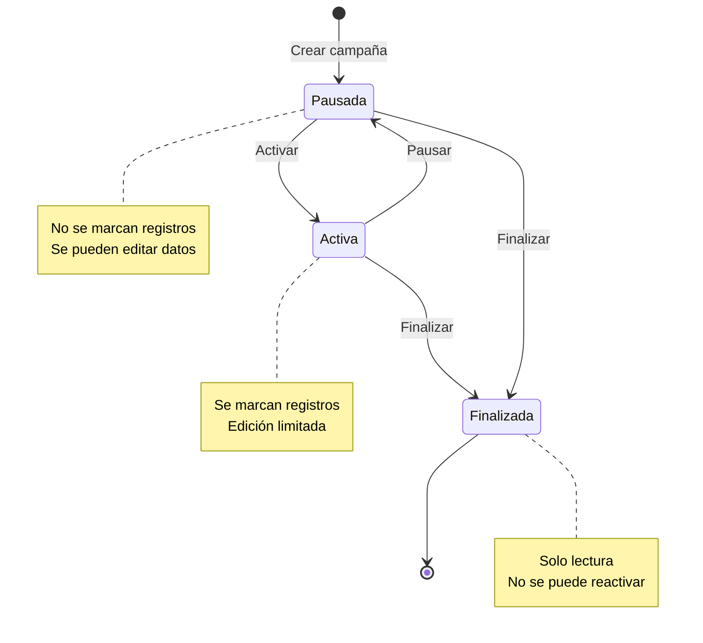

# Reglas de Negocio - Campañas

> **Tipo**: Lógica de Negocio (independiente de tecnología)
> **Aplica a**: Tanto APLICACION-ACTUAL como APLICACION-PROPUESTA

---

## 📊 Origen de las Reglas

Este documento contiene reglas de **3 orígenes**:

- **📘 MANUAL**: Extraídas del Manual oficial Tiphone v6 (`ManualMD/`)
- **💻 CÓDIGO**: Extraídas del código fuente (JavaScript, Web.config)
- **🧠 INFERIDA**: Deducidas por lógica/mejores prácticas (requieren validación)

Consulta `ORIGEN-REGLAS.md` para referencias detalladas.

---

## 1. Definición

Una **Campaña** es un conjunto de registros (contactos) que se marcan con un objetivo común. Cada campaña puede contener múltiples listas de registros.

---

## 2. Estados de Campaña



### Estados Permitidos 🧠

> **Origen**: 🧠 INFERIDA - Estados lógicos basados en ciclo de vida estándar

| Estado | ID | Descripción | Se marca | Se edita |
|--------|----|-----------  |----------|----------|
| **Pausada** | 2 | Estado inicial y temporal | ❌ No | ✅ Sí (todo) |
| **Activa** | 1 | En ejecución | ✅ Sí | ⚠️ Solo algunos campos |
| **Finalizada** | 3 | Terminada | ❌ No | ❌ No |

---

## 3. Reglas de Creación

### REGLA: Campos Obligatorios 🧠

> **Origen**: 🧠 INFERIDA - Campos lógicamente necesarios

**Descripción**: Al crear una campaña, ciertos campos son obligatorios.

**Campos obligatorios**:
- `Alias` (string, único por cuenta)
- `IdCuenta` (int)
- `IdTipoCampana` (int)
- `FechaInicio` (datetime)
- `FechaFin` (datetime)

**Validación**:
```
SI algún campo obligatorio está vacío ENTONCES
    Rechazar con error específico por campo
FIN SI
```

**Mensajes de error**:
- "El alias es obligatorio"
- "Debe seleccionar un tipo de campaña"
- "La fecha de inicio es obligatoria"
- "La fecha de fin es obligatoria"

---

### REGLA: Alias Único 🧠

> **Origen**: 🧠 INFERIDA - Estándar para evitar confusión

**Descripción**: El alias de una campaña debe ser único dentro de su cuenta.

**Razón**: El alias se usa como identificador visual en toda la aplicación.

**Validación**:
```sql
SELECT COUNT(*)
FROM Campanas
WHERE Alias = @Alias
  AND IdCuenta = @IdCuenta
  AND Id <> @IdCampanaActual
```

**Condición**:
```
SI COUNT > 0 ENTONCES
    Rechazar con error
FIN SI
```

**Mensaje de error**:
"Ya existe una campaña con el alias '{alias}' en esta cuenta."

**Excepción**: Cuentas diferentes pueden tener el mismo alias.

---

### REGLA: Validación de Fechas

**Descripción**: La fecha de fin debe ser posterior a la fecha de inicio.

**Validación**:
```
SI FechaFin <= FechaInicio ENTONCES
    Rechazar con error
FIN SI
```

**Mensaje de error**:
"La fecha de fin debe ser posterior a la fecha de inicio."

---

### REGLA: Estado Inicial

**Descripción**: Toda campaña nueva se crea en estado "Pausada".

**Razón**: Permite configurar listas y parámetros antes de activar.

**Implementación**:
```
IdEstado = 2  // Pausada
```

---

## 4. Reglas de Activación

### REGLA: Requisitos para Activar

**Descripción**: Para activar una campaña, debe cumplir ciertos requisitos.

**Requisitos**:
1. ✅ Debe tener al menos 1 lista activa
2. ✅ Las listas activas deben tener registros
3. ✅ Debe tener al menos 1 grupo asignado
4. ✅ Los grupos asignados deben tener operadores
5. ✅ Fecha actual debe estar entre FechaInicio y FechaFin

**Validación**:
```
SI NO tiene listas activas ENTONCES
    Rechazar: "La campaña debe tener al menos una lista activa"
FIN SI

SI listas activas sin registros ENTONCES
    Rechazar: "Las listas activas deben contener registros"
FIN SI

SI NO tiene grupos asignados ENTONCES
    Rechazar: "Debe asignar al menos un grupo a la campaña"
FIN SI

SI grupos sin operadores ENTONCES
    Rechazar: "Los grupos asignados deben tener operadores disponibles"
FIN SI

SI fecha_actual < FechaInicio OR fecha_actual > FechaFin ENTONCES
    Rechazar: "La campaña solo puede activarse dentro del rango de fechas configurado"
FIN SI
```

---

### REGLA: Efecto de Activación

**Descripción**: Al activar una campaña, se inicia la marcación automática.

**Efectos**:
1. Estado cambia a "Activa" (IdEstado = 1)
2. Se notifica al motor de marcación (Persuader)
3. Los registros pendientes empiezan a marcarse
4. Los operadores del grupo pueden recibir llamadas

---

## 5. Reglas de Pausa

### REGLA: Pausar Campaña Activa

**Descripción**: Una campaña activa puede pausarse en cualquier momento.

**Efectos**:
1. Estado cambia a "Pausada" (IdEstado = 2)
2. Se detiene la marcación de nuevos registros
3. Llamadas en curso se completan normalmente
4. Los registros quedan en su estado actual

**Importante**: Pausar NO afecta las llamadas ya en curso.

---

## 6. Reglas de Finalización

### REGLA: Finalizar Campaña

**Descripción**: Una campaña puede finalizarse desde cualquier estado (Activa o Pausada).

**Confirmación requerida**: Sí (acción irreversible)

**Efectos**:
1. Estado cambia a "Finalizada" (IdEstado = 3)
2. Se detiene inmediatamente la marcación
3. Llamadas en curso se completan
4. No se puede editar ni reactivar
5. Pasa a modo solo lectura

**Mensaje de confirmación**:
"¿Está seguro de finalizar la campaña '{alias}'? Esta acción no se puede deshacer."

---

## 7. Reglas de Edición

### REGLA: Campos Editables según Estado

**Descripción**: Los campos que se pueden editar dependen del estado de la campaña.

| Campo | Pausada | Activa | Finalizada |
|-------|---------|--------|------------|
| Alias | ✅ Sí | ❌ No | ❌ No |
| Descripción | ✅ Sí | ✅ Sí | ❌ No |
| Tipo campaña | ✅ Sí | ❌ No | ❌ No |
| Fecha inicio | ✅ Sí | ❌ No | ❌ No |
| Fecha fin | ✅ Sí | ⚠️ Solo extender | ❌ No |
| Horarios | ✅ Sí | ✅ Sí | ❌ No |
| Grupos | ✅ Sí | ✅ Sí | ❌ No |
| Listas | ✅ Sí | ✅ Sí | ❌ No |

**Excepción para Fecha Fin en Activa**:
```
SI nueva_fecha_fin > fecha_fin_actual ENTONCES
    Permitir (extender campaña)
SINO
    Rechazar "No se puede reducir la fecha de fin de una campaña activa"
FIN SI
```

---

## 8. Reglas de Eliminación

### REGLA: Eliminar Campaña

**Descripción**: Una campaña solo puede eliminarse en ciertos casos.

**Condiciones para eliminar**:
```
SI estado = Pausada Y NO tiene registros marcados ENTONCES
    Permitir eliminación
SINO
    Rechazar eliminación
FIN SI
```

**Mensaje de rechazo**:
- Si está Activa: "No se puede eliminar una campaña activa. Debe pausarla o finalizarla primero."
- Si está Finalizada: "No se puede eliminar una campaña finalizada. Use la opción de archivar."
- Si tiene registros marcados: "No se puede eliminar una campaña con registros ya marcados."

**Alternativa**: Ofrecer "Finalizar" en lugar de eliminar.

---

## 9. Reglas de Listas

### REGLA: Límite de Listas Activas

**Descripción**: Una campaña no puede tener más de 50 listas activas simultáneamente.

**Razón**: Limitación del motor de marcación (Persuader).

**Validación al activar lista**:
```sql
SELECT COUNT(*)
FROM Listas
WHERE IdCampana = @IdCampana
  AND Activa = 1
```

**Condición**:
```
SI COUNT >= 50 ENTONCES
    Rechazar: "La campaña ya tiene 50 listas activas. Pause alguna lista antes de activar esta."
FIN SI
```

---

### REGLA: Lista sin Registros

**Descripción**: Una lista activa debe contener al menos 1 registro.

**Validación**:
```sql
SELECT COUNT(*)
FROM Registros
WHERE IdLista = @IdLista
```

**Condición**:
```
SI COUNT = 0 ENTONCES
    Rechazar: "No se puede activar una lista vacía"
FIN SI
```

---

## 10. Reglas de Asignación de Grupos

### REGLA: Mínimo de Grupos

**Descripción**: Una campaña debe tener al menos 1 grupo asignado para poder activarse.

**Validación**:
```sql
SELECT COUNT(*)
FROM Campana_Grupo
WHERE IdCampana = @IdCampana
```

**Condición**:
```
SI COUNT = 0 ENTONCES
    Rechazar activación
FIN SI
```

---

### REGLA: Grupos con Operadores

**Descripción**: Los grupos asignados deben tener al menos 1 operador disponible.

**Validación**:
```sql
SELECT COUNT(DISTINCT og.IdOperador)
FROM Campana_Grupo cg
INNER JOIN Operador_Grupo og ON cg.IdGrupo = og.IdGrupo
INNER JOIN Operadores o ON og.IdOperador = o.Id
WHERE cg.IdCampana = @IdCampana
  AND o.Activo = 1
```

**Condición**:
```
SI COUNT = 0 ENTONCES
    Rechazar: "Los grupos asignados deben tener operadores disponibles"
FIN SI
```

---

## 11. Reglas de Tipos de Campaña

### REGLA: Tipos Disponibles

**Descripción**: Existen diferentes tipos de campaña con comportamientos distintos.

| Tipo | ID | Comportamiento |
|------|----|--------------  |
| **Manual** | 1 | Operador marca manualmente |
| **Predictiva** | 2 | Sistema marca automáticamente |
| **Preview** | 3 | Operador ve datos antes de marcar |
| **Power Dialer** | 4 | Marca automática con ratio fijo |
| **IVR** | 5 | Automatizada con menú de voz |

**Validación**:
```
SI IdTipoCampana NO está en (1,2,3,4,5) ENTONCES
    Rechazar: "Tipo de campaña no válido"
FIN SI
```

---

## 12. Reglas de Horarios

### REGLA: Horario de Marcación

**Descripción**: Solo se marcan registros dentro del horario configurado.

**Configuración**:
- `HoraInicio` (time): Ej. 09:00
- `HoraFin` (time): Ej. 21:00
- `DiasSemana` (bitmask): Lunes=1, Martes=2, Miércoles=4, etc.

**Validación en tiempo real**:
```
hora_actual = HORA_SISTEMA()
dia_actual = DIA_SEMANA()

SI hora_actual < HoraInicio OR hora_actual > HoraFin ENTONCES
    NO marcar (fuera de horario)
FIN SI

SI NOT (DiasSemana & dia_actual) ENTONCES
    NO marcar (día no permitido)
FIN SI
```

---

### REGLA: Respeto de Festivos

**Descripción**: No se marcan registros en días festivos configurados.

**Validación**:
```sql
SELECT COUNT(*)
FROM Festivos
WHERE Fecha = @FechaActual
  AND (IdCuenta = @IdCuenta OR EsNacional = 1)
```

**Condición**:
```
SI COUNT > 0 ENTONCES
    NO marcar (día festivo)
FIN SI
```

---

## 13. Reglas de Prioridad

### REGLA: Prioridad de Campaña

**Descripción**: Las campañas tienen prioridad para asignación de operadores.

**Escala**: 1 (baja) a 5 (alta)

**Comportamiento**:
```
SI múltiples campañas compiten por el mismo grupo ENTONCES
    Priorizar campaña con Prioridad más alta
FIN SI
```

---

## 14. Reglas de Capacidad

### REGLA: Máximo de Líneas Simultáneas

**Descripción**: Límite de llamadas simultáneas que puede tener una campaña.

**Configuración**: `MaxLineas` (int)

**Validación en tiempo real**:
```sql
SELECT COUNT(*)
FROM Llamadas
WHERE IdCampana = @IdCampana
  AND Estado IN ('En curso', 'Marcando')
```

**Condición**:
```
SI COUNT >= MaxLineas ENTONCES
    NO iniciar nueva llamada
    Esperar a que termine alguna llamada en curso
FIN SI
```

---

## 15. Reglas de Auditoría

### REGLA: Registro de Cambios

**Descripción**: Todos los cambios importantes en una campaña deben auditarse.

**Eventos auditados**:
- Creación
- Activación
- Pausa
- Finalización
- Cambios de configuración (mientras está activa)
- Eliminación

**Datos a registrar**:
- Usuario que realizó la acción
- Fecha y hora
- Acción realizada
- Valores anteriores (si aplica)
- Valores nuevos (si aplica)

---

## 16. Validaciones Cruzadas

### REGLA: Solapamiento de Fechas

**Descripción**: Advertir (no bloquear) si hay campañas con fechas solapadas en la misma cuenta.

**Validación**:
```sql
SELECT COUNT(*)
FROM Campanas
WHERE IdCuenta = @IdCuenta
  AND Id <> @IdCampanaActual
  AND Estado <> 3  -- No Finalizada
  AND (
    (FechaInicio <= @FechaFin AND FechaFin >= @FechaInicio)
  )
```

**Condición**:
```
SI COUNT > 0 ENTONCES
    Mostrar advertencia: "Existen {COUNT} campañas activas con fechas solapadas"
    Permitir continuar (es solo advertencia)
FIN SI
```

---

## 17. Integración con Persuader

### REGLA: Notificación a Motor de Marcación

**Descripción**: Cuando se activa una campaña, se debe notificar al motor Persuader.

**API Persuader**:
```
POST https://vpcpre.adlantia.com/MantPersuaderApi/api/v1.0/campanas/activar
Body: {
  "idCampana": 123,
  "tipoCampana": "Predictiva",
  "maxLineas": 10,
  "horarios": {...}
}
```

**Manejo de errores**:
```
SI Persuader no responde ENTONCES
    Revertir estado a "Pausada"
    Mostrar error: "Error al activar campaña en el motor de marcación"
FIN SI
```

---

## 18. Resumen de Reglas por Acción

### Crear Campaña
✅ Validar campos obligatorios
✅ Validar alias único
✅ Validar fechas (fin > inicio)
✅ Estado inicial = Pausada

### Activar Campaña
✅ Estado actual = Pausada
✅ Al menos 1 lista activa con registros
✅ Al menos 1 grupo con operadores
✅ Fecha actual dentro del rango
✅ Notificar a Persuader

### Pausar Campaña
✅ Estado actual = Activa
✅ Notificar a Persuader

### Finalizar Campaña
✅ Confirmación del usuario
✅ Notificar a Persuader
⚠️ Acción irreversible

### Editar Campaña
✅ Validar campos editables según estado
✅ Validar alias único (si cambió)
✅ Validar fechas

### Eliminar Campaña
✅ Estado = Pausada
✅ Sin registros marcados
❌ No permitir si estado = Activa o Finalizada

---

## 19. Ejemplos de Validación

### Ejemplo 1: Crear Campaña Válida

```
ENTRADA:
  Alias = "Cobranza Enero 2025"
  IdCuenta = 5
  IdTipoCampana = 2  // Predictiva
  FechaInicio = 2025-01-01
  FechaFin = 2025-01-31

VALIDACIONES:
  ✅ Alias no vacío
  ✅ Alias único en cuenta 5
  ✅ Tipo válido
  ✅ Fechas válidas (fin > inicio)

RESULTADO:
  ✅ Campaña creada con IdEstado = 2 (Pausada)
```

### Ejemplo 2: Activar Campaña - Error

```
ENTRADA:
  IdCampana = 123
  Acción = Activar

VALIDACIONES:
  ✅ Estado actual = Pausada
  ❌ No tiene listas activas

RESULTADO:
  ❌ Rechazar: "La campaña debe tener al menos una lista activa"
```

### Ejemplo 3: Editar Alias - Campaña Activa

```
ENTRADA:
  IdCampana = 123
  Estado actual = Activa
  Nuevo alias = "Ventas Q1"

VALIDACIONES:
  ❌ No se puede editar alias en campaña activa

RESULTADO:
  ❌ Rechazar: "No se puede cambiar el alias de una campaña activa"
```

---

**Documento**: Reglas de Negocio - Campañas
**Versión**: 1.0
**Fecha**: 2025-10-27
