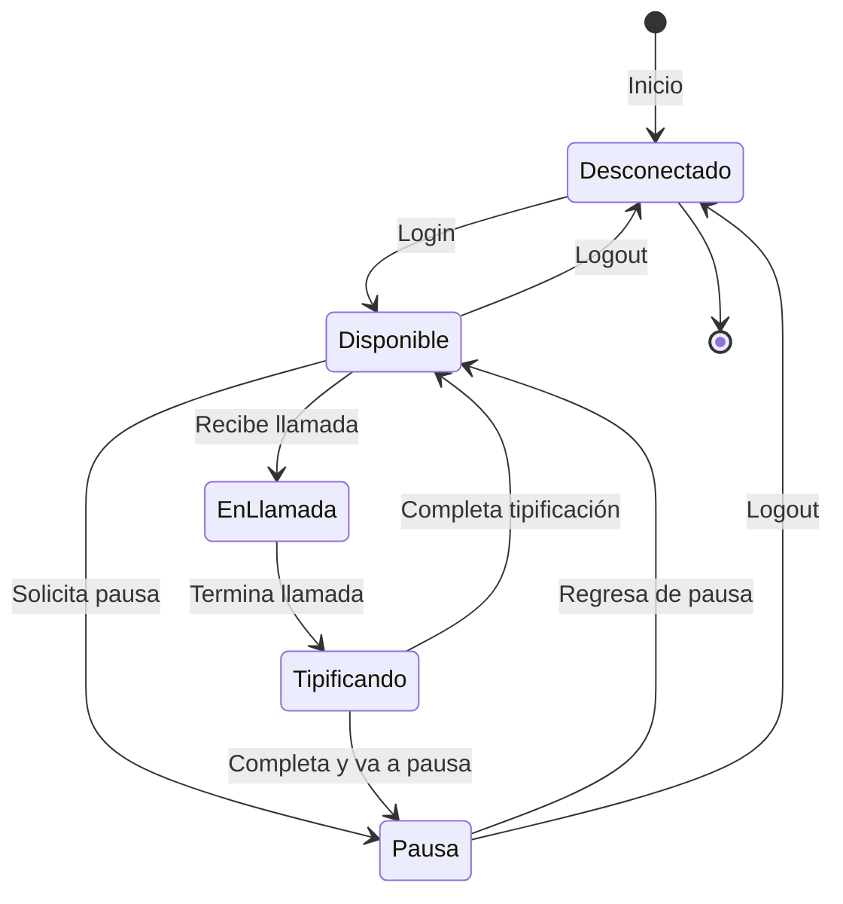

# Reglas de Negocio - Operadores

> **Tipo**: Lógica de Negocio (independiente de tecnología)
> **Aplica a**: Tanto APLICACION-ACTUAL como APLICACION-PROPUESTA

---

## 📊 Origen de las Reglas

Este documento contiene reglas de **3 orígenes**:

- **📘 MANUAL**: Extraídas del Manual oficial Tiphone v6 (`ManualMD/`)
- **💻 CÓDIGO**: Extraídas del código fuente (JavaScript, Web.config)
- **🧠 INFERIDA**: Deducidas por lógica/mejores prácticas (requieren validación)

Consulta `ORIGEN-REGLAS.md` para referencias detalladas.

---

## 1. Definición

Un **Operador** es un agente que atiende llamadas en campañas. Los operadores se organizan en grupos según habilidades o funciones.

---

## 2. Estados de Operador



### Estados Disponibles

| Estado | ID | Descripción | Recibe llamadas | Editable |
|--------|----|-----------  |-----------------|----------|
| **Desconectado** | 0 | No logueado | ❌ No | N/A |
| **Disponible** | 1 | Listo para llamadas | ✅ Sí | ❌ No |
| **En Llamada** | 2 | Atendiendo llamada | ❌ No | ❌ No |
| **Tipificando** | 3 | Clasificando llamada | ❌ No | ❌ No |
| **Pausa** | 4 | En descanso | ❌ No | ⚠️ Solo motivo |

---

## 3. Reglas de Alta/Creación

### REGLA: Campos Obligatorios

**Descripción**: Al crear un operador, ciertos campos son obligatorios.

**Campos obligatorios**:
- `Nombre` (string, min 2 caracteres)
- `Apellido` (string, min 2 caracteres)
- `Usuario` (string, único, min 4 caracteres)
- `Password` (string, min 6 caracteres)
- `Email` (string, formato válido, único)
- `IdCuenta` (int)
- `Extension` (string, único en cuenta)

**Validación**:
```
SI algún campo obligatorio está vacío ENTONCES
    Rechazar con error específico
FIN SI
```

**Mensajes de error**:
- "El nombre es obligatorio (mínimo 2 caracteres)"
- "El apellido es obligatorio (mínimo 2 caracteres)"
- "El usuario es obligatorio (mínimo 4 caracteres)"
- "La contraseña es obligatoria (mínimo 6 caracteres)"
- "El email es obligatorio y debe ser válido"
- "La extensión es obligatoria"

---

### REGLA: Usuario Único

**Descripción**: El nombre de usuario debe ser único en todo el sistema.

**Validación**:
```sql
SELECT COUNT(*)
FROM Operadores
WHERE Usuario = @Usuario
  AND Id <> @IdOperadorActual
```

**Condición**:
```
SI COUNT > 0 ENTONCES
    Rechazar: "El usuario '{usuario}' ya existe"
FIN SI
```

---

### REGLA: Email Único

**Descripción**: El email debe ser único en todo el sistema.

**Validación formato**:
```
Expresión regular: ^[a-zA-Z0-9._%+-]+@[a-zA-Z0-9.-]+\.[a-zA-Z]{2,}$
```

**Validación unicidad**:
```sql
SELECT COUNT(*)
FROM Operadores
WHERE Email = @Email
  AND Id <> @IdOperadorActual
```

**Condiciones**:
```
SI formato inválido ENTONCES
    Rechazar: "El email no tiene un formato válido"
FIN SI

SI COUNT > 0 ENTONCES
    Rechazar: "El email '{email}' ya está registrado"
FIN SI
```

---

### REGLA: Extensión Única por Cuenta

**Descripción**: La extensión debe ser única dentro de la cuenta.

**Razón**: La extensión identifica al operador en la central telefónica.

**Validación**:
```sql
SELECT COUNT(*)
FROM Operadores
WHERE Extension = @Extension
  AND IdCuenta = @IdCuenta
  AND Id <> @IdOperadorActual
```

**Condición**:
```
SI COUNT > 0 ENTONCES
    Rechazar: "La extensión '{extension}' ya está asignada a otro operador"
FIN SI
```

---

### REGLA: Estado Inicial

**Descripción**: Todo operador nuevo se crea activo pero desconectado.

**Implementación**:
```
Activo = 1 (Sí)
IdEstado = 0 (Desconectado)
```

---

## 4. Reglas de Login

### REGLA: Validación de Credenciales

**Descripción**: El operador debe proporcionar usuario y contraseña válidos.

**Validación**:
```sql
SELECT *
FROM Operadores
WHERE Usuario = @Usuario
  AND Password = HASH(@Password)
  AND Activo = 1
```

**Condiciones**:
```
SI no se encuentra registro ENTONCES
    Rechazar: "Usuario o contraseña incorrectos"
FIN SI

SI Activo = 0 ENTONCES
    Rechazar: "El operador está desactivado. Contacte al administrador"
FIN SI
```

---

### REGLA: Sesión Única

**Descripción**: Un operador solo puede tener una sesión activa a la vez.

**Validación**:
```sql
SELECT COUNT(*)
FROM Sesiones
WHERE IdOperador = @IdOperador
  AND FechaFin IS NULL
```

**Condición**:
```
SI COUNT > 0 ENTONCES
    Opción 1: Cerrar sesión anterior automáticamente
    Opción 2: Rechazar: "Ya existe una sesión activa. Cierre la sesión anterior"
FIN SI
```

**Implementación actual**: Opción 1 (cierre automático)

---

### REGLA: Registro de Sesión

**Descripción**: Cada login debe registrarse para auditoría.

**Datos a registrar**:
```
IdOperador
FechaInicio (datetime)
IP (string)
UserAgent (string)
```

---

### REGLA: Cambio de Estado al Login

**Descripción**: Al hacer login, el estado cambia a "Disponible".

**Implementación**:
```
IdEstado = 1  // Disponible
UltimaConexion = FECHA_ACTUAL()
```

---

## 5. Reglas de Logout

### REGLA: Finalizar Sesión

**Descripción**: Al hacer logout, se cierra la sesión y cambia el estado.

**Implementación**:
```sql
UPDATE Sesiones
SET FechaFin = GETDATE()
WHERE IdOperador = @IdOperador
  AND FechaFin IS NULL

UPDATE Operadores
SET IdEstado = 0  -- Desconectado
WHERE Id = @IdOperador
```

---

### REGLA: No Logout con Llamada Activa

**Descripción**: No se puede hacer logout si hay una llamada en curso.

**Validación**:
```sql
SELECT COUNT(*)
FROM Llamadas
WHERE IdOperador = @IdOperador
  AND Estado IN ('En curso', 'Tipificando')
```

**Condición**:
```
SI COUNT > 0 ENTONCES
    Rechazar: "No puede desconectarse mientras tiene una llamada activa"
FIN SI
```

---

## 6. Reglas de Asignación a Grupos

### REGLA: Mínimo de Grupos

**Descripción**: Un operador puede NO pertenecer a ningún grupo (queda inactivo para campañas).

**Validación**: No hay mínimo obligatorio.

---

### REGLA: Máximo de Grupos

**Descripción**: Un operador puede pertenecer a un máximo de 10 grupos simultáneos.

**Razón**: Evitar confusión y problemas de asignación.

**Validación**:
```sql
SELECT COUNT(*)
FROM Operador_Grupo
WHERE IdOperador = @IdOperador
```

**Condición**:
```
SI COUNT >= 10 ENTONCES
    Rechazar: "Un operador no puede pertenecer a más de 10 grupos"
FIN SI
```

---

### REGLA: Grupo Válido

**Descripción**: El grupo debe existir y pertenecer a la misma cuenta.

**Validación**:
```sql
SELECT COUNT(*)
FROM Grupos g
INNER JOIN Operadores o ON g.IdCuenta = o.IdCuenta
WHERE g.Id = @IdGrupo
  AND o.Id = @IdOperador
  AND g.Activo = 1
```

**Condición**:
```
SI COUNT = 0 ENTONCES
    Rechazar: "El grupo no existe o no pertenece a la misma cuenta"
FIN SI
```

---

### REGLA: Sin Duplicados

**Descripción**: Un operador no puede estar dos veces en el mismo grupo.

**Validación**:
```sql
SELECT COUNT(*)
FROM Operador_Grupo
WHERE IdOperador = @IdOperador
  AND IdGrupo = @IdGrupo
```

**Condición**:
```
SI COUNT > 0 ENTONCES
    Rechazar: "El operador ya pertenece a este grupo"
FIN SI
```

---

## 7. Reglas de Pausas

### REGLA: Tipos de Pausa

**Descripción**: Existen diferentes tipos de pausa con límites de tiempo.

| Tipo | ID | Duración Máxima | Requiere Aprobación |
|------|----|-----------------|--------------------|
| **Baño** | 1 | 5 minutos | ❌ No |
| **Café** | 2 | 10 minutos | ❌ No |
| **Comida** | 3 | 60 minutos | ✅ Sí (si > 30 min) |
| **Formación** | 4 | Ilimitada | ✅ Sí |
| **Técnica** | 5 | Ilimitada | ❌ No (problema técnico) |
| **Personal** | 6 | 15 minutos | ⚠️ Límite diario |

---

### REGLA: Solicitud de Pausa

**Descripción**: El operador puede solicitar pausa si cumple condiciones.

**Condiciones**:
```
SI Estado != Disponible ENTONCES
    Rechazar: "Solo puede pausar desde estado Disponible"
FIN SI

SI RequiereAprobacion(TipoPausa) Y NO tiene aprobación ENTONCES
    Enviar notificación a supervisor
    Estado = "Pendiente aprobación pausa"
SINO
    Estado = Pausa
    RegistrarInicioPausa()
FIN SI
```

---

### REGLA: Límite Diario de Pausas

**Descripción**: Pausas personales tienen límite diario acumulado.

**Límite**: 30 minutos/día de pausas personales

**Validación**:
```sql
SELECT SUM(DATEDIFF(minute, Inicio, Fin))
FROM Pausas
WHERE IdOperador = @IdOperador
  AND IdTipoPausa = 6  -- Personal
  AND CAST(Inicio AS DATE) = CAST(GETDATE() AS DATE)
```

**Condición**:
```
SI SUM >= 30 ENTONCES
    Rechazar: "Ha alcanzado el límite diario de pausas personales (30 minutos)"
FIN SI
```

---

### REGLA: Alerta de Tiempo Excedido

**Descripción**: Alertar al operador y supervisor si excede tiempo de pausa.

**Implementación**:
```
SI tiempo_pausa > DuracionMaxima + 2_minutos ENTONCES
    Enviar alerta a operador: "Su pausa ha excedido el tiempo permitido"
    Enviar alerta a supervisor: "Operador {nombre} excedió tiempo de pausa"
FIN SI
```

---

### REGLA: Fin de Pausa

**Descripción**: Al regresar de pausa, el estado vuelve a "Disponible".

**Implementación**:
```sql
UPDATE Pausas
SET Fin = GETDATE()
WHERE IdOperador = @IdOperador
  AND Fin IS NULL

UPDATE Operadores
SET IdEstado = 1  -- Disponible
WHERE Id = @IdOperador
```

---

## 8. Reglas de Llamadas

### REGLA: Asignación de Llamada

**Descripción**: Una llamada se asigna a operador disponible en grupo correcto.

**Condiciones**:
```
SI Estado = Disponible
   Y Pertenece a grupo de la campaña
   Y NO tiene llamada activa
   Y NO está en pausa ENTONCES
    Asignar llamada
    Estado = EnLlamada
FIN SI
```

---

### REGLA: Una Llamada a la Vez

**Descripción**: Un operador solo puede atender una llamada a la vez.

**Validación**:
```sql
SELECT COUNT(*)
FROM Llamadas
WHERE IdOperador = @IdOperador
  AND Estado IN ('En curso', 'Tipificando')
```

**Condición**:
```
SI COUNT > 0 ENTONCES
    NO asignar nueva llamada
FIN SI
```

---

### REGLA: Cambio de Estado Durante Llamada

**Descripción**: Estados durante y después de la llamada.

**Flujo**:
```
1. Llamada conectada: Estado = EnLlamada
2. Llamada finalizada: Estado = Tipificando
3. Tipificación completada:
   SI operador solicitó pausa ENTONCES
      Estado = Pausa
   SINO
      Estado = Disponible
   FIN SI
```

---

### REGLA: Tiempo Máximo de Tipificación

**Descripción**: Límite de tiempo para tipificar después de colgar.

**Límite**: 120 segundos (2 minutos)

**Implementación**:
```
SI tiempo_tipificacion > 120 segundos ENTONCES
    Alertar: "Tiempo de tipificación excedido"
    Registrar métrica
FIN SI
```

**Nota**: No forzar cambio de estado, solo alertar (puede haber casos legítimos).

---

## 9. Reglas de Activación/Desactivación

### REGLA: Desactivar Operador

**Descripción**: Un operador activo puede desactivarse.

**Condiciones**:
```
SI Estado = Disponible OR Estado = Desconectado ENTONCES
    Activo = 0
    Eliminar de grupos (opcional)
SINO
    Rechazar: "No puede desactivar un operador con llamada activa o en pausa"
FIN SI
```

---

### REGLA: Reactivar Operador

**Descripción**: Un operador desactivado puede reactivarse.

**Implementación**:
```
Activo = 1
Estado = Desconectado  // Debe hacer login de nuevo
```

---

## 10. Reglas de Edición

### REGLA: Campos Editables con Sesión Activa

**Descripción**: Algunos campos no se pueden editar si el operador está logueado.

| Campo | Sin Sesión | Con Sesión |
|-------|------------|------------|
| Nombre | ✅ Sí | ✅ Sí |
| Apellido | ✅ Sí | ✅ Sí |
| Usuario | ✅ Sí | ❌ No |
| Password | ✅ Sí | ⚠️ Requiere relogin |
| Email | ✅ Sí | ✅ Sí |
| Extension | ✅ Sí | ❌ No |
| Grupos | ✅ Sí | ⚠️ Afecta asignaciones |

**Validación para cambios críticos**:
```
SI tiene sesión activa Y campo crítico ENTONCES
    Opción 1: Rechazar hasta que haga logout
    Opción 2: Forzar logout y permitir cambio
FIN SI
```

---

### REGLA: Cambio de Contraseña

**Descripción**: Al cambiar contraseña, cerrar todas las sesiones activas.

**Implementación**:
```sql
-- Actualizar password
UPDATE Operadores
SET Password = HASH(@NuevaPassword),
    IdEstado = 0
WHERE Id = @IdOperador

-- Cerrar todas las sesiones
UPDATE Sesiones
SET FechaFin = GETDATE()
WHERE IdOperador = @IdOperador
  AND FechaFin IS NULL
```

---

## 11. Reglas de Métricas

### REGLA: Registro de Tiempos

**Descripción**: Registrar tiempos clave para métricas.

**Tiempos a registrar**:
- Tiempo en disponible
- Tiempo en llamada
- Tiempo en tipificación
- Tiempo en pausa (por tipo)
- Tiempo conectado total

---

### REGLA: KPIs Calculados

**Descripción**: KPIs que se calculan para cada operador.

| KPI | Fórmula |
|-----|---------|
| **Ocupación** | (Tiempo en llamada + Tiempo tipificando) / Tiempo conectado |
| **Disponibilidad** | Tiempo disponible / Tiempo conectado |
| **Tiempo Medio de Llamada (TMO)** | SUM(Duración llamadas) / COUNT(Llamadas) |
| **Llamadas por Hora** | COUNT(Llamadas) / (Tiempo conectado en horas) |

---

## 12. Reglas de Permisos

### REGLA: Permisos de Operador Base

**Descripción**: Permisos que tiene un operador por defecto.

**Permisos base**:
- ✅ Ver sus propias campañas asignadas
- ✅ Atender llamadas
- ✅ Tipificar llamadas
- ✅ Reprogramar contactos
- ✅ Solicitar pausas
- ✅ Ver su propio dashboard
- ❌ Editar campañas
- ❌ Ver otros operadores
- ❌ Acceso a supervisión

---

### REGLA: Permisos de Supervisor

**Descripción**: Permisos adicionales si tiene rol supervisor.

**Permisos adicionales**:
- ✅ Ver todos los operadores de su cuenta
- ✅ Supervisión en tiempo real
- ✅ Aprobar/rechazar pausas
- ✅ Ver reportes del equipo
- ✅ Escuchar llamadas (con grabación)
- ❌ Editar configuración de campañas

---

## 13. Reglas de Eliminación

### REGLA: No Eliminar, Solo Desactivar

**Descripción**: Los operadores NO se eliminan, solo se desactivan.

**Razón**: Mantener histórico de llamadas y métricas.

**Alternativa a eliminación**:
```
Activo = 0
Estado = Desconectado
Usuario = Usuario + "_DELETED_" + TIMESTAMP()
```

**Excepción**: Si NO tiene ninguna llamada registrada, se puede eliminar físicamente.

---

## 14. Validaciones Cruzadas

### REGLA: Validación de Capacidad de Grupo

**Descripción**: Al agregar operador a grupo, validar que no exceda capacidad.

**Validación**:
```sql
SELECT COUNT(*)
FROM Operador_Grupo
WHERE IdGrupo = @IdGrupo
```

**Condición** (si el grupo tiene límite configurado):
```
SI COUNT >= LimiteOperadores ENTONCES
    Rechazar: "El grupo ha alcanzado su capacidad máxima de operadores"
FIN SI
```

---

## 15. Reglas de Asterisk (Integración)

### REGLA: Extensión en Asterisk

**Descripción**: La extensión del operador debe existir en Asterisk.

**Validación** (antes de activar):
```
Verificar en configuración Asterisk:
  Archivo: \\192.168.1.159\Configuracion\extensions.conf
  Buscar: [extension_{numero}]
```

**Condición**:
```
SI NO existe en Asterisk ENTONCES
    Advertencia: "La extensión {ext} no está configurada en Asterisk"
    Permitir continuar (puede configurarse después)
FIN SI
```

---

## 16. Resumen de Reglas por Acción

### Crear Operador
✅ Validar campos obligatorios
✅ Validar usuario único
✅ Validar email único y formato
✅ Validar extensión única en cuenta
✅ Estado inicial = Desconectado, Activo = 1

### Login
✅ Validar credenciales
✅ Operador activo
✅ Cerrar sesión anterior si existe
✅ Registrar sesión
✅ Estado = Disponible

### Logout
✅ No hay llamada activa
✅ Cerrar sesión
✅ Estado = Desconectado

### Solicitar Pausa
✅ Estado = Disponible
✅ Validar tipo de pausa
✅ Validar límites diarios
✅ Aprobar si requiere aprobación

### Asignar a Grupo
✅ Máximo 10 grupos
✅ Grupo válido y misma cuenta
✅ Sin duplicados
✅ Capacidad del grupo

### Recibir Llamada
✅ Estado = Disponible
✅ Pertenece al grupo correcto
✅ No tiene llamada activa

### Editar Operador
✅ Validar unicidad (usuario, email, extensión)
✅ Validar si tiene sesión activa
✅ Cerrar sesión si cambio crítico

### Desactivar
✅ Estado = Disponible o Desconectado
✅ Activo = 0

---

## 17. Ejemplos de Validación

### Ejemplo 1: Crear Operador Válido

```
ENTRADA:
  Nombre = "Juan"
  Apellido = "Pérez"
  Usuario = "jperez"
  Password = "pass123"
  Email = "jperez@example.com"
  Extension = "1001"
  IdCuenta = 5

VALIDACIONES:
  ✅ Todos los campos completos
  ✅ Usuario "jperez" único
  ✅ Email válido y único
  ✅ Extensión "1001" única en cuenta 5

RESULTADO:
  ✅ Operador creado con Activo=1, Estado=0
```

### Ejemplo 2: Login - Error

```
ENTRADA:
  Usuario = "jperez"
  Password = "wrongpass"

VALIDACIONES:
  ❌ Credenciales no coinciden

RESULTADO:
  ❌ Rechazar: "Usuario o contraseña incorrectos"
```

### Ejemplo 3: Solicitar Pausa Personal - Excede Límite

```
ENTRADA:
  IdOperador = 123
  TipoPausa = 6 (Personal)

VALIDACIONES:
  ✅ Estado = Disponible
  ❌ Ya usó 30 minutos hoy

RESULTADO:
  ❌ Rechazar: "Ha alcanzado el límite diario de pausas personales (30 minutos)"
```

---

**Documento**: Reglas de Negocio - Operadores
**Versión**: 1.0
**Fecha**: 2025-10-27
