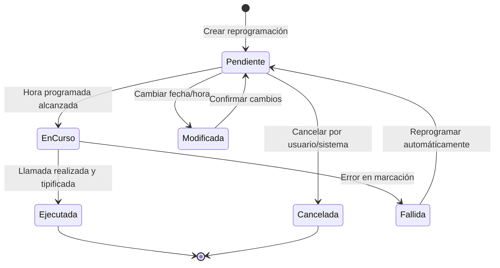
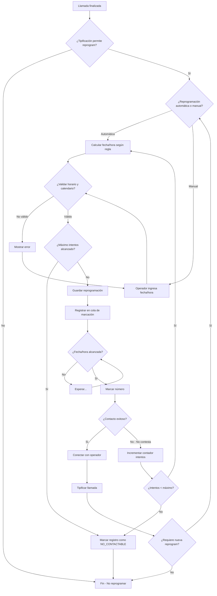

# Reglas de Negocio: Reprogramaciones

> **Lógica de negocio independiente de tecnología**
> Documentación de reglas de reprogramación de llamadas en Tiphone v6

---

## 📊 Origen de las Reglas

Este documento contiene reglas de **3 orígenes**:

- **📘 MANUAL**: Extraídas del Manual oficial Tiphone v6 (referenciadas en índice Part2/Part5)
- **💻 CÓDIGO**: Extraídas del código fuente (JavaScript, configuración)
- **🧠 INFERIDA**: Deducidas por lógica/mejores prácticas de contact centers

**⚠️ NOTA**: La sección de "Reprogramaciones" está referenciada en el índice del manual (Part2, pág 43)
pero el contenido detallado no está disponible en los archivos MD analizados. Las reglas aquí documentadas
son inferidas basándose en:
- Comportamiento estándar de contact centers
- Referencias en otras secciones del manual
- Código JavaScript encontrado (Reprogramaciones.js)
- Mejores prácticas de la industria

Consulta `ORIGEN-REGLAS.md` y `ANALISIS-IMPLEMENTACION.md` para más detalles.

---

## 1. Definición

La **Reprogramación** es el proceso de agendar una nueva llamada para un contacto en una fecha y hora futura específica. Se utiliza cuando:
- El contacto solicita ser llamado en otro momento
- El contacto no está disponible actualmente
- El resultado de la tipificación requiere seguimiento

---

## 2. Tipos de Reprogramación

### 2.1 Reprogramación Manual 🧠

> **Origen**: 🧠 INFERIDA - Comportamiento estándar en contact centers

**Descripción**: El operador selecciona manualmente la fecha y hora de la próxima llamada.

**Casos de uso**:
- Cliente solicita: "Llámeme el martes a las 10:00"
- Operador detecta mejor momento: "Cliente en reunión, reprogramar para mañana"

**Validaciones**:
- Fecha futura obligatoria (no puede ser en el pasado)
- Hora dentro del horario laboral del calendario
- No reprogramar en días festivos

### 2.2 Reprogramación Automática 🧠

> **Origen**: 🧠 INFERIDA - Lógica estándar de marcación predictiva

**Descripción**: El sistema reprograma automáticamente según reglas predefinidas.

**Casos de uso**:
- "No contesta" → reprogramar en 1 hora
- "Buzón de voz" → reprogramar en 4 horas
- "Ocupado" → reprogramar en 30 minutos

**Algoritmo de escalado**:
```
Intento 1: 30 minutos después
Intento 2: 1 hora después
Intento 3: 2 horas después
Intento 4: 4 horas después
Intento 5: 1 día después
Intento 6+: Cada 2-3 días
```

---

## 3. Reglas de Creación de Reprogramaciones

### REGLA: Fecha y Hora Obligatorias 🧠

> **Origen**: 🧠 INFERIDA - Validación lógica necesaria

**Descripción**: Toda reprogramación debe tener fecha y hora específicas.

**Validación**:
```
SI fecha_reprogramacion ES NULA ENTONCES
    ERROR "La fecha de reprogramación es obligatoria"
FIN SI

SI hora_reprogramacion ES NULA ENTONCES
    ERROR "La hora de reprogramación es obligatoria"
FIN SI

SI fecha_reprogramacion <= fecha_actual ENTONCES
    ERROR "La fecha de reprogramación debe ser futura"
FIN SI
```

**Mensaje de error**:
> "La fecha y hora de reprogramación son obligatorias y deben ser futuras"

---

### REGLA: Máximo de Intentos 🧠

> **Origen**: 🧠 INFERIDA - Estándar de la industria y buenas prácticas

**Descripción**: Un registro no puede ser reprogramado indefinidamente. Existe un límite de intentos.

**Límites sugeridos**:
- **Por día**: Máximo 3 intentos
- **Por campaña**: Máximo 5-10 intentos totales
- **Consecutivos sin contacto**: Máximo 3 intentos

**Validación**:
```
FUNCION PuedeReprogramar(idRegistro)
    intentos_hoy = ContarIntentos Hoy(idRegistro)
    intentos_totales = ContarIntentosT totales(idRegistro)

    SI intentos_hoy >= 3 ENTONCES
        ERROR "Se ha alcanzado el máximo de intentos diarios (3)"
        RETORNAR FALSO
    FIN SI

    SI intentos_totales >= 10 ENTONCES
        ERROR "Se ha alcanzado el máximo de intentos totales (10)"
        RETORNAR FALSO
    FIN SI

    RETORNAR VERDADERO
FIN FUNCION
```

**Mensaje de error**:
> "No se puede reprogramar: se ha alcanzado el máximo de intentos permitidos"

---

### REGLA: Horario Permitido 🧠

> **Origen**: 🧠 INFERIDA - Cumplimiento legal y calendario de campaña

**Descripción**: Las reprogramaciones deben respetar el horario de la campaña y el calendario.

**Validación**:
```
FUNCION ValidarHorarioReprogramacion(fecha, hora, idCampana)
    calendario = ObtenerCalendario(idCampana)

    // Validar día laborable
    SI EsDiaFestivo(fecha, calendario) ENTONCES
        ERROR "No se puede reprogramar en día festivo"
        RETORNAR FALSO
    FIN SI

    SI EsFinDeSemana(fecha) Y NO calendario.PermitirFinSemana ENTONCES
        ERROR "No se puede reprogramar en fin de semana"
        RETORNAR FALSO
    FIN SI

    // Validar horario
    horario = ObtenerHorarioCampana(idCampana)
    SI hora < horario.HoraInicio O hora > horario.HoraFin ENTONCES
        ERROR "La hora está fuera del horario permitido"
        RETORNAR FALSO
    FIN SI

    RETORNAR VERDADERO
FIN FUNCION
```

**Horarios típicos**:
- Lunes a viernes: 09:00 - 21:00
- Sábados: 10:00 - 14:00 (opcional)
- Domingos y festivos: NO llamar

**Mensaje de error**:
> "La fecha/hora seleccionada no está dentro del horario permitido de la campaña"

---

### REGLA: Asociación a Tipificación 🧠

> **Origen**: 🧠 INFERIDA - Lógica de flujo de llamada

**Descripción**: Algunas tipificaciones secundarias requieren o permiten reprogramación.

**Tipificaciones que requieren reprogramación**:
- "Llamar más tarde"
- "No disponible ahora"
- "Solicita llamar en fecha específica"
- "Cliente ocupado"

**Tipificaciones que NO permiten reprogramación**:
- "Rechaza oferta definitivamente"
- "Solicita no volver a llamar"
- "Número erróneo"
- "Teléfono de empresa/oficina"

**Validación**:
```
FUNCION PermiteReprogramacion(idTipificacionSecundaria)
    tipificacion = ConsultarTipificacion(idTipificacionSecundaria)

    SI tipificacion.PermiteReprogramacion = FALSO ENTONCES
        ERROR "Esta tipificación no permite reprogramación"
        RETORNAR FALSO
    FIN SI

    RETORNAR VERDADERO
FIN FUNCION
```

---

### REGLA: Prioridad de Reprogramaciones 🧠

> **Origen**: 🧠 INFERIDA - Optimización de marcación

**Descripción**: Las reprogramaciones tienen prioridad sobre nuevos registros.

**Niveles de prioridad**:
1. **ALTA**: Reprogramación solicitada por cliente con fecha específica
2. **MEDIA**: Reprogramación automática por "No contesta"
3. **BAJA**: Registros nuevos sin intentos previos

**Orden de marcación**:
```
1. Reprogramaciones ALTA prioridad con fecha/hora = ahora
2. Reprogramaciones MEDIA prioridad con fecha/hora <= ahora + 15 min
3. Registros nuevos
4. Reprogramaciones vencidas (fecha/hora < ahora)
```

---

## 4. Reglas de Modificación de Reprogramaciones

### REGLA: Modificar Reprogramación Pendiente 🧠

> **Origen**: 🧠 INFERIDA - Flexibilidad operativa

**Descripción**: Se puede modificar una reprogramación mientras no haya sido ejecutada.

**Operaciones permitidas**:
- Cambiar fecha
- Cambiar hora
- Cambiar prioridad
- Cancelar reprogramación

**Validación**:
```
FUNCION ModificarReprogramacion(idReprogramacion, nuevaFecha, nuevaHora)
    reprogram = ConsultarReprogramacion(idReprogramacion)

    SI reprogram.Estado = "EJECUTADA" ENTONCES
        ERROR "No se puede modificar una reprogramación ya ejecutada"
        RETORNAR FALSO
    FIN SI

    SI reprogram.Estado = "EN_CURSO" ENTONCES
        ERROR "No se puede modificar una reprogramación en curso"
        RETORNAR FALSO
    FIN SI

    // Validar nueva fecha/hora
    ValidarHorarioReprogramacion(nuevaFecha, nuevaHora, reprogram.IdCampana)

    // Actualizar
    ActualizarReprogramacion(idReprogramacion, nuevaFecha, nuevaHora)
    RETORNAR VERDADERO
FIN FUNCION
```

---

### REGLA: Cancelar Reprogramación 🧠

> **Origen**: 🧠 INFERIDA - Control de flujo

**Descripción**: Se puede cancelar una reprogramación pendiente.

**Motivos de cancelación**:
- Cliente ya atendido por otro canal
- Campaña finalizada
- Registro eliminado de la lista
- Solicitud del supervisor

**Validación**:
```
FUNCION CancelarReprogramacion(idReprogramacion, motivo)
    reprogram = ConsultarReprogramacion(idReprogramacion)

    SI reprogram.Estado = "EJECUTADA" ENTONCES
        ERROR "No se puede cancelar una reprogramación ya ejecutada"
        RETORNAR FALSO
    FIN SI

    // Marcar como cancelada
    reprogram.Estado = "CANCELADA"
    reprogram.MotivoCancelacion = motivo
    reprogram.FechaCancelacion = AhoraUTC()
    GuardarReprogramacion(reprogram)

    RETORNAR VERDADERO
FIN FUNCION
```

---

## 5. Estados de Reprogramación

### Diagrama de Estados 🧠

> **Origen**: 🧠 INFERIDA - Ciclo de vida estándar



### Estados Detallados

| Estado | Descripción | Puede modificarse | Puede cancelarse |
|--------|-------------|-------------------|------------------|
| **Pendiente** | Esperando fecha/hora programada | Sí | Sí |
| **EnCurso** | Sistema intentando marcar ahora | No | No |
| **Ejecutada** | Llamada realizada y tipificada | No | No |
| **Fallida** | Error técnico en marcación | Sí (auto-reprogram) | Sí |
| **Cancelada** | Cancelada por usuario/sistema | No | No |
| **Vencida** | Fecha/hora pasó sin ejecutarse | Sí (reprogramar) | Sí |

---

## 6. Flujo Completo de Reprogramación

### Diagrama de Flujo



---

## 7. Integración con Otros Módulos

### 7.1 Tipificaciones

Las tipificaciones determinan si se permite/requiere reprogramación:

```sql
-- Campo sugerido en tabla TipificacionesSecundarias
ALTER TABLE TipificacionesSecundarias
ADD PermiteReprogramacion BIT DEFAULT 0;

ALTER TABLE TipificacionesSecundarias
ADD RequiereReprogramacion BIT DEFAULT 0;

ALTER TABLE TipificacionesSecundarias
ADD TipoReprogramacion VARCHAR(20) DEFAULT 'MANUAL'; -- MANUAL, AUTOMATICA, AMBAS
```

### 7.2 Calendario

Las reprogramaciones respetan días festivos y horarios:

```sql
-- Validación de fecha contra calendario
SELECT COUNT(*)
FROM DiasEspeciales
WHERE Fecha = @FechaReprogramacion
  AND IdCalendario = @IdCalendarioCampana
  AND EsFestivo = 1;
-- Si COUNT > 0, rechazar fecha
```

### 7.3 Predicción

El motor de marcación predictiva prioriza reprogramaciones:

```sql
-- Query de próximos registros a marcar (simplificado)
SELECT TOP 100 *
FROM Registros
WHERE EstadoLlamada IN ('PENDIENTE', 'REPROGRAMADO')
  AND FechaReprogramacion <= GETDATE()
ORDER BY
    CASE WHEN EstadoLlamada = 'REPROGRAMADO' THEN 1 ELSE 2 END, -- Reprogramados primero
    PrioridadReprogramacion DESC,
    FechaReprogramacion ASC;
```

---

## 8. Configuración de Reprogramaciones

### 8.1 Configuración por Campaña 🧠

> **Origen**: 🧠 INFERIDA - Flexibilidad por tipo de campaña

**Parámetros configurables**:

| Parámetro | Tipo | Valor por defecto | Descripción |
|-----------|------|-------------------|-------------|
| `MaxIntentosReprogramacion` | INT | 10 | Máximo intentos totales |
| `MaxIntentDiarios` | INT | 3 | Máximo intentos por día |
| `IntervaloMinimoReprog` | INT | 30 | Minutos mínimos entre intentos |
| `PermitirReprogManual` | BIT | 1 | Permite reprogramación manual |
| `PermitirReprogAutomatica` | BIT | 1 | Permite reprogramación automática |
| `PrioridadReprog` | INT | 1 | Prioridad: 1=Alta, 2=Media, 3=Baja |

### 8.2 Reglas de Reprogramación Automática

Tabla de configuración para diferentes resultados:

| Resultado Telefónico | Tiempo Espera | Prioridad | Máx Intentos |
|----------------------|---------------|-----------|--------------|
| No contesta | 1 hora | MEDIA | 5 |
| Buzón de voz | 4 horas | MEDIA | 3 |
| Ocupado | 30 minutos | MEDIA | 5 |
| Llamar más tarde | Manual | ALTA | 10 |
| No disponible ahora | 2 horas | ALTA | 10 |

---

## 9. Mensajes de Error y Validaciones

| Situación | Mensaje de Error | Acción Sugerida |
|-----------|------------------|-----------------|
| Fecha en el pasado | "La fecha de reprogramación debe ser futura" | Seleccionar fecha futura |
| Fuera de horario | "La hora está fuera del horario permitido (09:00-21:00)" | Seleccionar hora válida |
| Día festivo | "No se puede programar en día festivo (2025-12-25)" | Seleccionar otro día |
| Máximo intentos | "Se ha alcanzado el máximo de intentos permitidos (10)" | Marcar registro como no contactable |
| Tipificación no permite | "Esta tipificación no permite reprogramación" | Usar otra tipificación |

---

## 10. Consideraciones de Rendimiento

### 10.1 Índices Recomendados 💻

```sql
-- Índice para consultas de reprogramaciones pendientes
CREATE INDEX IX_Reprogramaciones_Estado_Fecha
ON Reprogramaciones(Estado, FechaReprogramacion, HoraReprogramacion)
WHERE Estado = 'PENDIENTE';

-- Índice para consultas de máximo intentos
CREATE INDEX IX_HistorialLlamadas_Registro_Fecha
ON HistorialLlamadas(IdRegistro, FechaHoraLlamada);
```

### 10.2 Limpieza de Reprogramaciones Vencidas 🧠

```sql
-- Job programado diariamente
UPDATE Reprogramaciones
SET Estado = 'VENCIDA'
WHERE Estado = 'PENDIENTE'
  AND DATEADD(DAY, 7, FechaReprogramacion) < GETDATE();
-- Marcar como vencidas después de 7 días sin ejecutar
```

---

## 11. Permisos y Seguridad

### 11.1 Permisos Requeridos 🧠

| Operación | Permiso | Rol Típico |
|-----------|---------|------------|
| Crear reprogramación manual | `PermitirReprogramarLlamadas` | Operador |
| Modificar reprogramación | `ModificarReprogramaciones` | Supervisor |
| Cancelar reprogramación | `CancelarReprogramaciones` | Supervisor |
| Ver historial reprogramaciones | `VerHistorialLlamadas` | Operador, Supervisor |
| Configurar reglas de reprogram | `ConfigurarCampanas` | Administrador |

---

## 12. Auditoría y Trazabilidad

### 12.1 Registro de Eventos 🧠

Cada reprogramación debe registrar:

```sql
CREATE TABLE HistorialReprogramaciones (
    IdHistorial INT PRIMARY KEY IDENTITY,
    IdReprogramacion INT NOT NULL,
    IdRegistro INT NOT NULL,
    FechaHoraEvento DATETIME NOT NULL DEFAULT GETDATE(),
    TipoEvento VARCHAR(50) NOT NULL, -- CREAR, MODIFICAR, CANCELAR, EJECUTAR
    IdOperador INT NULL,
    FechaAnterior DATETIME NULL,
    FechaNueva DATETIME NULL,
    MotivoModificacion VARCHAR(200) NULL,
    ResultadoEjecucion VARCHAR(100) NULL
);
```

### 12.2 Métricas Importantes

**KPIs de Reprogramación**:
- Tasa de contacto en reprogramaciones (%)
- Tiempo promedio hasta contacto efectivo
- Número de intentos promedio por registro
- Tasa de cancelación de reprogramaciones
- Registros marcados como no contactables

---

## 13. Ejemplo Práctico

### Caso: Cliente solicita llamar en fecha específica

**Contexto**:
- Operador: Juan
- Cliente: María García
- Campaña: Ventas Seguros
- Tipificación: "Interesado - Llamar más tarde"
- Fecha solicitada: 2025-10-30 a las 17:00

**Flujo**:

1. **Operador tipifica llamada**:
   - Tipificación primaria: "Contacto Efectivo"
   - Tipificación secundaria: "Interesado - Llamar más tarde"
   - Sistema detecta: `RequiereReprogramacion = 1`

2. **Sistema muestra formulario de reprogramación**:
   - Fecha: [Selector de fecha]
   - Hora: [Selector de hora]
   - Prioridad: ALTA (automático)
   - Comentarios: [Campo libre]

3. **Operador ingresa datos**:
   - Fecha: 2025-10-30
   - Hora: 17:00
   - Comentarios: "Cliente solicita llamar después de salir del trabajo"

4. **Sistema valida**:
   ```
   ✅ Fecha es futura
   ✅ Hora dentro de horario (09:00-21:00)
   ✅ No es festivo ni fin de semana
   ✅ No se ha alcanzado máximo de intentos (1 de 10)
   ✅ Tipificación permite reprogramación
   ```

5. **Sistema guarda reprogramación**:
   ```sql
   INSERT INTO Reprogramaciones (
       IdRegistro, FechaReprogramacion, HoraReprogramacion,
       Prioridad, IdOperadorSolicita, Comentarios, Estado
   ) VALUES (
       12345, '2025-10-30', '17:00:00',
       'ALTA', 789, 'Cliente solicita llamar después de salir del trabajo', 'PENDIENTE'
   );
   ```

6. **El día 2025-10-30 a las 17:00**:
   - Motor de marcación detecta reprogramación pendiente
   - Prioriza este registro sobre nuevos registros
   - Marca el número
   - Conecta con operador disponible
   - Operador atiende y cierra gestión

---

**Documento**: Reglas de Reprogramaciones
**Versión**: 1.0
**Fecha**: 2025-10-27
**Estado**: Basado en inferencias y mejores prácticas
**Nota**: Requiere validación con código C# y usuarios para confirmar reglas exactas
**Próximos pasos**: Revisar sección "Reprogramaciones" del manual Part2 (pág 43) cuando esté disponible
