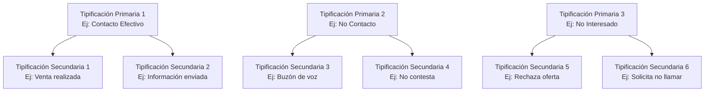
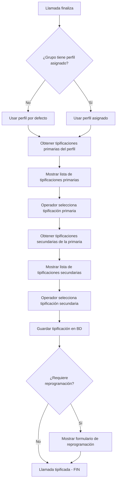

# Reglas de Negocio: Tipificaciones

> **Lógica de negocio independiente de tecnología**
> Documentación de reglas de tipificación de llamadas en Tiphone v6

---

## 📊 Origen de las Reglas

Este documento contiene reglas de **3 orígenes**:

- **📘 MANUAL**: Extraídas del Manual oficial Tiphone v6 (`ManualMD/Tiphone_Admin_Supervision_Part7.md`)
- **💻 CÓDIGO**: Extraídas del código fuente (JavaScript, Web.config, ASPX)
- **🧠 INFERIDA**: Deducidas por lógica/mejores prácticas (requieren validación)

Consulta `ORIGEN-REGLAS.md` para referencias detalladas de cada regla.

---

## 1. Definición

La **Tipificación** es el proceso de clasificar el resultado de una llamada finalizada. Se realiza en dos niveles:

1. **Tipificación Primaria**: Categoría general del resultado (ej: "Contacto efectivo", "No contacto", "No interesado")
2. **Tipificación Secundaria**: Subcategoría específica (ej: dentro de "No contacto" → "Buzón de voz", "No contesta", "Teléfono equivocado")

---

## 2. Jerarquía y Estructura

### Tipificación Primaria

| Característica | Descripción |
|----------------|-------------|
| **Nivel** | Primer nivel de clasificación |
| **Contenido** | Conjunto de tipificaciones secundarias |
| **Obligatoria** | Sí - Siempre se debe seleccionar una |
| **Relación** | Se asocia a Perfiles |

### Tipificación Secundaria

| Característica | Descripción |
|----------------|-------------|
| **Nivel** | Segundo nivel de clasificación |
| **Pertenencia** | Siempre pertenece a una tipificación primaria |
| **Obligatoria** | Sí - Una vez seleccionada la primaria |
| **Múltiples** | Una tipificación primaria puede tener N secundarias |

### Diagrama de Jerarquía



---

## 3. Reglas de Tipificaciones Primarias

### REGLA: Nombre de Tipificación Primaria 📘

> **Origen**: 📘 MANUAL - Part7, pág 15

**Descripción**: El nombre de la tipificación primaria tiene restricción de longitud.

**Validación**:
- Longitud máxima: **100 caracteres alfanuméricos**
- Campo obligatorio
- Debe ser único (recomendado)

**Pseudocódigo**:
```
SI longitud(nombreTipificacion) > 100 ENTONCES
    ERROR "El nombre de la tipificación no puede superar los 100 caracteres"
FIN SI

SI nombreTipificacion está vacío ENTONCES
    ERROR "El nombre de la tipificación es obligatorio"
FIN SI
```

**Mensaje de error**:
> "El nombre de la tipificación no puede superar los 100 caracteres"

---

### REGLA: Eliminar Tipificación Primaria 📘

> **Origen**: 📘 MANUAL - Part7, pág 15

**Descripción**: Una tipificación primaria no puede eliminarse si está asociada a algún perfil.

**Validación**:
- Verificar si está asociada a algún perfil antes de eliminar
- Si está asociada, rechazar eliminación
- Primero debe desasociarse de todos los perfiles

**Pseudocódigo**:
```
FUNCION EliminarTipificacionPrimaria(idTipificacion)
    perfilesAsociados = ConsultarPerfilesConTipificacion(idTipificacion)

    SI perfilesAsociados.Count > 0 ENTONCES
        nombrePerfiles = perfilesAsociados.Join(", ")
        ERROR "No se puede eliminar la tipificación porque está asociada a los siguientes perfiles: " + nombrePerfiles
        RETORNAR FALSO
    FIN SI

    EliminarDeBD(idTipificacion)
    RETORNAR VERDADERO
FIN FUNCION
```

**Mensaje de error**:
> "No se puede eliminar la tipificación porque está asociada a los siguientes perfiles: [lista de perfiles]. Primero debe desasociarla de estos perfiles."

**Restricción**:
- Integridad referencial
- Evita perder datos asociados

---

### REGLA: Añadir/Eliminar Tipificaciones Secundarias 📘

> **Origen**: 📘 MANUAL - Part7, pág 15-16

**Descripción**: Desde el formulario de tipificación primaria se pueden añadir y eliminar tipificaciones secundarias.

**Operaciones permitidas**:
1. **Añadir**: Se muestra una caja de edición debajo de la última tipificación secundaria
2. **Eliminar**: El icono aparece en rojo al pulsar eliminar

**Validación**:
- Una tipificación primaria puede tener 0 o más secundarias
- Al eliminar secundarias, verificar que no estén siendo usadas (recomendado)

**Flujo de añadir secundaria**:
```
Usuario pulsa botón "Añadir tipificación secundaria"
    → Sistema muestra caja de edición debajo de última secundaria
    → Usuario escribe descripción
    → Usuario pulsa "Guardar"
    → Sistema valida descripción no vacía
    → Sistema guarda en BD asociada a la tipificación primaria
```

---

## 4. Reglas de Perfiles de Tipificaciones

### REGLA: Debe Existir al Menos un Perfil 📘

> **Origen**: 📘 MANUAL - Part7, pág 17

**Descripción**: El sistema debe tener al menos un perfil de tipificaciones en todo momento.

**Validación**:
- Al eliminar un perfil, verificar que quede al menos 1
- Si se intenta eliminar el último perfil, rechazar operación

**Pseudocódigo**:
```
FUNCION EliminarPerfil(idPerfil)
    totalPerfiles = ContarPerfiles()

    SI totalPerfiles <= 1 ENTONCES
        ERROR "No se puede eliminar el perfil porque debe existir al menos un perfil en el sistema"
        RETORNAR FALSO
    FIN SI

    // Continuar con validación de asociación a grupos...
FIN FUNCION
```

**Mensaje de error**:
> "No se puede eliminar el perfil porque debe existir al menos un perfil en el sistema"

**Razón de negocio**:
- Garantizar que siempre haya tipificaciones disponibles
- Evitar estado inconsistente del sistema

---

### REGLA: Perfil Por Defecto Obligatorio 📘

> **Origen**: 📘 MANUAL - Part7, pág 17

**Descripción**: Uno de los perfiles debe estar marcado como "Por defecto".

**Validación**:
- Siempre debe existir exactamente UN perfil marcado como "Por defecto"
- No puede haber 0 perfiles por defecto
- No puede haber más de 1 perfil por defecto

**Pseudocódigo**:
```
FUNCION MarcarComoDefecto(idPerfil)
    // Desmarcar cualquier otro perfil como defecto
    ActualizarBD("UPDATE Perfiles SET EsDefecto = 0 WHERE EsDefecto = 1")

    // Marcar el nuevo como defecto
    ActualizarBD("UPDATE Perfiles SET EsDefecto = 1 WHERE IdPerfil = " + idPerfil)
FIN FUNCION

FUNCION EliminarPerfil(idPerfil)
    perfil = ConsultarPerfil(idPerfil)

    SI perfil.EsDefecto ENTONCES
        ERROR "No se puede eliminar el perfil por defecto. Primero marque otro perfil como por defecto."
        RETORNAR FALSO
    FIN SI

    // Continuar con otras validaciones...
FIN FUNCION
```

**Visualización**:
- El perfil por defecto se muestra en **negrita** en la lista de perfiles

**Mensaje de error**:
> "No se puede eliminar el perfil por defecto. Primero marque otro perfil como por defecto."

---

### REGLA: No Eliminar Perfil Asignado a Grupo 📘

> **Origen**: 📘 MANUAL - Part7, pág 17

**Descripción**: No se puede eliminar un perfil que está asignado a uno o más grupos.

**Validación**:
- Verificar asignación a grupos antes de eliminar
- Si está asignado, rechazar eliminación
- Primero debe desasignarse de todos los grupos

**Pseudocódigo**:
```
FUNCION EliminarPerfil(idPerfil)
    gruposAsignados = ConsultarGruposConPerfil(idPerfil)

    SI gruposAsignados.Count > 0 ENTONCES
        nombreGrupos = gruposAsignados.Join(", ")
        ERROR "No se puede eliminar el perfil porque está asignado a los siguientes grupos: " + nombreGrupos
        RETORNAR FALSO
    FIN SI

    EliminarDeBD(idPerfil)
    RETORNAR VERDADERO
FIN FUNCION
```

**Mensaje de error**:
> "No se puede eliminar el perfil porque está asignado a los siguientes grupos: [lista de grupos]. Primero debe desasignarlo de estos grupos."

---

### REGLA: Grupo Sin Perfil Usa el Por Defecto 📘

> **Origen**: 📘 MANUAL - Part7, pág 18

**Descripción**: Si un grupo de atención no tiene un perfil asignado explícitamente, usa el perfil marcado como "Por defecto".

**Validación**:
- Siempre debe haber un perfil por defecto disponible (regla anterior)
- Al consultar tipificaciones para un grupo sin perfil, usar el por defecto

**Pseudocódigo**:
```
FUNCION ObtenerPerfilGrupo(idGrupo)
    perfilAsignado = ConsultarPerfilAsignado(idGrupo)

    SI perfilAsignado ES NULO ENTONCES
        perfilDefecto = ConsultarPerfilDefecto()
        RETORNAR perfilDefecto
    FIN SI

    RETORNAR perfilAsignado
FIN FUNCION

FUNCION ObtenerTipificacionesParaGrupo(idGrupo)
    perfil = ObtenerPerfilGrupo(idGrupo)
    tipificaciones = ConsultarTipificacionesDePerfil(perfil.Id)
    RETORNAR tipificaciones
FIN FUNCION
```

**Comportamiento UI**:
- Si un grupo no tiene perfil asignado, en la UI se indica: **"Perfil por defecto"**

---

## 5. Reglas de Asignación Perfil a Grupo

### REGLA: Asignación de Perfil a Grupo de Atención 📘

> **Origen**: 📘 MANUAL - Part7, pág 18-19

**Descripción**: Cada grupo de atención puede tener un perfil de tipificaciones asignado. La asignación es modificable.

**Validación**:
- Un grupo puede tener 0 o 1 perfil asignado (no más de 1)
- Si tiene 0, se usa el por defecto automáticamente
- La asignación es modificable en cualquier momento

**Operaciones**:
- **Asignar**: Seleccionar perfil de lista desplegable
- **Modificar**: Cambiar perfil asignado
- **Desasignar**: Dejar sin perfil (usará el por defecto)

**Pseudocódigo**:
```
FUNCION AsignarPerfilAGrupo(idGrupo, idPerfil)
    SI idPerfil ES NULO ENTONCES
        // Desasignar (usará el por defecto)
        EjecutarSQL("UPDATE Grupos SET IdPerfil = NULL WHERE IdGrupo = " + idGrupo)
    SINO
        // Verificar que el perfil existe
        perfil = ConsultarPerfil(idPerfil)
        SI perfil ES NULO ENTONCES
            ERROR "El perfil seleccionado no existe"
            RETORNAR FALSO
        FIN SI

        // Asignar
        EjecutarSQL("UPDATE Grupos SET IdPerfil = " + idPerfil + " WHERE IdGrupo = " + idGrupo)
    FIN SI

    RETORNAR VERDADERO
FIN FUNCION
```

---

## 6. Flujo Completo de Tipificación

### Diagrama de Flujo: Tipificar Llamada



### Pseudocódigo Completo

```
FUNCION TipificarLlamada(idLlamada, idGrupo)
    // 1. Obtener perfil del grupo
    perfil = ObtenerPerfilGrupo(idGrupo)

    // 2. Obtener tipificaciones primarias
    tipificacionesPrimarias = ConsultarTipificacionesPrimarias(perfil.Id)

    // 3. Mostrar al operador
    MostrarFormulario(tipificacionesPrimarias)

    // 4. Operador selecciona primaria
    idPrimaria = EsperarSeleccionOperador()

    // 5. Obtener secundarias de la primaria seleccionada
    tipificacionesSecundarias = ConsultarTipificacionesSecundarias(idPrimaria)

    // 6. Mostrar secundarias al operador
    MostrarFormulario(tipificacionesSecundarias)

    // 7. Operador selecciona secundaria
    idSecundaria = EsperarSeleccionOperador()

    // 8. Guardar tipificación
    GuardarTipificacion(idLlamada, idPrimaria, idSecundaria)

    // 9. Verificar si requiere reprogramación
    tipSecundaria = ConsultarTipificacionSecundaria(idSecundaria)
    SI tipSecundaria.RequiereReprogramacion ENTONCES
        MostrarFormularioReprogramacion(idLlamada)
    FIN SI

    // 10. Marcar llamada como tipificada
    ActualizarEstadoLlamada(idLlamada, "TIPIFICADA")
FIN FUNCION
```

---

## 7. Ejemplos Prácticos

### Ejemplo 1: Campaña de Ventas

**Perfil**: "Ventas Outbound"

**Tipificaciones Primarias y Secundarias**:

| Primaria | Secundarias |
|----------|-------------|
| **Contacto Efectivo** | - Venta realizada<br>- Interesado (llamar luego)<br>- Información enviada |
| **No Contacto** | - No contesta<br>- Buzón de voz<br>- Teléfono apagado<br>- Número erróneo |
| **No Interesado** | - Rechaza oferta<br>- Ya tiene el servicio<br>- Solicita no volver a llamar |
| **Otros** | - Cliente ocupado (llamar luego)<br>- Idioma extranjero<br>- Línea con problemas |

### Ejemplo 2: Campaña de Encuestas

**Perfil**: "Encuestas"

**Tipificaciones Primarias y Secundarias**:

| Primaria | Secundarias |
|----------|-------------|
| **Encuesta Completada** | - Completada totalmente<br>- Completada parcialmente |
| **Encuesta No Realizada** | - No contesta<br>- Rechaza participar<br>- No disponible ahora |
| **Contacto Inválido** | - Teléfono erróneo<br>- Duplicado<br>- Fallecido |

---

## 8. Reglas de Integridad

### Integridad Referencial 🧠

> **Origen**: 🧠 INFERIDA - Lógica de integridad de BD

**Reglas**:
1. No se puede eliminar una tipificación primaria si tiene secundarias asociadas
2. Al eliminar una tipificación primaria, eliminar sus secundarias (cascada) o rechazar si se están usando
3. No se puede eliminar un perfil si está asignado a grupos
4. No se puede eliminar el último perfil del sistema
5. No se puede desmarcar el perfil por defecto sin marcar otro

### Validaciones de Negocio 🧠

> **Origen**: 🧠 INFERIDA - Mejores prácticas

**Validaciones recomendadas**:
1. **Nombres únicos**: Evitar tipificaciones con nombres duplicados
2. **Límite de secundarias**: Máximo razonable 50 secundarias por primaria (evitar UI sobrecargada)
3. **Auditoría**: Registrar cambios en tipificaciones (quién, cuándo, qué)
4. **Tipificaciones en uso**: Marcar como "no eliminable" si se han usado en llamadas históricas

---

## 9. Permisos

### Administrar Tipificaciones 📘

> **Origen**: 📘 MANUAL - Part7, pág 14-15

**Permiso requerido**: "Administrar subsistema"

**Operaciones permitidas**:
- Crear tipificaciones primarias y secundarias
- Modificar tipificaciones
- Eliminar tipificaciones (con restricciones)
- Crear perfiles
- Modificar perfiles
- Eliminar perfiles (con restricciones)
- Marcar perfil por defecto
- Asignar perfiles a grupos

**Sin este permiso**: No se muestra la opción "Tipificaciones" en el menú

---

## 10. Estados y Ciclo de Vida

### Estados de Tipificación 🧠

> **Origen**: 🧠 INFERIDA - Estados lógicos

| Estado | Descripción | Se puede usar | Se puede modificar | Se puede eliminar |
|--------|-------------|---------------|-------------------|-------------------|
| **Activa** | Tipificación en uso | Sí | Sí | Solo si no está asociada a perfil |
| **Inactiva** | Tipificación deshabilitada | No | Sí | Solo si no está asociada a perfil |

**Nota**: El manual no menciona estados explícitamente, pero es buena práctica implementarlos para no perder histórico.

---

## 11. Mensajes de Error

| Situación | Mensaje |
|-----------|---------|
| Nombre tipificación > 100 caracteres | "El nombre de la tipificación no puede superar los 100 caracteres" |
| Eliminar tipificación asociada a perfil | "No se puede eliminar la tipificación porque está asociada a perfiles" |
| Eliminar último perfil | "Debe existir al menos un perfil en el sistema" |
| Eliminar perfil por defecto | "No se puede eliminar el perfil por defecto" |
| Eliminar perfil asignado a grupo | "No se puede eliminar el perfil porque está asignado a grupos" |

---

## 12. Consideraciones Técnicas

### Base de Datos 💻

Estructura sugerida (inferida del comportamiento):

```sql
-- Tabla de tipificaciones primarias
CREATE TABLE TipificacionesPrimarias (
    IdTipificacion INT PRIMARY KEY IDENTITY,
    Nombre NVARCHAR(100) NOT NULL,
    Activa BIT DEFAULT 1
);

-- Tabla de tipificaciones secundarias
CREATE TABLE TipificacionesSecundarias (
    IdTipificacionSecundaria INT PRIMARY KEY IDENTITY,
    IdTipificacionPrimaria INT NOT NULL,
    Descripcion NVARCHAR(200) NOT NULL,
    RequiereReprogramacion BIT DEFAULT 0,
    FOREIGN KEY (IdTipificacionPrimaria) REFERENCES TipificacionesPrimarias(IdTipificacion)
);

-- Tabla de perfiles
CREATE TABLE Perfiles (
    IdPerfil INT PRIMARY KEY IDENTITY,
    Nombre NVARCHAR(100) NOT NULL,
    EsDefecto BIT DEFAULT 0
);

-- Relación muchos a muchos: Perfil - Tipificaciones Primarias
CREATE TABLE PerfilTipificaciones (
    IdPerfil INT NOT NULL,
    IdTipificacion INT NOT NULL,
    PRIMARY KEY (IdPerfil, IdTipificacion),
    FOREIGN KEY (IdPerfil) REFERENCES Perfiles(IdPerfil),
    FOREIGN KEY (IdTipificacion) REFERENCES TipificacionesPrimarias(IdTipificacion)
);

-- Asignación de perfil a grupo
ALTER TABLE Grupos ADD IdPerfil INT NULL;
ALTER TABLE Grupos ADD CONSTRAINT FK_Grupos_Perfil
    FOREIGN KEY (IdPerfil) REFERENCES Perfiles(IdPerfil);
```

---

## 13. Relación con Otros Módulos

### Módulos Relacionados

1. **Grupos**: Cada grupo tiene un perfil de tipificaciones asignado
2. **Llamadas**: Cada llamada finalizada debe tipificarse
3. **Reprogramaciones**: Algunas tipificaciones secundarias pueden disparar reprogramaciones
4. **Reportes**: Las tipificaciones se usan para estadísticas y análisis
5. **Operadores**: Los operadores ven las tipificaciones según el grupo al que atienden

---

**Documento**: Reglas de Tipificaciones
**Versión**: 1.0
**Fecha**: 2025-10-27
**Fuentes**: Manual Part7.md (págs 14-20), inferencias lógicas
**Estado**: Completo - Reglas extraídas del manual y marcadas con origen
